# Hello, everyone! 😊 {background-color="#1B3A6B"}

# Recap and lecture overview 📚 {background-color="#1B3A6B"}

## Recap of our last lecture
### In our last class, we covered

:::{style="margin-top: 30px; font-size: 24px;"}
:::{.columns}
:::{.column width="50%"}
- How to `push` and `pull` changes to and from remote repositories
- Using `.gitignore` to avoid tracking certain files
- Creating and managing branches with `git branch` and `git checkout`
- The difference between `clone` and `fork` repositories
- Resolving conflicts when multiple people change the same code
- Going back to specific commits with `git checkout` and `git reset`
- Workflow for merging branches back to `master/main`
:::

:::{.column width="50%"}
:::{style="text-align: center;"}
[{width="100%"}](#){data-modal-type="image" data-modal-url="figures/git-ref.png"}

Source: [Lodato (2010)](https://marklodato.github.io/visual-git-guide/index-en.html)
:::
:::
:::
:::

## Today's lecture

:::{style="margin-top: 30px; font-size: 24px;"}
:::{.columns}
:::{.column width="50%"}
Today we will cover:

- Understanding changes with `git diff`
- Amending commits with `git commit --amend`
- Cherry-picking commits with, well, `git cherry-pick` 😅
- Understanding `git rebase` and its uses
- Saving work temporarily with `git stash`
- Checking your GitHub CLI setup
- GitHub CLI repository management
- [Mock-up quiz!]{.alert}
:::

:::{.column width="50%"}
:::{style="text-align: center;"}
[{width="70%"}](#){data-modal-type="image" data-modal-url="figures/github-cli.jpeg"}
[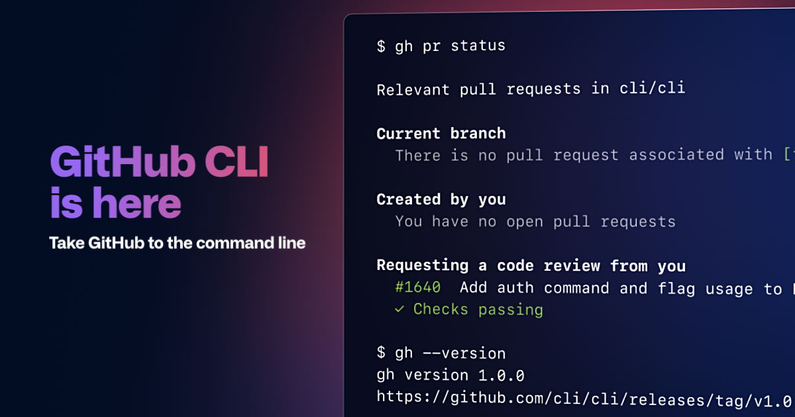{width="70%"}](#){data-modal-type="image" data-modal-url="figures/cli.png"}
:::
:::
:::
:::

## Tweet of the day
### This is very interesting! 🤯

:::{style="text-align: center; margin-top: 30px; font-size: 22px;"}
[{width="30%"}](#){data-modal-type="image" data-modal-url="figures/tweet-jev.png"}

<https://x.com/CompleteSkeptic/status/2099925684256899543>

<https://typesafe.ai/blog/introducing-system-one-models-and-jev>
:::

# Understanding changes with git diff 🔍 {background-color="#1B3A6B"}

## What is `git diff`?

:::{style="margin-top: 30px; font-size: 22px;"}
:::{.columns}
:::{.column width="50%"}
- `git diff` shows [what has changed]{.alert}, line by line
- It compares your working directory, the staging area, commits, or branches
- Read it before every commit. It is the cheapest way to catch a mistake
- Let's make a change in `my-project` and look at it

```bash
echo "# This is a data cleaning script" >> ./01-data-cleaning.py
git diff
``` 
:::

:::{.column width="50%"}
:::{style="text-align: center;"}
[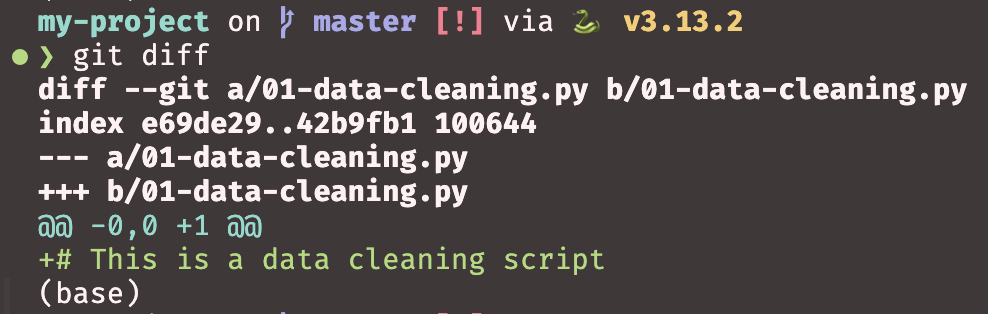{width="80%"}](#){data-modal-type="image" data-modal-url="figures/diff-01.png"}
:::

Reading the output:

- `a/` is the old version, `b/` is the new one
- `index e69de29..42b9fb1`: short IDs of the file before and after the change; `100644` means a regular file ([other file modes](https://git-scm.com/book/en/v2/Git-Internals-Git-Objects#_tree_objects))
- `@@ -0,0 +1 @@`: old file had 0 lines, new file has 1 line starting at line 1
- `+` before a line: added; `-` before a line: removed
:::
:::
:::

## Common `git diff` commands

:::{style="margin-top: 30px; font-size: 21px;"}
:::{.columns}
:::{.column width="50%"}
**Basic diff commands:**

- `git diff`: shows unstaged changes in working directory
- `git diff --staged`: shows staged changes ready to commit
- `git diff HEAD`: shows all changes since last commit
- `git diff --name-only`: shows only filenames that changed

:::{style="margin-top: -20px; text-align: center;"}
[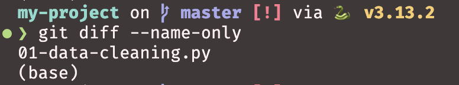{width="100%"}](#){data-modal-type="image" data-modal-url="figures/diff-one-line.png"}
:::
:::

:::{.column width="50%"}
**Comparing commits:**

- `git diff commit1..commit2`: compares two specific commits
- `git diff branch1..branch2`: compares two branches
- `git diff --stat`: shows summary of changes (files modified, insertions, deletions)

:::{style="margin-top: -20px; text-align: center;"}
[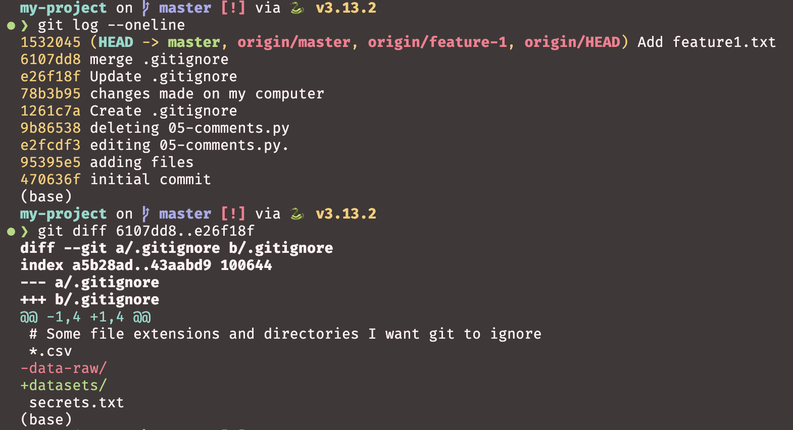{width="100%"}](#){data-modal-type="image" data-modal-url="figures/diff-commits.png"}
:::

- `@@ -1,4 +1,4 @@` means that in the original file, lines 1 to 4 were present, and in the new file, lines 1 to 4 are also present, but with some changes
:::
:::
:::

# Amending and undoing commits {background-color="#1B3A6B"}

## What is `git commit --amend`?

:::{style="margin-top: 30px; font-size: 24px;"}
- `git commit --amend` [rewrites your last commit]{.alert}
- Use it when you mistyped the message, or forgot to add a file
- Whatever is staged gets folded into the previous commit
- [Only amend commits you have not pushed]{.alert}. Rewriting shared history causes trouble for everyone else

:::{style="text-align: center; margin-top: -20px;"}
[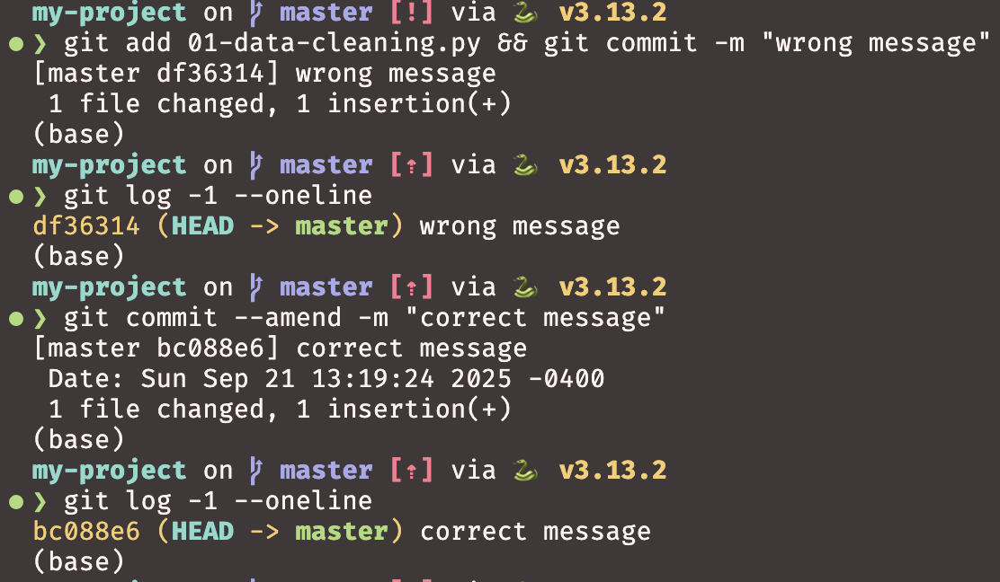{width="60%"}](#){data-modal-type="image" data-modal-url="figures/amend-message.png"}
:::
:::

## How to amend commits

:::{style="margin-top: 30px; font-size: 22px;"}
:::{.columns}
:::{.column width="50%"}
**Amending the commit message:**
```bash
git commit --amend -m "New commit message"
```

**Adding forgotten files:**
```bash
git add forgotten-file.txt
git commit --amend --no-edit
```

**Both together:**
```bash
git add new-file.txt
git commit --amend -m "Updated commit message"
```
:::

:::{.column width="50%"}
**Important rules:**

- Only amend [local commits]{.alert}
- Don't amend commits that have been pushed to a shared repository, as it rewrites history
- To undo a pushed commit, use `git revert`, which adds a new commit that reverses it
- Always communicate with your team before amending shared history
:::
:::
:::

## Undoing commits with `git reset`

:::{style="margin-top: 30px; font-size: 22px;"}
:::{.columns}
:::{.column width="50%"}
- If you made a mistake, git allows you to undo commits
- `git reset` can move the HEAD pointer to a previous commit
- `--soft` keeps your changes staged
- `--mixed` (the default) keeps them, but unstaged. [This is usually what you want]{.alert}, so you can review the files before committing again
- `--hard` throws them away entirely
- [Use with caution too!]{.alert} Hard reset will delete uncommitted changes

:::{style="text-align: center; margin-top: -20px;"}
[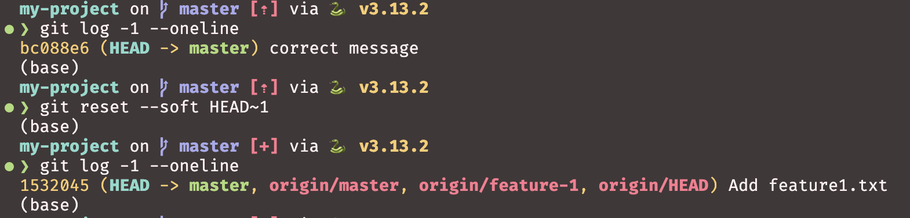{width="100%"}](#){data-modal-type="image" data-modal-url="figures/undo.png"}
:::
:::

:::{.column width="50%"}
:::{style="margin-top: -20px;"}
**Undo last commit, keep changes staged:**

```bash
git reset --soft HEAD~1
```

**Undo last commit, keep changes unstaged:**
```bash
git reset HEAD~1   # same as git reset --mixed HEAD~1
```

**Undo last commit and discard changes:**
```bash
git reset --hard HEAD~1
```

- You can undo as many commits as needed by changing the number after `HEAD~`, such as `HEAD~2` for the last two commits
:::
:::
:::
:::

# Cherry-picking commits {background-color="#1B3A6B"}

## What is `git cherry-pick`?

:::{style="margin-top: 30px; font-size: 24px;"}
:::{.columns}
:::{.column width="50%"}
- `git cherry-pick` allows you to [pick specific commits]{.alert} from one branch and apply them to another
- Useful when you want to apply a bug fix or feature from one branch to another
- Each commit is applied individually with its own commit message
- Can be used to backport changes to older versions
- [Creates new commits]{.alert} rather than modifying existing ones
- More details: [Atlassian's cherry-pick tutorial](https://www.atlassian.com/git/tutorials/cherry-pick)
:::

:::{.column width="50%"}
:::{style="text-align: center; margin-top: -20px;"}
[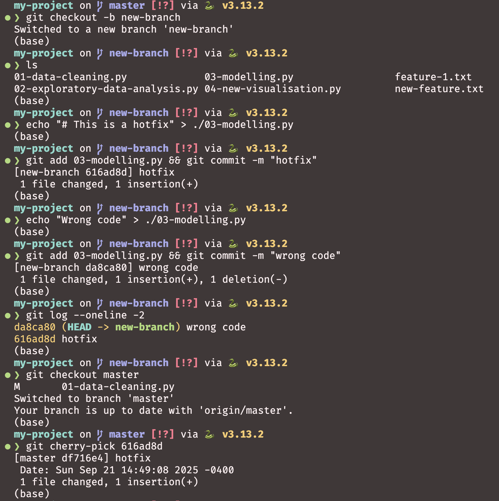{width="100%"}](#){data-modal-type="image" data-modal-url="figures/cherry-pick.png"}
:::
:::
:::
:::

## Using `git cherry-pick`

:::{style="margin-top: 30px; font-size: 22px;"}
:::{.columns}
:::{.column width="45%"}
**Basic cherry-pick:**
```bash
# Cherry-pick a single commit
git cherry-pick abc1234

# Cherry-pick multiple commits
git cherry-pick abc1234 def5678

# Cherry-pick a range of commits (^ includes abc1234 itself)
git cherry-pick abc1234^..def5678
```

**After cherry-picking:**

- The commit is applied to your current branch
- It creates a new commit with the same changes
- Original commit history is preserved
:::

:::{.column width="55%"}
**Handling conflicts:**
```bash
# If conflicts occur during cherry-pick
git cherry-pick --continue  # After resolving conflicts
git cherry-pick --abort     # Cancel the cherry-pick
git cherry-pick --skip      # Skip the current commit
```

**Common use cases:**

- Applying hotfixes to multiple branches
- Backporting features to release branches
- Moving specific commits between branches
:::
:::
:::

# Understanding git rebase {background-color="#1B3A6B"}

## Understanding `git rebase`

:::{style="margin-top: 30px; font-size: 24px;"}
:::{.columns}
:::{.column width="40%"}
- `git rebase` allows you to [move or combine commits]{.alert} to a new base commit
- Changes the commit history by replaying commits on top of another base
- Creates a [linear, clean commit history]{.alert}
- Useful for keeping feature branches up to date with main branch
- [Rewrites commit history]{.alert} - avoid using it on shared or public branches!
- More details: [Atlassian's rebase tutorial](https://www.atlassian.com/git/tutorials/rewriting-history/git-rebase)
:::

:::{.column width="60%"}
:::{style="text-align: center; margin-top: -20px;"}
[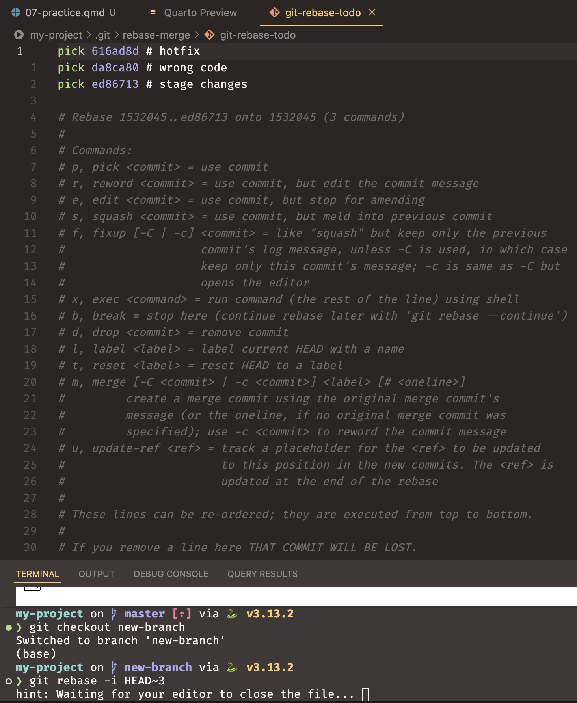{width="70%"}](#){data-modal-type="image" data-modal-url="figures/rebase.png"}
:::
:::
:::
:::

## Types of rebasing

:::{style="margin-top: 30px; font-size: 22px;"}
:::{.columns}
:::{.column width="50%"}
**Interactive rebase:**
```bash
# Interactive rebase of last 3 commits
git rebase -i HEAD~3

# Interactive rebase of the commits after abc1234
git rebase -i abc1234
```

**Rebase onto another branch:**
```bash
# Rebase current branch onto main
git rebase main

# Rebase feature branch onto main
git checkout feature-branch
git rebase main
```
:::

:::{.column width="50%"}
**During interactive rebase you can:**

- `pick`: use the commit as-is
- `reword`: change the commit message
- `edit`: modify the commit contents
- `squash`: combine with the previous commit
- `drop`: remove the commit entirely
- To reorder commits, move the lines themselves
:::
:::
:::

# Saving work with git stash {background-color="#1B3A6B"}

## What is `git stash`?

:::{style="margin-top: 30px; font-size: 22px;"}
:::{.columns}
:::{.column width="43%"}
- `git stash` [puts your uncommitted changes aside]{.alert}, leaving a clean working directory. [This is very useful!]{.alert}
- Think of it as a clipboard for work in progress
- Stashes pile up in a stack, so the last one you saved is the first one back
- Read more: [Atlassian's stash tutorial](https://www.atlassian.com/git/tutorials/saving-changes/git-stash)

**Use it when:**

- An urgent fix arrives and you are mid-way through something else
- You want to `pull` but have local changes in the way
- You are experimenting and want to park the experiment
- You started work on the wrong branch
:::

:::{.column width="57%"}
:::{style="text-align: center; margin-top: 20px;"}
```bash
# 1. On feature-branch, you edit a tracked file
echo "df = df.dropna()" >> 01-data-cleaning.py
git status   # modified: 01-data-cleaning.py

# 2. A bug report arrives. Park your edit
git stash
git status   # nothing to commit, working tree clean

# 3. Fix the bug on main
git checkout main
echo "# Fixed typo" >> README.md
git commit -am "Fix typo in README"

# 4. Go back and pick up where you left off
git checkout feature-branch
git stash pop  # your dropna() line is back
```
:::
:::
:::
:::

## Basic `git stash` commands

:::{style="margin-top: 30px; font-size: 22px;"}
:::{.columns}
:::{.column width="50%"}
**Saving and restoring stashes:**
```bash
# Stash current changes (tracked files only)
git stash

# Stash with a descriptive message
git stash push -m "WIP: adding user authentication"

# Stash including untracked files
git stash -u

# Stash including untracked and ignored files
git stash -a

# Restore most recent stash and remove from stack
git stash pop

# Restore most recent stash but keep in stack
git stash apply
```
:::

:::{.column width="50%"}
**Managing multiple stashes:**
```bash
# List all stashes
git stash list

# Apply a specific stash
git stash apply stash@{2}

# Drop a specific stash
git stash drop stash@{1}

# Clear all stashes (use with caution!)
git stash clear

# Show changes in most recent stash
git stash show

# Show changes in stash with diff
git stash show -p stash@{0}
```
:::
:::
:::

## Moving changes to another branch with `git stash`

:::{style="margin-top: 30px; font-size: 20px;"}
:::{.columns}
:::{.column width="50%"}
**A very common scenario:**

You've been coding away, only to realise you're on the [wrong branch]{.alert}! 😱

`git stash` makes it easy to move your uncommitted changes to the correct branch:

```bash
# You're on main but should be on feature-x
# First, stash your changes
git stash push -m "Move to feature-x branch"

# Switch to the correct branch
git checkout feature-x

# Apply your stashed changes
git stash pop
```

This technique works for both tracked and untracked files (use `git stash -u` for untracked).
:::

:::{.column width="50%"}
**Creating a new branch from stash:**

If the branch doesn't exist yet, you can create it directly from the stash:

```bash
# Stash your current work
git stash

# Create new branch with stashed changes
git stash branch new-feature-branch
```

This command:

- Creates a new branch from where you stashed
- Checks out the new branch
- Applies the stash
- Drops the stash if applied successfully

[Pro tip:]{.alert} This is the safest way to recover stashed work if you're unsure about conflicts!
:::
:::
:::

# GitHub CLI 🖥️ {background-color="#1B3A6B"}

## Is your GitHub CLI ready?

:::{style="margin-top: 30px; font-size: 24px;"}
:::{.columns}
:::{.column width="50%"}
- You installed `gh` and logged in during lecture 06. Let's check both

```bash
gh --version     # is gh installed?
gh auth status   # which account is active?
```

- Command not found? Mac: `brew install gh`. WSL: [Linux instructions](https://github.com/cli/cli/blob/trunk/docs/install_linux.md#debian)
- Not logged in? Run `gh auth login` (next slide)
- Today: [pull requests and issues]{.alert} without leaving the terminal
:::

:::{.column width="50%"}
:::{style="text-align: center;"}
[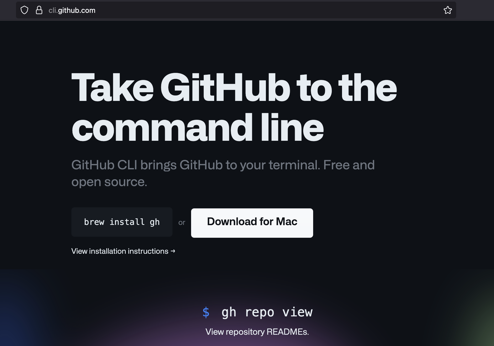{width="100%"}](#){data-modal-type="image" data-modal-url="figures/gh-cli.png"}
:::
:::
:::
:::

## How to connect your terminal to GitHub

:::{style="margin-top: 30px; font-size: 22px;"}
**Authenticate with GitHub:**
```bash
gh auth login
```
- Select GitHub.com
- Choose HTTPS Git operations
- Choose `Y` to authenticate Git with your GitHub credentials
- Choose `Login with a web browser` 
- Copy the one-time code, then press `Enter` to open the link in your browser

:::{style="text-align: center; margin-top: -20px;"}
[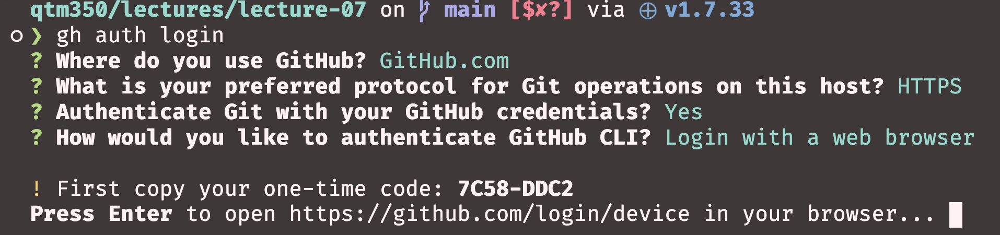{width="90%"}](#){data-modal-type="image" data-modal-url="figures/auth.png"}
:::

- And you're all set to use GitHub CLI! 🎉
:::

## Working with repositories, pull requests, and issues

:::{style="margin-top: 30px; font-size: 22px;"}
:::{.columns}
:::{.column width="40%"}
**Repository operations:**
```bash
# List your repositories
gh repo list

# View repository details
gh repo view --web

# Clone a repository
gh repo clone owner/repo

# Archive/unarchive a repository
gh repo archive
gh repo unarchive
```
:::

:::{.column width="60%"}
**Pull requests and issues:**

```bash
# Create a new pull request
gh pr create --title "My PR" --body "Description of my PR"

# List pull requests
gh pr list

# View pull request details
gh pr view 123 --web

# Create a new issue
gh issue create --title "My Issue" --body "Description of my issue"

# List issues
gh issue list

# View issue details
gh issue view 456 --web
```
:::
:::
:::

# GitHub CLI - Practical Examples 💡 {background-color="#1B3A6B"}

## Real-world GitHub CLI usage

:::{style="margin-top: 30px; font-size: 23px;"}
:::{.columns}
:::{.column width="50%"}
```bash
mkdir new-project && cd new-project
echo "# New project" > README.md
git init && git add . && git commit -m "first commit"
```

:::{style="text-align: center; margin-top: -20px;"}
[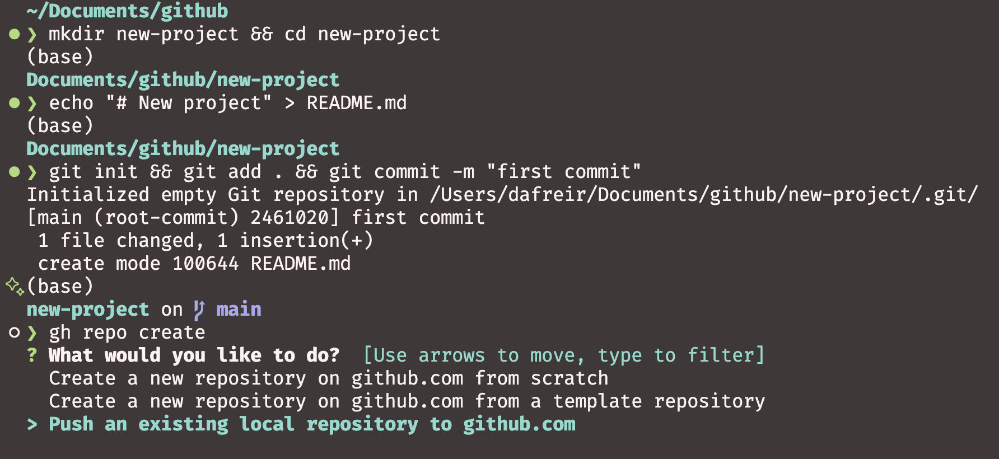{width="100%"}](#){data-modal-type="image" data-modal-url="figures/repo-create01.png"}
:::

- More information: <https://cli.github.com/manual/gh_repo_create>
:::

:::{.column width="50%"}
```bash
gh repo create
# Follow the prompts
gh repo view --web
```

:::{style="text-align: center; margin-top: -20px;"}
[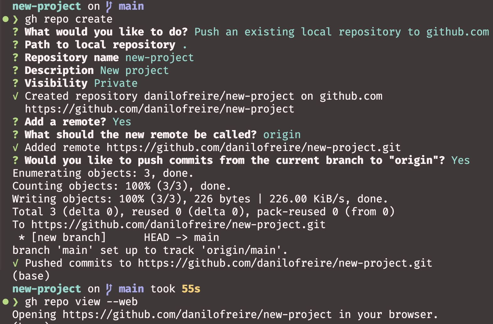{width="100%"}](#){data-modal-type="image" data-modal-url="figures/repo-create02.png"}
:::

- You can even create a new repository and push your local code to it in one command!

```bash
gh repo create new-project --public --source=. --push
```
:::
:::
:::

## Goodbye, GitHub Desktop! 👋 

:::{style="margin-top: 30px; font-size: 23px; text-align: center;"}
[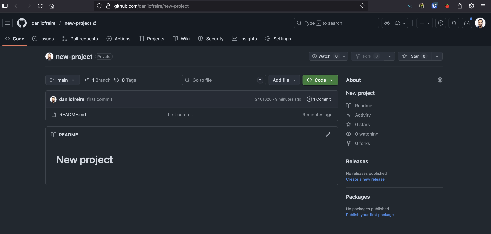{width="100%"}](#){data-modal-type="image" data-modal-url="figures/gh-repo.png"}
:::

# Practice Time! ⏱️ {background-color="#1B3A6B"}

## Git practice quiz

:::{style="margin-top: 30px; font-size: 19px;"}
:::{.columns}
:::{.column width="50%"}
[Set up the repository]{.alert}

1. Create a `git-practice` directory, move into it, and initialise a repository
2. Create a `src` folder, then use brace expansion to create `main.py`, `utils.py` and `test.py` inside it in one command
3. Use `echo` to write `print("Hello")` into `src/main.py`, and check its contents with `cat`. Commit everything: "Initial commit"

[Check and fix]{.alert}

4. Use `echo` to replace the text with `print("Hello, world")`, then run `git diff`. Commit with the message "Updte greeting", then fix the typo with `--amend`
5. Rename `src/test.py` to `src/test_main.py`, check with `ls src`, and commit: "Rename test file"
:::

:::{.column width="50%"}
[Branches and stash]{.alert}

6. Create and switch to a branch called `hotfix`. Add a `.gitignore` containing `temp/` and commit: "Add gitignore"
7. Switch back to your default branch. Use `git log hotfix --oneline` to find the ID of the "Add gitignore" commit, then bring over only that commit with `cherry-pick`
8. Add `# TODO` to `src/utils.py`, stash the change, and check that `git status` is clean
9. Bring the change back with `git stash pop`, then use `cat` to confirm `# TODO` is there

[To GitHub]{.alert}

10. Create a private GitHub repository from this folder, and open it in the browser
:::
:::

:::{style="text-align: center;"}
Check your work with `git log --oneline` and `git status`. Answers are in the appendix at the end of this lecture
:::
:::

# And that's a wrap! 🎉 {background-color="#1B3A6B"}

# Appendix: Quiz answers {background-color="#1B3A6B"}

## Solutions to practice quiz

:::{style="margin-top: 30px; font-size: 21px;"}
Here are the answers to the practice quiz. Try to complete the quiz first before checking these answers!

1. `mkdir git-practice && cd git-practice && git init`
2. `mkdir src && touch src/{main,utils,test}.py`
3. `echo 'print("Hello")' > src/main.py && cat src/main.py && git add . && git commit -m "Initial commit"`
4. `echo 'print("Hello, world")' > src/main.py && git diff`, then `git commit -am "Updte greeting"` and `git commit --amend -m "Update greeting"`
5. `mv src/test.py src/test_main.py && ls src && git add . && git commit -m "Rename test file"`
    - `git mv src/test.py src/test_main.py` does the same and stages it in one step
6. `git checkout -b hotfix && echo "temp/" > .gitignore && git add .gitignore && git commit -m "Add gitignore"`
7. `git checkout main && git log hotfix --oneline`, then `git cherry-pick <commit-id>`
    - If `git init` gave you a branch called `master`, use that name instead. Check with `git branch`
8. `echo "# TODO" >> src/utils.py && git stash && git status`
9. `git stash pop && cat src/utils.py`
10. `gh repo create git-practice --private --source=. --push && gh repo view --web`
:::
