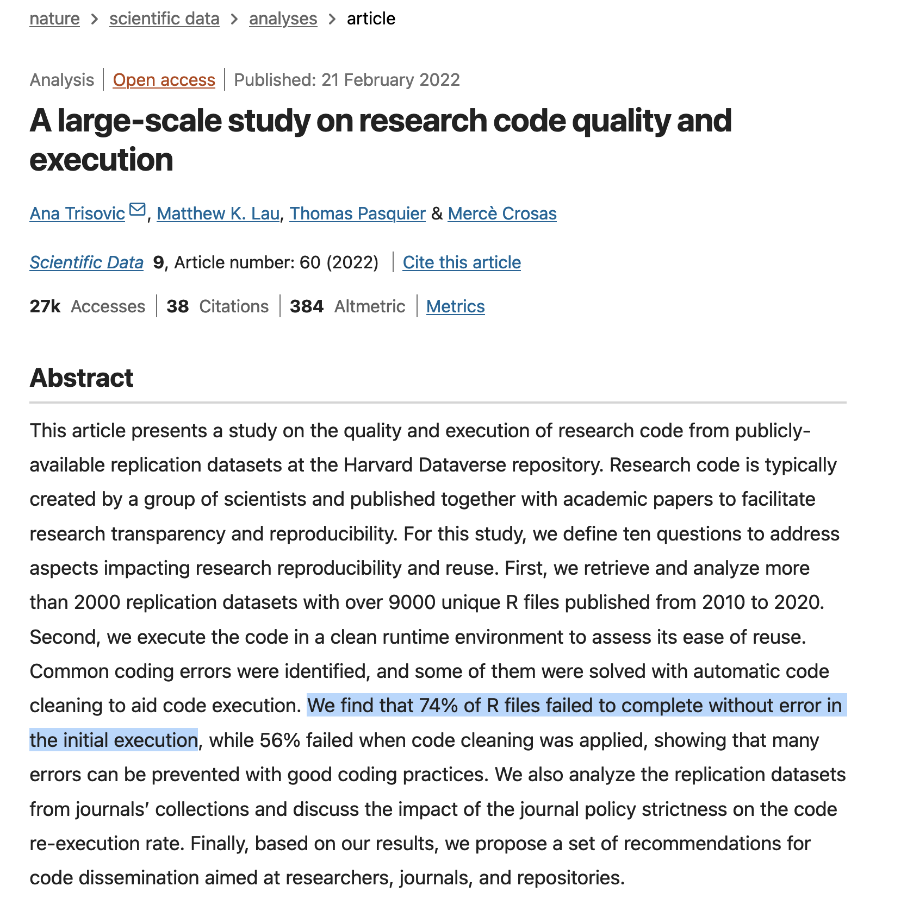
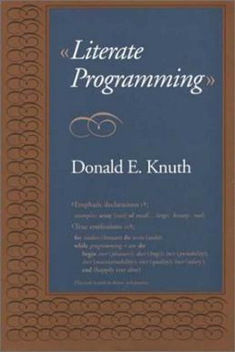
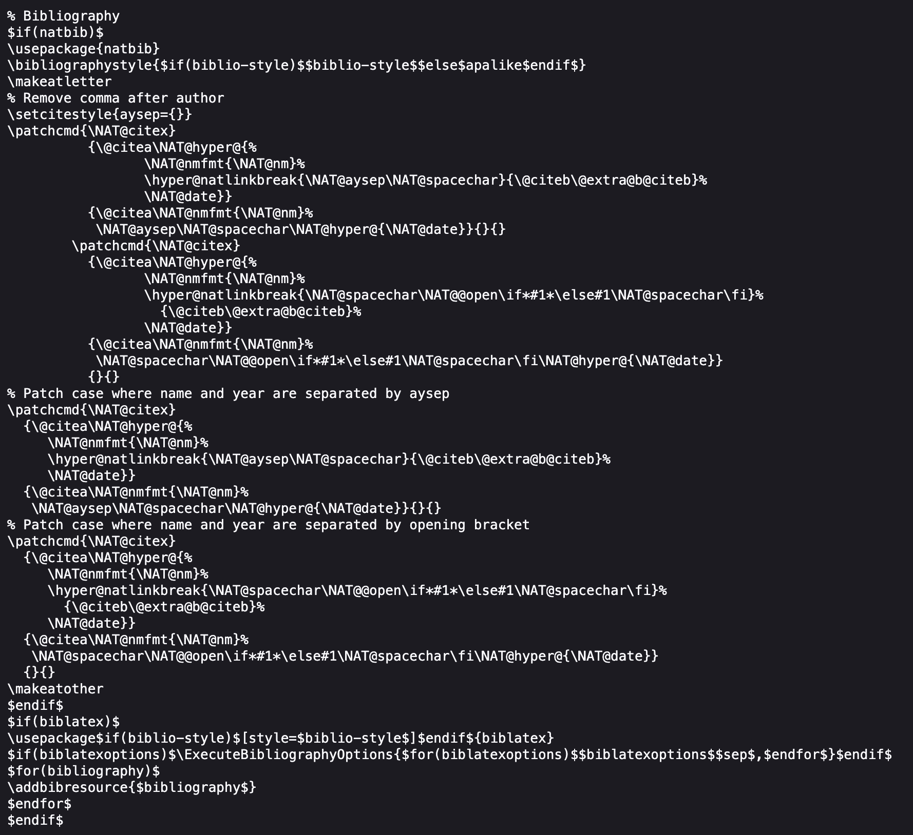
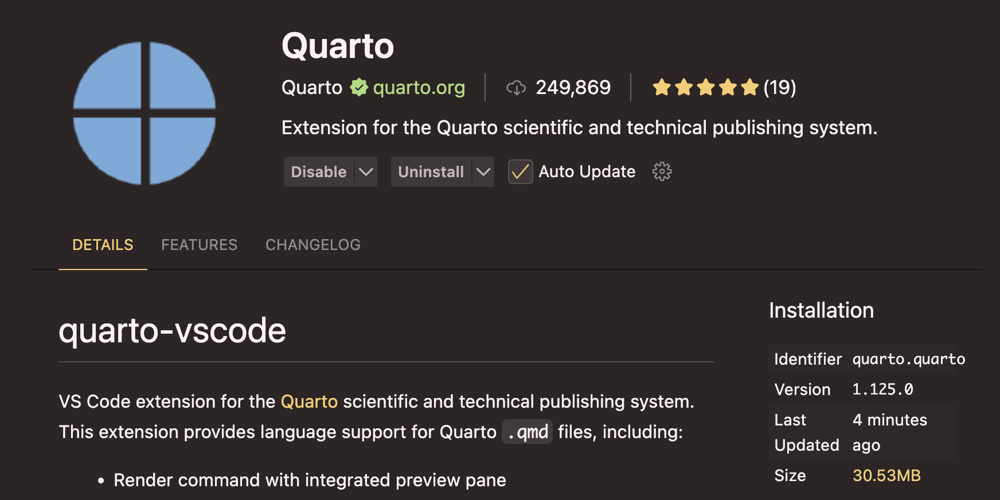

# Nice to see you all again! 😊 {background-color="#1B3A6B"}

## Recap of our last lectures
### Before the quiz, we covered

:::{style="margin-top: 30px; font-size: 26px;"}
:::{.columns}
:::{.column width="50%"}
- The [command line]{.alert}: navigation, file management, text tools, pipes, and scripts
- [Git]{.alert}: repositories, staging, commits, branches, and merges
- [GitHub]{.alert}: remotes, forks, pull requests, issues, and the `gh` CLI
- Last class you put all of it to work in [quiz 01]{.alert}
- Congratulations, that was the hardest setup work of the course 🎉
:::

:::{.column width="50%"}
:::{style="text-align: center;"}
[{width="90%"}](#){data-modal-type="image" data-modal-url="figures/quiz-01.png"}
:::
:::
:::
:::

## Today's lecture

:::{style="margin-top: 30px; font-size: 25px;"}
:::{.columns}
:::{.column width="50%"}
A new module starts today: [can anyone check your work?]{.alert}

- The [reproducibility crisis]{.alert}: why published research often fails when re-run
- Habits that prevent it: project structure, raw data, paths, seeds, environments
- [Literate programming]{.alert}: text, code and results in one file
- [Quarto](https://quarto.org/): installing it and writing your first document
- Next class: PDFs, citations, websites and parameterised reports
:::

:::{.column width="50%"}
:::{style="text-align: center;"}
[{width="100%"}](#){data-modal-type="image" data-modal-url="figures/quarto.png"}
:::
:::
:::
:::

## Tweets of the day

:::{style="margin-top: 30px; font-size: 22px; text-align: center;"}
:::{.columns}
:::{.column width="50%"}
[{width="100%"}](#){data-modal-type="image" data-modal-url="figures/tweet-voxium.png"}

<https://x.com/v0xium/status/2101526107128529120>
:::

:::{.column width="50%"}
[{width="100%"}](#){data-modal-type="image" data-modal-url="figures/tweet-mitchellh.png"}

<https://x.com/mitchellh/status/2100249348345057389>
:::
:::
:::

# Why is reproducible research so important? 🤔 {background-color="#1B3A6B"}

## The reproducibility crisis

:::{style="margin-top: 30px; font-size: 26px;"}
:::{.columns}
:::{.column width="50%"}
- [Reproducibility](https://en.wikipedia.org/wiki/Reproducibility): someone using your data and code gets your results
- A low bar, yet [many published findings fail it]{.alert}
- The [reproducibility crisis](https://en.wikipedia.org/wiki/Replication_crisis) hit psychology, medicine and economics hardest. No empirical field escaped
- Causes: small samples, p-hacking, selective reporting, unshared code
- This course focuses on [code and data]{.alert}. Most computational results fail for a mundane reason
:::

:::{.column width="50%"}
:::{style="text-align: center; font-size: 18px;"}
[{width="50%"}](#){data-modal-type="image" data-modal-url="figures/power-posing.jpg"}

Amy Cuddy's "power posing": 78 million TED views, [but its hormone effects failed to replicate](https://doi.org/10.1177/0956797614553946)
:::
:::
:::
:::

## How bad is it? Two famous papers

:::{style="margin-top: 30px; font-size: 20px;"}
:::{.columns}
:::{.column width="50%"}
**Medicine**

:::{style="text-align: center;"}
[{width="65%"}](#){data-modal-type="image" data-modal-url="figures/ioannidis.png"}
:::

- [Ioannidis (2005)](https://doi.org/10.1371/journal.pmed.0020124), one of the most cited papers in medicine
- For most study designs, a positive finding is [more likely false than true]{.alert}
- Causes: small samples, flexible analyses, financial interests, many teams chasing one question
:::

:::{.column width="50%"}
**Psychology**

:::{style="text-align: center;"}
[{width="80%"}](#){data-modal-type="image" data-modal-url="figures/science.png"}
:::

- [Open Science Collaboration (2015)](https://www.science.org/doi/10.1126/science.aac4716): 270 researchers re-ran 100 psychology experiments
- Originals: 97% significant. Replications: [36%]{.alert}, with effects halved
- Journals responded with pre-registration, open data and registered reports
:::
:::
:::

## We all write code, so we are fine, right?

:::{style="margin-top: 30px; font-size: 24px;"}
:::{.columns}
:::{.column width="45%"}
:::{style="text-align: center; font-size: 16px;"}
[{width="90%"}](#){data-modal-type="image" data-modal-url="figures/sdata.png"}

<https://www.nature.com/articles/s41597-022-01143-6>
:::
:::

:::{.column width="55%"}
:::{style="margin-top: 30px;"}
- [Trisovic et al. (2022)](https://www.nature.com/articles/s41597-022-01143-6) re-ran 9,078 `R` files from 2,109 replication packages on Harvard Dataverse
- [74% failed]{.alert} on the first run. 56% still failed after automated fixes
- Common causes: missing packages, hardcoded paths, changed functions, missing data
- Authors [chose to deposit]{.alert} these files with their papers
- Imagine the code they did not publish 😅
:::
:::
:::
:::

## Five selfish reasons to work reproducibly

:::{style="margin-top: 30px; font-size: 26px;"}
[Markowetz (2015)](https://doi.org/10.1186/s13059-015-0850-7) argues reproducibility helps you, too:

1. [Avoid disaster]{.alert}: catch your errors before a reviewer, a retraction or a job interview does
2. [Easier writing]{.alert}: when the data change, every number and figure updates
3. [Reviewers see it your way]{.alert}: they run your analysis instead of guessing
4. [Continuity]{.alert}: a new collaborator, or future-you, can pick it up tomorrow
5. [Reputation]{.alert}: working, shared code shows you know what you are doing

:::{.fragment style="margin-top: 15px;"}
Reason 2 will save you hours in this course. Reason 1 returns in a few slides, with two famous economists
:::
:::

# What does it take to be reproducible? {background-color="#1B3A6B"}

## The reproducibility ladder

:::{style="margin-top: 30px; font-size: 25px;"}
:::{.columns}
:::{.column width="52%"}
- These words mean different things:

:::{.incremental}
- [Re-runnable]{.alert}: the code runs again on your machine, today
- [Reproducible]{.alert}: same code and data give the same results, on any machine
- [Reusable]{.alert}: others can apply your work to new questions
- [Replicable]{.alert}: new, independent data give the same finding
- Each step is harder than the one below it
- Replicability needs data you may never get, so it is mostly outside your control
:::

:::{.fragment style="margin-top: 15px;"}
[Reproducibility is fully in your control]{.alert}, so this course grades you on it
:::
:::

:::{.column width="48%"}
:::{style="display: flex; align-items: stretch; gap: 14px; margin-top: 10px;"}
:::{style="display: flex; flex-direction: column; justify-content: space-between; align-items: center; font-size: 17px; color: #555; padding: 6px 0;"}
harder

▲

│

│

easier
:::

:::{style="flex: 1; display: flex; flex-direction: column; gap: 8px; text-align: center; font-size: 19px;"}
[replicable]{style="background:#1B3A6B; color:#fff; padding:9px; border-radius:6px; display:block;"}

[reusable]{style="background:#3A5B8C; color:#fff; padding:9px; border-radius:6px; display:block;"}

[reproducible]{style="background:#6E8AB0; color:#fff; padding:9px; border-radius:6px; display:block;"}

[re-runnable]{style="background:#C3CFDE; color:#1B3A6B; padding:9px; border-radius:6px; display:block;"}
:::
:::

:::{style="font-size: 18px; margin-top: 15px; text-align: center;"}
In one large study, most deposited R files did not clear the first step
:::
:::
:::
:::

## What a reproducible project needs

:::{style="margin-top: 30px; font-size: 26px;"}
A result is reproducible only if [all four of these travel together]{.alert}:

:::{.columns}
:::{.column width="50%"}
1. [Code]{.alert}: every step from raw data to final number, runnable
2. [Data]{.alert}: the raw inputs, or a script that fetches them
:::

:::{.column width="50%"}
3. [Environment]{.alert}: the language and package versions
4. [Documentation]{.alert}: what the project does and the run order
:::
:::

:::{style="margin-top: 25px;"}
[Leave one out and it fails]{.alert}:

- No data: readers cannot check your code
- No environment: it runs today and breaks next year
- No documentation: nobody knows which script runs first
:::
:::

## Project structure

:::{style="margin-top: 30px; font-size: 23px;"}
:::{.columns}
:::{.column width="48%"}
- [One folder per project]{.alert}, with the same layout every time
- We use it for the rest of the course, and [the final project requires it]{.alert}

```{verbatim}
my-project/
├── data/
│   ├── raw/          # never edited by hand
│   └── clean/        # built by scripts
├── scripts/          # the code, in run order
├── output/           # figures and tables
└── README.md         # what and how
```
:::

:::{.column width="52%"}
- `data/raw/` holds your [inputs]{.alert}. Everything else can be rebuilt from it
- `data/raw/` is [read-only]{.alert}: download once, never edit
- Numbered scripts (`01-clean.py`, `02-analyse.py`) show the run order
- `data/clean/` and `output/` are disposable: the scripts rebuild them
- Put them in `.gitignore` and commit only sources
- `README.md` explains the project to the next person, usually you in six months

:::{style="margin-top: 15px;"}
[Delete everything except `data/raw/` and `scripts/`. Can you rebuild the project?]{.alert}
:::
:::
:::
:::

## Every project needs a README

:::{style="margin-top: 30px; font-size: 24px;"}
:::{.columns}
:::{.column width="45%"}
- GitHub shows a README on [every repository page]{.alert}
- It answers [what is this]{.alert}, [how do I rebuild it]{.alert} and [in what order]{.alert}
- List each data source and its download date, so stale data is easy to spot
- List the rebuild commands in run order, ready to paste
- Note the language and package versions (more in a minute)
- Ten lines are enough. Start early and keep it current
:::

:::{.column width="55%"}
```{verbatim}
# Rainfall and crop yields in Brazil

Analysis of rainfall and maize yields, 2000-2024.

## Data
- data/raw/rainfall.csv: INMET, downloaded 12 Sep 2026
- data/raw/yields.csv: IBGE, downloaded 12 Sep 2026

## How to rebuild
Run the scripts in order:

    python scripts/01-clean.py
    python scripts/02-analyse.py
    quarto render report.qmd

## Environment
Python 3.13, pandas 3.0, matplotlib 3.10
```
:::
:::
:::

## The most famous spreadsheet error in economics

:::{style="margin-top: 30px; font-size: 23px;"}
:::{.columns}
:::{.column width="55%"}
- [Reinhart and Rogoff (2010)](https://www.aeaweb.org/articles?id=10.1257/aer.100.2.573), "Growth in a Time of Debt": above [90% debt-to-GDP]{.alert}, growth turns negative
- After 2008, it became the standard citation for [austerity]{.alert}
- In 2013, graduate student Thomas Herndon could not reproduce it and asked for the spreadsheet
- One formula [averaged rows 30 to 44, not 30 to 49]{.alert}, dropping five countries
- With two other fixes (excluded data, odd weighting), growth above 90% was [+2.2%, not -0.1%](https://doi.org/10.1093/cje/bet075)
- The analysis sat in a [private spreadsheet]{.alert}, so three years of policy debate passed before anyone noticed
- A public script and dataset would have caught it in an afternoon
:::

:::{.column width="45%"}
:::{style="text-align: center; margin-top: 20px;"}
[{width="100%"}](#){data-modal-type="image" data-modal-url="figures/reinhart-rogoff-error.png"}
:::
:::
:::
:::

## The absolute path problem

:::{style="margin-top: 30px; font-size: 24px;"}
:::{.columns}
:::{.column width="52%"}
A top reason code fails on another machine:

:::{style="font-size: 18px;"}
```{.python filename="analysis.py"}
import pandas as pd

df = pd.read_csv("/Users/ana/Desktop/project/data/raw/rainfall.csv")
```
:::

Anyone else who runs it gets:

:::{style="font-size: 22px;"}
```{verbatim}
FileNotFoundError: [Errno 2] No such file
or directory:
'/Users/ana/Desktop/project/data/raw/rainfall.csv'
```
:::
:::

:::{.column width="48%"}
- An [absolute path]{.alert} starts at `/` and names one spot on one machine
- Only Ana has `/Users/ana`, so the script fails everywhere else
- A [relative path]{.alert} starts from the [working directory]{.alert}, like `pwd` in the shell
- A program inherits it from where you launch it, so "it works for me" proves little
- Hardcoded paths were a top cause of failure in the Trisovic study
:::
:::
:::

## Relative paths fix it

:::{style="margin-top: 30px; font-size: 21px;"}
:::{.columns}
:::{.column width="52%"}
Write paths [relative to the project folder]{.alert}:

```{.python filename="analysis.py"}
import pandas as pd

df = pd.read_csv("data/raw/rainfall.csv")
```

Or build them with `pathlib`:

```{.python filename="analysis.py"}
from pathlib import Path

raw = Path("data") / "raw" / "rainfall.csv"
df = pd.read_csv(raw)
```
:::

:::{.column width="48%"}
- `pathlib` picks the right separator on macOS, Linux and Windows
- Quarto runs each document from [the folder holding the `.qmd` file]{.alert}
- Avoid `os.chdir()`: it changes state mid-script and makes the code hard to follow

:::{.fragment style="margin-top: 20px;"}
[If your code contains your username, it is not reproducible]{.alert}
:::
:::
:::
:::

## Randomness needs a seed

:::{style="margin-top: 30px; font-size: 22px;"}
:::{.columns}
:::{.column width="50%"}
Without a seed, every run gives new numbers:

```{python}
#| echo: true
import numpy as np

print(np.random.normal(size=3).round(3))
print(np.random.normal(size=3).round(3))
```

With a seed, everyone gets the same sequence:

```{python}
#| echo: true
np.random.seed(350)
print(np.random.normal(size=3).round(3))

np.random.seed(350)
print(np.random.normal(size=3).round(3))
```
:::

:::{.column width="50%"}
- `np.random` is not truly random. It is a [pseudorandom generator]{.alert}: a formula that walks a fixed sequence
- The [seed]{.alert} sets the starting point, which fixes the whole sequence
- Newer code uses a generator object:

```{.python}
rng = np.random.default_rng(350)
rng.normal(size=3)
```

- Python's `random` has its own generator. scikit-learn needs `random_state=`
- Randomness hides in sampling, train-test splits and model starting weights
- [Seed every random draw]{.alert}
:::
:::
:::

## Record your environment

:::{style="margin-top: 30px; font-size: 23px;"}
:::{.columns}
:::{.column width="50%"}
- Packages change: new arguments, flipped defaults, removed methods
- Code from 2024 may give different numbers in 2026, or not run. This is [version drift]{.alert}
- Record your versions so others can match them

At minimum, note them in your README:

```{python}
#| echo: true
import sys, numpy, pandas

print("python:", sys.version.split()[0])
print("numpy :", numpy.__version__)
print("pandas:", pandas.__version__)
```
:::

:::{.column width="50%"}
`pip` lists every package. `python -m` uses the Python you actually run:

```{.bash filename="Terminal"}
python -m pip list
```

```{verbatim}
Package         Version
--------------- -------
jupyter_client  8.6.3
matplotlib      3.10.8
numpy           2.4.3
pandas          3.0.2
```

:::{.fragment style="margin-top: 20px;"}
A version list helps diagnose failures. [Module 08 adds tools that prevent them]{.alert}: virtual environments, `uv` and containers
:::
:::
:::
:::

# Literate programming {background-color="#1B3A6B"}

## Literate programming

:::{style="margin-top: 30px; font-size: 24px;"}
:::{.columns}
:::{.column width="50%"}
- Now a tool for the biggest habit: [text, code and results in one file]{.alert}
- [Donald Knuth](https://en.wikipedia.org/wiki/Donald_Knuth) coined [literate programming]{.alert} in 1984: write for humans first, machines second
- Two operations split the file:
  - [Weaving]{.alert}: the readable document (HTML, PDF)
  - [Tangling]{.alert}: the executable code
- Explaining your steps catches bad logic early
- Numbers come from the code, so [they cannot go stale]{.alert}
:::

:::{.column width="50%"}
:::{style="text-align: center;"}
[{width="60%"}](#){data-modal-type="image" data-modal-url="figures/book.jpg"}
:::
:::
:::
:::

## From LaTeX to Quarto

:::{style="margin-top: 30px; font-size: 21px;"}
:::{.columns}
:::{.column width="55%"}
- [LaTeX](https://www.latex-project.org/) came first: beautiful output, verbose syntax, steep learning curve (I've been there 😅)
- [Markdown](https://en.wikipedia.org/wiki/Markdown) kept the ideas with a simpler syntax: `**bold**`, `- list`, `[link](url)`
- [R Markdown](https://rmarkdown.rstudio.com/) added R chunks, and [Jupyter](https://jupyter.org/) did the same for Python
- Both struggle with [mixed languages or output formats]{.alert}
- [Quarto](https://quarto.org/) (2022, Posit) rebuilt R Markdown for [any language]{.alert}: Python, R, Julia, Observable JS
- One `.qmd` renders to HTML, PDF, Word, slides, websites, books and dashboards
- [Pandoc](https://pandoc.org/) does the final conversion
- These slides, the course website and every course PDF use Quarto
:::

:::{.column width="45%"}
:::{style="text-align: center;"}
[{width="100%"}](#){data-modal-type="image" data-modal-url="figures/latex.png"}
:::
:::
:::
:::

## What Quarto can produce

:::{style="margin-top: 30px; font-size: 24px;"}
:::{.columns}
:::{.column width="60%"}
::: {layout-ncol="2"}
[{width="55%"}](#){data-modal-type="image" data-modal-url="figures/report.png"}

[{width="100%"}](#){data-modal-type="image" data-modal-url="figures/dashboard.png"}

[{width="100%"}](#){data-modal-type="image" data-modal-url="figures/book-2.png"}

[{width="100%"}](#){data-modal-type="image" data-modal-url="figures/website.png"}
:::
:::

:::{.column width="40%"}
- Clockwise from top left: a company report, an [interactive dashboard](https://jjallaire.github.io/gapminder-dashboard/), a website, and a book
- All four are plain text, so they [work well with Git]{.alert}
- Only the `format:` line changes
- Click any image to zoom in
:::
:::
:::

## How does Quarto work?

:::{style="margin-top: 30px; font-size: 24px;"}
:::{.columns}
:::{.column width="50%"}
```{mermaid}
%%| fig-width: 10
%%| fig-height: 9
%%{
  init: {
    "theme": "dark",
    "themeCSS": ".label foreignObject, .cluster-label foreignObject { font-size: 90%; overflow: visible; }"
  }
}%%
flowchart LR
  A1[qmd] --> C{"knitr<br>(R)"}
  A1[qmd] --> B{"Jupyter<br>(Python)"}
  A2[ipynb] --> B{"Jupyter<br>(Python)"}
  B --> D[md]
  C --> D[md]
  D --> E{Pandoc}
  E --> F[pdf]
  E --> G[docx]
  E --> H[html]
  E --> I[...]

  subgraph engine [Engine]
  B
  C
  end
```
:::

:::{.column width="50%"}
- Quarto reads `.qmd` files and Jupyter notebooks (`.ipynb`). A [YAML cell](https://quarto.org/docs/tools/jupyter-lab.html) on top is optional
- Pipeline: `.qmd` → engine (Jupyter or knitr) → `.md` → [Pandoc](https://pandoc.org/) → output
- Pandoc turns Markdown into HTML, PDF, Word and [dozens of other formats](https://pandoc.org/MANUAL.html)
- Quarto calls Pandoc for you, with the options from your YAML header
:::
:::
:::

# Getting Quarto running 🛠️ {background-color="#1B3A6B"}

## Installing Quarto

:::{style="margin-top: 30px; font-size: 23px;"}
:::{.columns}
:::{.column width="55%"}
:::{style="text-align: center;"}
[{width="90%"}](#){data-modal-type="image" data-modal-url="figures/quarto-download.png"}

<https://quarto.org/docs/download/>
:::
:::

:::{.column width="45%"}
- Download the installer on the left, or use a package manager
- On macOS, with [Homebrew](https://brew.sh/):

```{.bash filename="Terminal"}
brew install --cask quarto
```

- On Windows, install Quarto [inside WSL](https://quarto.org/docs/download/), next to your shell and Git
- PDFs also need LaTeX. Install the lightweight [TinyTeX](https://yihui.org/tinytex/):

```{.bash filename="Terminal"}
quarto install tinytex
```
:::
:::
:::

## Did it work? Ask Quarto itself

:::{style="margin-top: 30px; font-size: 22px;"}
```{.bash filename="Terminal"}
quarto check
```

```{verbatim}
Quarto 1.9.38
[✓] Checking environment information...
[✓] Checking versions of quarto binary dependencies...
      Pandoc version 3.8.3: OK
      Dart Sass version 1.87.0: OK
[✓] Checking Quarto installation......OK
      Version: 1.9.38
[✓] Checking tools....................OK
      TinyTeX: v2026.04
[✓] Checking LaTeX....................OK
[✓] Checking basic markdown render....OK
[✓] Checking Python 3 installation....OK
      Version: 3.13.13
      Jupyter: 5.9.1
```

Run this first when something breaks. Your versions will differ from mine
:::

## Write in whatever editor you like

:::{style="margin-top: 30px; font-size: 24px;"}
:::{.columns}
:::{.column width="50%"}
- A `.qmd` file is [plain text]{.alert}: VS Code, RStudio, Jupyter Lab, Neovim, even Notepad work
- We use [VS Code with the Quarto extension](https://marketplace.visualstudio.com/items?itemName=quarto.quarto): highlighting, completion, a render button and live preview
- Install it from the [Extensions marketplace]{.alert}
- Its [visual editor](https://quarto.org/docs/visual-editor/vscode/) renders Markdown as you type. Try both modes
:::

:::{.column width="50%"}
:::{style="text-align: center; margin-top: -20px;"}
[{width="100%"}](#){data-modal-type="image" data-modal-url="figures/quarto-vscode.png"}

:::{style="font-size: 16px;"}
[Quarto extension for VS Code](https://marketplace.visualstudio.com/items?itemName=quarto.quarto)
:::
:::
:::
:::
:::

## Rendering from the terminal

:::{style="margin-top: 30px; font-size: 24px;"}
`quarto --help` lists every command. These do most of the work:

```{.bash filename="Terminal"}
## Render a file to its default format
quarto render report.qmd

## Render to a specific format
quarto render report.qmd --to pdf

## Render, open in the browser, and re-render on every save
quarto preview report.qmd
```

:::{.fragment style="margin-top: 20px;"}
- [`render`]{.alert} builds the document once, when you are done
- [`preview`]{.alert} keeps a live version open while you write
- Output lands next to the source (`report.qmd` → `report.html`), unless a project sets `output-dir`
:::
:::

# Your first Quarto document {background-color="#1B3A6B"}

## Anatomy of a Quarto document

:::{style="margin-top: 30px; font-size: 24px;"}
- A Quarto document has a [YAML header]{.alert}, [code chunks]{.alert} and [Markdown text]{.alert}
- We look at each in turn. Markdown in depth comes next lecture

::: {layout-ncol="3"}
[{width="100%"}](#){data-modal-type="image" data-modal-url="figures/yaml.png"}

[{width="100%"}](#){data-modal-type="image" data-modal-url="figures/code-chunks.png"}

[{width="100%"}](#){data-modal-type="image" data-modal-url="figures/markdown-text.png"}
:::
:::

## The YAML header

:::{style="margin-top: 30px; font-size: 24px;"}
:::{.columns}
:::{.column width="50%"}
``` yaml
---
title: "Rainfall report"
author: "Your name"
date: 2026-10-06
format:
  html:
    toc: true
    code-fold: true
execute:
  warning: false
jupyter: python3
---
```
:::

:::{.column width="50%"}
- YAML stands for "YAML Ain't Markup Language" (a recursive joke). It describes [data]{.alert}
- It sits at the top, between two `---` lines
- `key: value` pairs, where [indentation creates nesting]{.alert}. Use spaces: tabs are illegal for indentation
- `format: html` is the short form. Indent under it to add options
- `execute:` sets defaults for [every chunk]{.alert}
- Quote values that contain a colon: `title: "Quarto: a first look"`
- `_quarto.yml`, GitHub Actions and Docker Compose use the same syntax
:::
:::
:::

## Code chunks

:::{style="margin-top: 30px; font-size: 24px;"}
:::{.columns}
:::{.column width="50%"}
```` markdown
```{{python}}
#| label: fig-rainfall
#| echo: false
#| warning: false

import matplotlib.pyplot as plt

plt.bar(rain["month"], rain["mm"])
plt.ylabel("Rainfall (mm)")
plt.show()
```
````
:::

:::{.column width="50%"}
- Three backticks and `{python}` open a chunk; three backticks close it
- On render, the chunk [runs]{.alert} and its output goes into the document
- `#|` lines are [chunk options]{.alert}, in YAML syntax
- Here they label the figure and hide the code and warnings
:::
:::
:::

## The chunk options you will use most

:::{style="margin-top: 30px; font-size: 24px;"}
:::{.columns}
:::{.column width="55%"}
:::{style="text-align: center;"}
| Option | Effect |
|:-------|:-------|
| `echo: false` | hide the code, keep the output |
| `eval: false` | show the code, do not run it |
| `include: false` | run the code, show nothing |
| `warning: false` | hide warnings |
| `label: fig-rain` | name the chunk for cross-references |
| `fig-cap: "..."` | put a caption under the figure |
| `layout-ncol: 2` | arrange the outputs in columns |
:::
:::

:::{.column width="45%"}
- `#|` options apply to [one chunk]{.alert}
- [Document-wide]{.alert} defaults go in the YAML header:

```yaml
execute:
  echo: false
  warning: false
```

- Chunk options override these, so you can hide all code but show one chunk
- Cross-references need a [prefixed label]{.alert}: `fig-`, `tbl-`, `eq-`, `sec-`, `lst-`
- `@fig-rain` then prints "Figure 1", numbered for you
- Full list in the [Quarto documentation](https://quarto.org/docs/computations/execution-options.html)
:::
:::
:::

## Chunk options in action

:::{style="margin-top: 30px; font-size: 24px;"}
:::{.columns}
:::{.column width="46%"}
`layout-ncol: 2` puts two plots side by side; `echo: false` hides the code:

```` markdown
```{{python}}
#| echo: false
#| layout-ncol: 2

plt.bar(rain["month"], rain["mm"])
plt.show()

plt.plot(rain["month"], rain["mm"])
plt.show()
```
````
:::

:::{.column width="54%"}
What the reader sees:

```{python}
#| echo: false
#| layout-ncol: 2

import pandas as pd
import matplotlib.pyplot as plt

rain = pd.DataFrame({
    "month": ["Jan", "Feb", "Mar", "Apr"],
    "mm": [241, 215, 180, 96]
})

fig, ax = plt.subplots(figsize=(4, 3))
ax.bar(rain["month"], rain["mm"], color="#1B3A6B")
ax.set_ylabel("Rainfall (mm)")
plt.tight_layout()
plt.show()

fig, ax = plt.subplots(figsize=(4, 3))
ax.plot(rain["month"], rain["mm"], color="#1B3A6B", marker="o")
ax.set_ylabel("Rainfall (mm)")
plt.tight_layout()
plt.show()
```

Both figures come from the code at render time. [Change the data and they update]{.alert}
:::
:::
:::

## Engines: what actually runs your code

:::{style="margin-top: 30px; font-size: 23px;"}
:::{.columns}
:::{.column width="55%"}
- Quarto runs no code itself. It hands chunks to an [engine]{.alert}
- [Jupyter]{.alert} runs Python and any language with a Jupyter kernel. [knitr]{.alert} runs R
- [This course uses Jupyter]{.alert}. These slides render with `jupyter: python3`
- Each render starts [one fresh session]{.alert} and runs the chunks top to bottom
- Chunks share state like notebook cells: a variable from chunk one exists in chunk ten
- So every render is a [restart-and-run-all]{.alert} test
- A document that renders has just run its analysis from scratch
:::

:::{.column width="45%"}
```yaml
---
title: "My report"
format: html
jupyter: python3
---
```

:::{style="margin-top: 20px;"}
Quarto can usually detect the engine. Declaring it tells readers what to install.

To use R, write `{r}` chunks and Quarto picks knitr
:::
:::
:::
:::

## A minimal Python document

:::{style="margin-top: 30px; font-size: 24px;"}
:::{.columns}
:::{.column width="50%"}
```{verbatim}
---
title: "Palmer Penguins Demo"
format:
  html:
    code-fold: true
jupyter: python3
---

## Meet Quarto

Quarto enables you to weave together content and
executable code into a finished document. To learn
more about Quarto see <https://quarto.org>.

```{{python}}
#| echo: false

import seaborn as sns
from palmerpenguins import load_penguins
sns.set_style('whitegrid')

penguins = load_penguins()

g = sns.lmplot(x="flipper_length_mm",
               y="body_mass_g",
               hue="species",
               height=7,
               data=penguins,
               palette=['#FF8C00','#159090','#A034F0'])
g.set_xlabels('Flipper Length')
g.set_ylabels('Body Mass')
```
:::

:::{.column width="45%"}
- Thirty lines, with everything from today's lecture
- The [YAML header]{.alert} sets the title, format and engine
- `code-fold: true` hides code behind a toggle, but `echo: false` removes this chunk's code
- The prose is [Markdown]{.alert}, with a `##` heading
- One [chunk]{.alert} loads penguin data and draws a figure (needs `pip install palmerpenguins`)
- The next slide shows the result
:::
:::
:::

## The rendered page

:::{style="margin-top: 30px; font-size: 24px;"}
:::{.columns}
:::{.column width="55%"}
:::{style="text-align: center;"}
[{width="85%"}](#){data-modal-type="image" data-modal-url="figures/jupyter-plot.png"}
:::
:::

:::{.column width="45%"}
:::{style="margin-top: 20px;"}
- Title from the YAML, heading and prose from the Markdown, figure from the chunk
- `echo: false` wins over `code-fold: true`: only the figure shows
- Change the data and render again: [the figure and numbers follow]{.alert}
- The page can only show figures its own code produced
:::
:::
:::
:::

## Try it yourself! {#sec-exercise-01}

:::{style="margin-top: 30px; font-size: 21px;"}
:::{.columns}
:::{.column width="52%"}
Create a Quarto document from scratch and render it to HTML.

1. Make a new file called `weather.qmd`
2. Start it with this YAML header:

```yaml
---
title: "Rainfall report"
author: "Your name"
format: html
jupyter: python3
---
```

3. Add a `##` heading and a short paragraph
4. Add a chunk that builds the table below and prints it
5. Add a [second]{.alert} chunk that draws a bar chart, with its code hidden
6. Render the file and open the result
:::

:::{.column width="48%"}
Use this data so everyone gets the same answer:

```{.python}
import pandas as pd

rain = pd.DataFrame({
    "month": ["Jan", "Feb", "Mar", "Apr"],
    "mm": [241, 215, 180, 96]
})
```

:::{style="margin-top: 15px;"}
Stuck? See the chunk options slide. `quarto check` diagnoses a broken installation
:::

[[Answer: Appendix 01]{.button}](#sec-appendix-01)
:::
:::
:::

## Summary

:::{style="margin-top: 30px; font-size: 26px;"}
- The reproducibility crisis is real. Most computational results fail because [the code does not run]{.alert}
- The ladder: re-runnable → reproducible → reusable → replicable. This course gets you to step two
- [Code, data, environment and documentation]{.alert} travel together
- Habits: untouched raw data, cleaning in code, relative paths, seeds, recorded versions, a README
- [Literate programming]{.alert} keeps text, code and results in one file
- [Quarto]{.alert} is our tool: one plain-text `.qmd`, one `render` command, many formats
:::

## Next class

:::{style="margin-top: 30px; font-size: 25px;"}
:::{.columns}
:::{.column width="50%"}
- Quarto [in practice]{.alert}: Markdown, PDFs and automatic citations
- `freeze`: rendering [without re-running everything]{.alert}
- Slides (like these) and [websites]{.alert}, published from GitHub
- [Parameterised reports]{.alert}: one file, one report per country
- Bring a working Quarto installation. Today's exercise is the test 🤓
:::

:::{.column width="50%"}
:::{style="text-align: center; margin-top: 20px;"}
[{width="100%"}](#){data-modal-type="image" data-modal-url="figures/website.png"}
:::
:::
:::
:::

## Additional materials

:::{style="margin-top: 30px; font-size: 24px;"}
- [Quarto documentation](https://quarto.org/docs/guide/)
- [Quarto gallery](https://quarto.org/docs/gallery/), full example documents with their source code
- [Awesome Quarto](https://github.com/mcanouil/awesome-quarto#readme), a curated list of examples and extensions
- [Introduction to Quarto (video)](https://youtu.be/_f3latmOhew?si=18Gdq9HVK-j_G0eM)
- [Quarto for academics (video)](https://youtu.be/EbAAmrB0luA?si=7sgRwILesUKHPbiG)
- [Beautiful reports and presentations with Quarto (video - worth watching)](https://www.youtube.com/live/hbf7Ai3jnxY?si=3LDtD38oFj8NCu21)
- [The Turing Way](https://book.the-turing-way.org/), a community handbook on reproducible data science
- [Sandve et al. (2013), "Ten Simple Rules for Reproducible Computational Research"](https://doi.org/10.1371/journal.pcbi.1003285), still true a decade later
- [Markowetz (2015), "Five selfish reasons to work reproducibly"](https://doi.org/10.1186/s13059-015-0850-7)
- ["The student who caught out the profs" (BBC)](https://www.bbc.com/news/magazine-22223190), the Reinhart and Rogoff story
:::

# And that's all for today! 🥳 {background-color="#1B3A6B"}

# Thank you very much and see you soon! 😊 🙏🏼 {background-color="#1B3A6B"}

## Appendix 01: Solution to the exercise {#sec-appendix-01}

:::{style="margin-top: 30px; font-size: 18px;"}
:::{.columns}
:::{.column width="55%"}
The complete `weather.qmd`:

````{verbatim}
---
title: "Rainfall report"
author: "Your name"
format: html
jupyter: python3
---

## Rainfall in the first four months

Rainfall fell steadily from January to April, with April
receiving less than half of January's total.

```{{python}}
import pandas as pd

rain = pd.DataFrame({
    "month": ["Jan", "Feb", "Mar", "Apr"],
    "mm": [241, 215, 180, 96]
})

rain
```

```{{python}}
#| echo: false

import matplotlib.pyplot as plt

plt.bar(rain["month"], rain["mm"], color="#1B3A6B")
plt.ylabel("Rainfall (mm)")
plt.show()
```
````

Then render it:

```{.bash filename="Terminal"}
quarto render weather.qmd
```
:::

:::{.column width="45%"}
`#| echo: false` hides the code and keeps the output, as task 5 asked.

The chart your second chunk produces:

```{python}
#| echo: false
#| fig-align: center

fig, ax = plt.subplots(figsize=(5, 3.2))
ax.bar(rain["month"], rain["mm"], color="#1B3A6B")
ax.set_ylabel("Rainfall (mm)")
ax.spines[["top", "right"]].set_visible(False)
plt.tight_layout()
plt.show()
```

[[Back to the main text]{.button}](#sec-exercise-01)
:::
:::
:::
