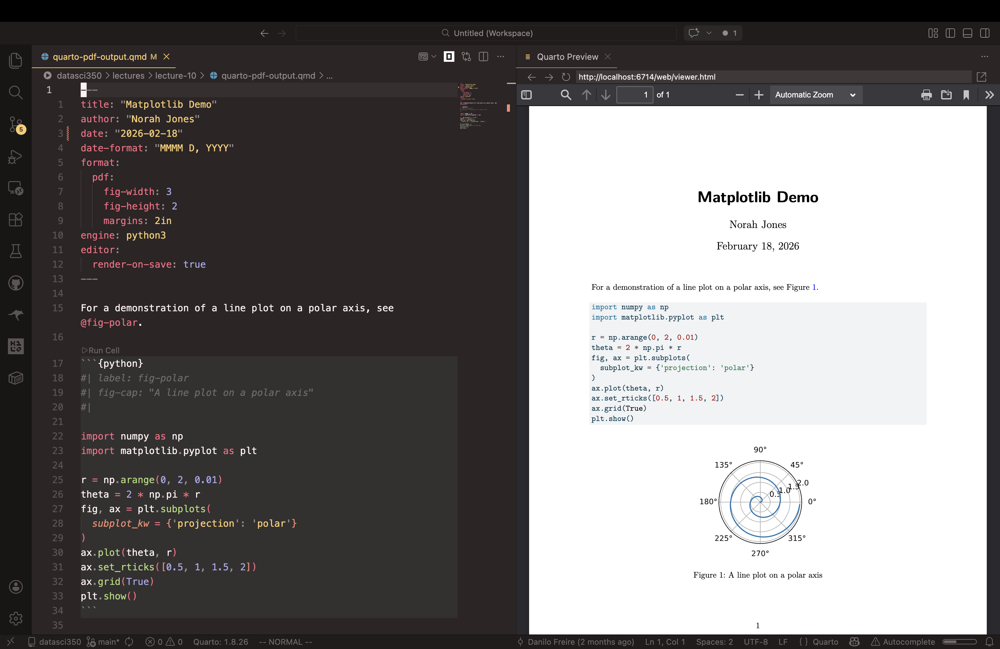
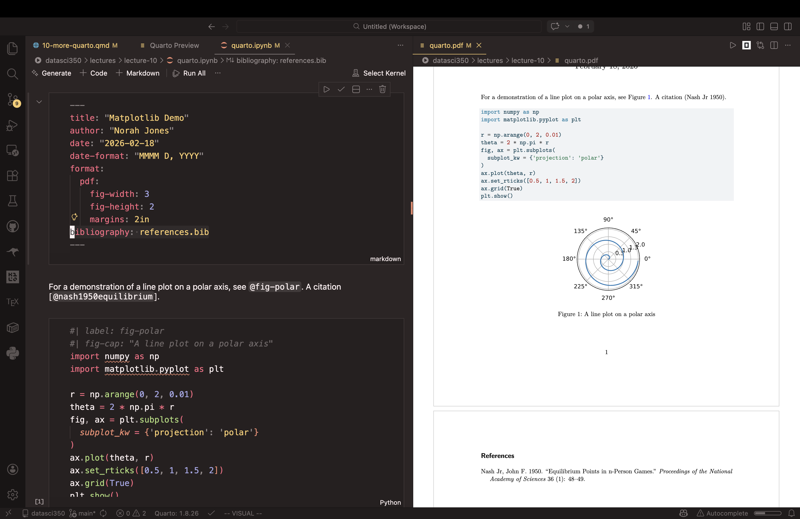
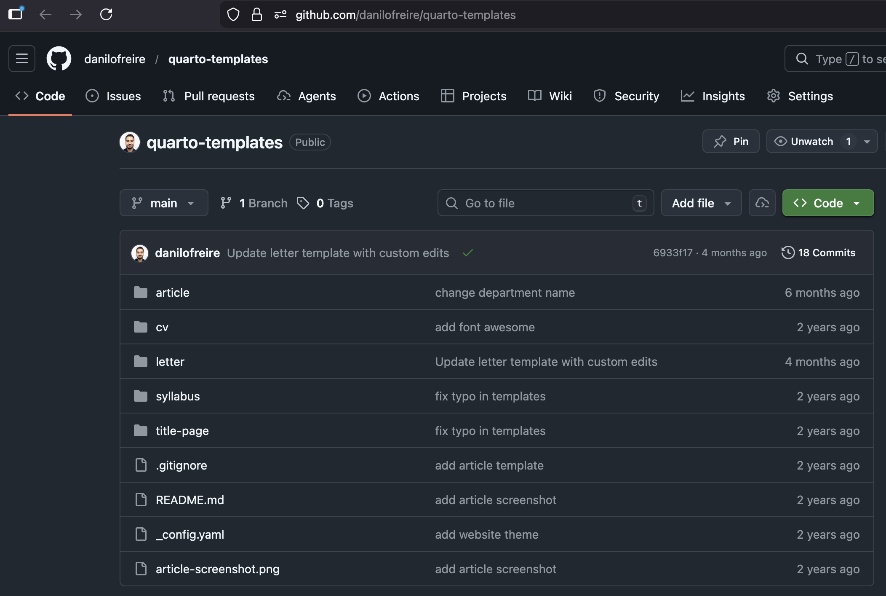
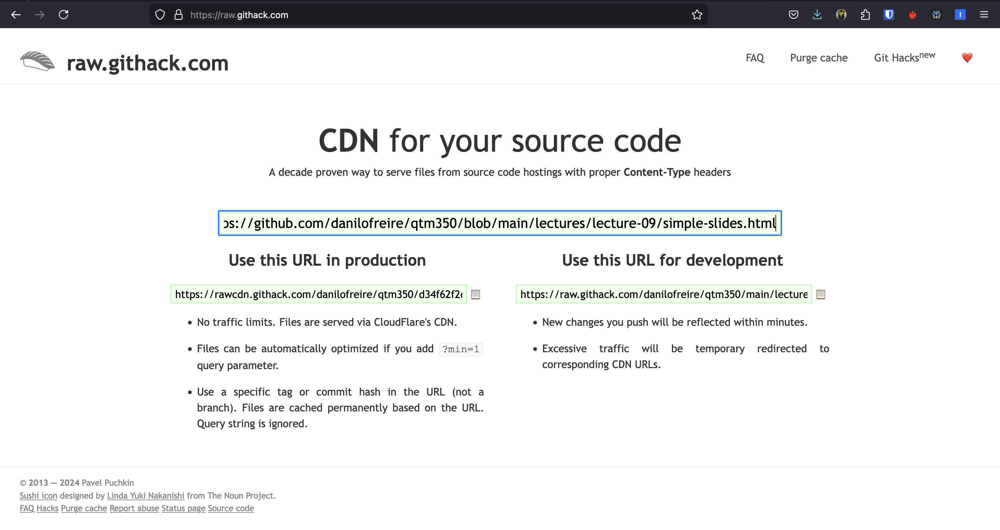
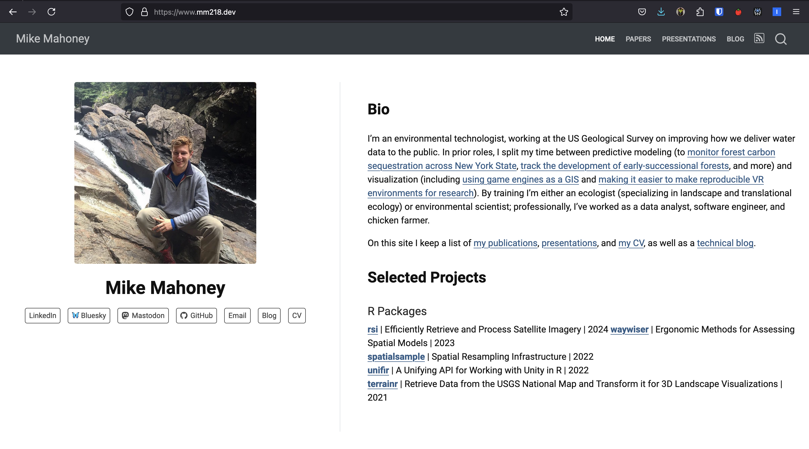
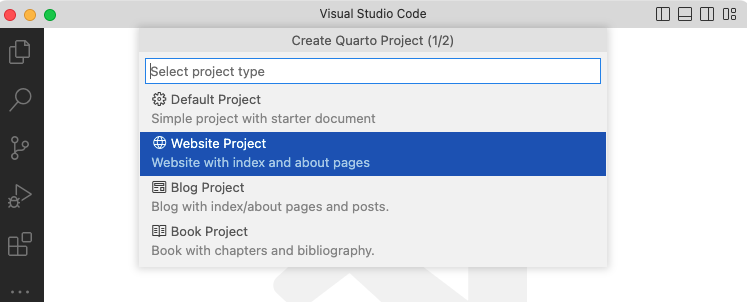
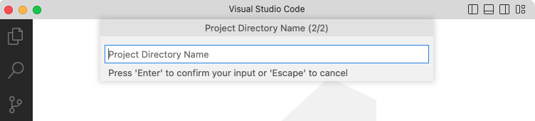
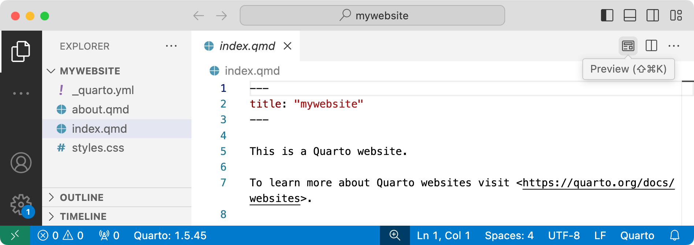
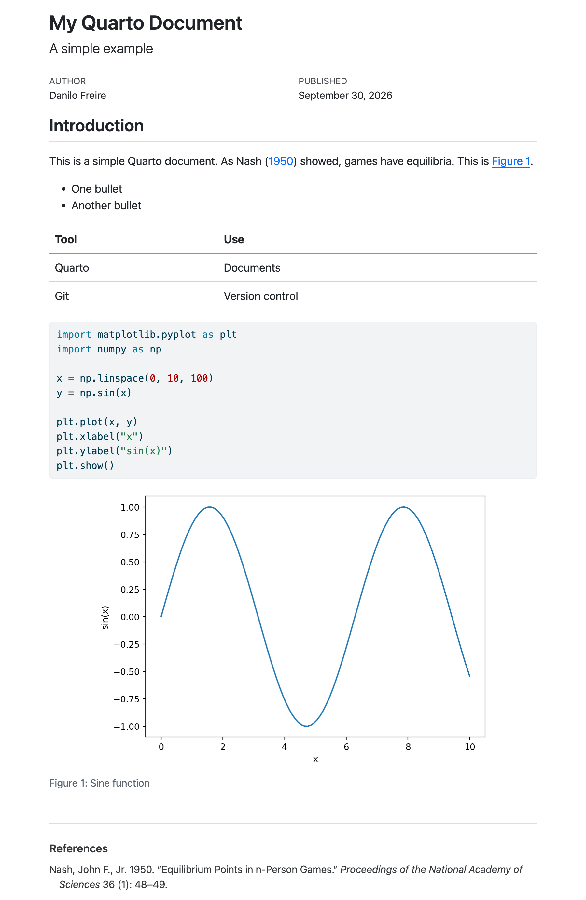

# Hello, everyone! 😊 {background-color="#1B3A6B"}

## Recap of our last lecture
### In our last class, we covered

:::{style="margin-top: 30px; font-size: 22px;"}
:::{.columns}
:::{.column width="50%"}
- The [reproducibility crisis]{.alert}: most results fail because the code does not run
- Habits that fix it: project structure, untouched raw data, relative paths, seeds, recorded versions
- [Quarto]{.alert}: a [YAML header]{.alert}, [Markdown]{.alert} and [code chunks]{.alert}
- `quarto render` builds a document; `quarto preview` keeps a live one open
- Every render is a [restart-and-run-all]{.alert} test
- You rendered your first document. Today [we put Quarto to work]{.alert}
:::

:::{.column width="50%"}
````markdown
---
title: My Quarto Document
subtitle: A simple example
author: Danilo Freire
date: 2026-09-18
format:
  html:
    theme: cosmo
    embed-resources: true
---

# Introduction

This is a simple Quarto document.

```{{python}}
print("Hello, world!")
```

## Subsection

[Link](https://www.emory.edu).
````
:::
:::
:::

## Today's lecture

:::{style="margin-top: 30px; font-size: 24px;"}
:::{.columns}
:::{.column width="50%"}
Last class you rendered one HTML page. Today:

- [Markdown]{.alert} beyond the basics: tables, footnotes, maths
- [PDFs]{.alert}, and [citations]{.alert} formatted from a `.bib` file
- `freeze`: rendering [without re-running everything]{.alert}
- [Slides]{.alert} (like these) and [websites]{.alert}, published free from GitHub
- [Parameterised reports]{.alert}: one file, one report per country
- Two exercises, so keep your laptop charged
:::

:::{.column width="50%"}
:::{style="text-align: center; margin-top: 20px;"}
[{width="100%"}](#){data-modal-type="image" data-modal-url="figures/voila.png"}
:::
:::
:::
:::

# Markdown, PDFs, and citations 🛠️ {background-color="#1B3A6B"}

## Markdown you will use every week

:::{style="margin-top: 30px; font-size: 24px;"}
:::{.columns}
:::{.column width="50%"}
:::{style="text-align: center;"}
| You type | You get |
|:---------|:--------|
| `**bold**`, `*italic*` | **bold**, *italic* |
| `~~scratch that~~` | ~~scratch that~~ |
| `[text](url)` | a [link]{.alert} |
| `` | an image |
| `` `code` `` | `code` |
| `> quote` | a blockquote |
| `2^10^`, `H~2~O` | 2^10^, H~2~O |
| `footnote[^1]` | a numbered footnote |
:::
:::

:::{.column width="50%"}
- Tables use pipes and dashes. Colons set the alignment

:::{style="text-align: center; margin-bottom: 30px; margin-top: 30px;"}
```markdown
| Left | Centre | Right |
|:-----|:------:|------:|
| a    | b      | c     |
```
:::

- Maths is LaTeX between dollar signs: `$\mu = \frac{1}{n}\sum x_i$` inline, `$$ ... $$` for display
- Symbols: [LaTeX Wiki](https://en.wikibooks.org/wiki/LaTeX/Mathematics). Everything else: [Markdown Guide](https://www.markdownguide.org/)
- That is most of the language. [Markdown is small on purpose]{.alert}
:::
:::
:::

## Markdown, raw and rendered

:::{style="margin-top: 30px; font-size: 21px;"}
:::{.columns}
:::{.column width="50%"}
```markdown
# Heading 1

This is a paragraph[^1].

## Heading 2

This is *italic*, this is `code`,
this is ~~strikethrough~~.

This is a [link](https://www.emory.edu).
Equation: $\mu = \frac{1}{n} \sum_{i=1}^{n} x_i$

List:

- Item 1
- Item 2
  - Subitem 1

[^1]: This is a footnote.

| Header 1 | Header 2 | Header 3 |
|:---------|:--------:|---------:|
| Cell 1   | Cell 2   | Cell 3   |
```
:::

:::{.column width="50%"}
[Heading 1]{style="font-size: 1.5em; font-weight: 700; display: block; margin-bottom: 12px;"}

This is a paragraph[^1].

[Heading 2]{style="font-size: 1.2em; font-weight: 700; display: block; margin: 12px 0;"}

This is *italic*, this is `code`,
this is ~~strikethrough~~.

This is a [link](https://www.emory.edu).
Equation: $\mu = \frac{1}{n} \sum_{i=1}^{n} x_i$

List:

- Item 1
- Item 2
  - Subitem 1

[^1]: This is a footnote.

| Header 1 | Header 2 | Header 3 |
|:---------|:--------:|---------:|
| Cell 1   | Cell 2   | Cell 3   |
:::
:::
:::

## Rendering Jupyter notebooks

:::{style="margin-top: 30px; font-size: 22px;"}
:::{.columns}
:::{.column width="40%"}
- Quarto renders `.ipynb` notebooks [as they are]{.alert}
- Optionally, add a YAML header in a raw first cell, then run:

```{.bash filename="Terminal"}
quarto render notebook.ipynb --to html
```

- By default Quarto uses the outputs [stored]{.alert} in the notebook. `--execute` re-runs the code first
- Python not found? `quarto check jupyter` diagnoses it; the [`QUARTO_PYTHON` variable](https://quarto.org/docs/computations/python.html) fixes it
- For long documents, `.qmd` is nicer to write
:::

:::{.column width="60%"}
:::{style="text-align: center;"}
[{width="95%"}](#){data-modal-type="image" data-modal-url="figures/jupyter-notebook.png"}

:::{style="font-size: 17px;"}
The same notebook, rendered. [More details here](https://quarto.org/docs/get-started/hello/jupyter.html)
:::
:::
:::
:::
:::

## PDFs

:::{style="margin-top: 30px; font-size: 22px;"}
:::{.columns}
:::{.column width="50%"}
- Most journals, agencies and employers still want [PDF]{.alert}
- PDFs go through LaTeX: [TinyTeX](https://yihui.org/tinytex/), installed last class (`quarto install tinytex`)
- Then PDF is one flag:

```{.bash filename="Terminal"}
quarto render report.qmd --to pdf
```

- Notebooks too, with `--execute` to re-run them:

```{.bash filename="Terminal"}
quarto render notebook.ipynb --to pdf --execute
```

- Fonts, margins and page size are YAML options ([PDF basics guide](https://quarto.org/docs/output-formats/pdf-basics.html))
:::

:::{.column width="50%"}
:::{style="text-align: center;"}
[{width="100%"}](#){data-modal-type="image" data-modal-url="figures/pdf.png"}
:::
:::
:::
:::

## Citations with BibTeX

:::{style="margin-top: 30px; font-size: 22px;"}
:::{.columns}
:::{.column width="50%"}
- References by hand are slow and error-prone. [BibTeX]{.alert} automates them
- A `.bib` file is plain text: one entry per source, each with a [citation key]{.alert} (here, `nash1950equilibrium`)
- Point your YAML at the file:

```yaml
bibliography: references.bib
```

- Cite by key in your text:
  - `@nash1950equilibrium` → Nash (1950)
  - `[@nash1950equilibrium]` → (Nash 1950)
  - `[@nash1950equilibrium, p. 48]` → (Nash 1950, 48)
- Quarto formats the citations [and]{.alert} adds the reference list
- Change the style with `csl: apa.csl` ([thousands of styles](https://github.com/citation-style-language/styles))
:::

:::{.column width="50%"}
```bibtex
@article{nash1950equilibrium,
  title={Equilibrium points in n-person games},
  author={Nash, Jr., John F.},
  journal={Proceedings of the national
           academy of sciences},
  volume={36},
  number={1},
  pages={48--49},
  year={1950},
  publisher={National Acad Sciences}
}
```

:::{style="margin-top: 15px;"}
- Cite it once or fifty times: the entry lives in [one place]{.alert}
- Delete a citation and the reference list updates on the next render
- More in the [Quarto citations guide](https://quarto.org/docs/authoring/footnotes-and-citations.html)
:::
:::
:::
:::

## Where BibTeX entries come from

:::{style="margin-top: 30px; font-size: 22px;"}
:::{.columns}
:::{.column width="50%"}
- You rarely type an entry by hand
- On [Google Scholar](https://scholar.google.com/), click [Cite]{.alert}, then [BibTeX]{.alert}, and paste into your `.bib` file
- For bigger projects, use a reference manager. [Zotero](https://www.zotero.org/) is free, open source, and exports `.bib` files that stay in sync
- Check imported entries: Scholar sometimes gets capitalisation and journal names wrong

:::{style="margin-top: 10px;"}
[{width="90%"}](#){data-modal-type="image" data-modal-url="figures/bibtex.png"}
:::
:::

:::{.column width="50%"}
:::{style="text-align: center;"}
[{width="85%"}](#){data-modal-type="image" data-modal-url="figures/scholar.png"}

[{width="85%"}](#){data-modal-type="image" data-modal-url="figures/citation.png"}
:::
:::
:::
:::

## Cross-references: the other `@`

:::{style="margin-top: 25px; font-size: 20px;"}
:::{.columns}
:::{.column width="50%"}
A citation points outside your document; a [cross-reference]{.alert} points inside it. Label the chunk, then use the label:

````{verbatim}
```{{python}}
#| label: fig-rain
#| fig-cap: "Monthly rainfall in Atlanta"
plt.plot(month, rain)
```

Rainfall peaks in March (@fig-rain).
````

The last line renders as [Rainfall peaks in March (Figure 1)]{.alert}

Tables take the label underneath, after a colon:

:::{style="text-align: center; margin-top: 30px;"}
```markdown
| City     | Population |
|:---------|-----------:|
| Atlanta  |    498,715 |
| Savannah |    147,780 |

: Two cities {#tbl-cities}
```
:::
:::

:::{.column width="50%"}
:::{style="margin-top: 20px;"}
- The prefix tells Quarto [what it numbers]{.alert}: `fig-`, `tbl-`, `eq-`, `sec-`, `lst-`
- With no prefix (`label: rainfall`), the caption has [no number]{.alert}
- And `@rainfall` prints "(rainfall?)" with a citation warning
- `@sec-` also needs `number-sections: true` in the YAML
- `[-@fig-rain]` prints the bare number, for use inside brackets
- Add a figure mid-document and [every number updates]{.alert}, in captions and text
- The same labels work in HTML and PDF

:::{style="margin-top: 12px;"}
So never number by hand. [A typed "Figure 3" is wrong once you add a Figure 2]{.alert}
:::
:::
:::
:::
:::

## Formatting LaTeX documents

:::{style="margin-top: 30px; font-size: 24px;"}
:::{.columns}
:::{.column width="50%"}
- Quarto's default PDF looks fine, but journals and universities often want [a specific look]{.alert}
- LaTeX templates do that. Point your YAML at one:

```markdown
format:
  pdf:
    template: your-template.latex
```

- My templates (articles, syllabi, letters, CVs): <https://github.com/danilofreire/quarto-templates>
- Use them, or find others you like 😅
:::

:::{.column width="50%"}
:::{style="text-align: center;"}
[{width="95%"}](#){data-modal-type="image" data-modal-url="figures/latex.png"}
:::
:::
:::
:::

## Try it yourself! {#sec-exercise-01}

:::{style="margin-top: 30px; font-size: 24px;"}
:::{.columns}
:::{.column width="55%"}
1. Create a file called `practice.qmd` in VS Code
2. Write a YAML header with `title`, `author`, `format: html`, and `bibliography: references.bib`
3. Add a `##` heading, a paragraph, a bulleted list, and a small Markdown table
4. Add a Python chunk that plots something (e.g., `plt.plot`) with these chunk options:
   - `#| echo: true` and `#| eval: true`
   - `#| fig-cap: "Your caption here"`
   - `#| label: fig-myplot`
5. Reference the figure in your text with `@fig-myplot`
:::

:::{.column width="45%"}
6. Create a `references.bib` file with one BibTeX entry (grab one from [Google Scholar](https://scholar.google.com/))
7. Cite it in your text with `@key`
8. Render to HTML and to PDF:

```{.bash filename="Terminal"}
quarto render practice.qmd
quarto render practice.qmd --to pdf
```

:::{style="margin-top: 10px; font-size: 20px;"}
Chunk options are on last class's table. `@fig-` references point at `fig-` labels
:::

:::{style="margin-top: 10px;"}
[[Example]{.button}](#sec-appendix-01)
:::
:::
:::
:::

# Renders you can trust {background-color="#1B3A6B"}

## The problem with re-rendering

:::{style="margin-top: 40px; font-size: 23px;"}
:::{.columns}
:::{.column width="55%"}
- You finish a report in October. In November you fix a typo and render again
- Meanwhile, a new `pandas` release changed one default
- You edited one character. [Three numbers in the results table changed]{.alert}
- A colleague asks why their printed copy disagrees with the website

:::{style="margin-top: 15px;"}
[Rendering re-computes]{.alert}: every render re-runs every chunk, changed or not
:::
:::

:::{.column width="45%"}
:::{style="font-size: 23px;"}
- [Your document did not change. Its surroundings did:]{.alert}

- A package upgrade changes a default
- An API returns today's data instead of October's
- A random draw with no seed
- Code that reads the clock or today's date
- A different machine with different versions

:::{style="margin-top: 12px;"}
We want [controlled re-execution]{.alert}: code re-runs only when the source changes
:::
:::
:::
:::
:::

## `freeze`: re-run only when the source changes

:::{style="margin-top: 30px; font-size: 23px;"}
:::{.columns}
:::{.column width="50%"}
Put this in `_quarto.yml` for a project:

```yaml
project:
  type: website

execute:
  freeze: auto
```

- `freeze` only works inside a project, when you run `quarto render` with no file name
- `quarto render report.qmd` always re-runs the code, frozen or not

:::

:::{.column width="50%"}
- Quarto runs the code once and stores the results in `_freeze/`
- After that, a project render re-runs a document [only when its source changes]{.alert}
- `freeze: auto`: new code, new results. No change, same results
- `freeze: true`: never re-run. For [archival]{.alert} work, like a submitted paper
- `freeze: false`: the default, always re-run

:::{style="margin-top: 12px;"}
- [Commit `_freeze/`]{.alert}, so whoever clones your repository gets your numbers
- Your site rebuilds in seconds, because only edited pages run again
:::
:::
:::
:::

## What `freeze` does and does not do

:::{style="margin-top: 30px; font-size: 24px;"}
:::{.columns}
:::{.column width="50%"}
[What it does]{.alert}

- Controls [when]{.alert} your code runs again
- Keeps October's results until you touch the source
- Stops accidental re-computation
- Makes a render fast and predictable
:::

:::{.column width="50%"}
[What it does not do]{.alert}

- Control [what your code runs with]{.alert}
- Survive deleting `_freeze/`
- Protect a machine with other package versions
- Pin `pandas` to the version you tested
:::
:::

:::{style="margin-top: 18px;"}
So `freeze` postpones the problem. [Module 08]{.alert} pins the environment with `uv` and containers. Until then, use `freeze: auto`, commit `_freeze/`, and list your versions in the README
:::
:::

# Presentations and websites {background-color="#1B3A6B"}

## Slides with reveal.js

:::{style="margin-top: 30px; font-size: 23px;"}
:::{.columns}
:::{.column width="50%"}
- Quarto makes slides with [reveal.js](https://revealjs.com/), an HTML presentation framework
- These slides are Quarto + reveal.js!
- Why not PowerPoint?
  - [Plain text]{.alert}: diffs, version control, readable merge conflicts
  - [Code runs in the slides]{.alert}: charts update with the data
  - [Many formats]{.alert}: the same `.qmd` can become a PDF handout
  - [Free hosting]{.alert}: push to GitHub, share a link
- Your first deck takes longer than dragging boxes. Your 50th is no harder than your 2nd
:::

:::{.column width="50%"}
:::{style="margin-top: -20px;"}
The YAML sets the format; headings do the rest:

```yaml
title: "My Presentation"
author: "Your Name"
format:
  revealjs:
    embed-resources: true
```

- `#` starts a [section]{.alert}, `##` starts a [new slide]{.alert}
- `embed-resources: true` puts images and fonts into one self-contained file
- `:::` fenced divs handle layout: columns, centred text, font sizes
- Chunks, images, tables and citations work as in a report
- Full reference: [Quarto reveal.js docs](https://quarto.org/docs/presentations/revealjs/)
:::
:::
:::
:::

## Two decks to learn from

:::{style="margin-top: 30px; font-size: 24px;"}
:::{.columns}
:::{.column width="55%"}
1. [A minimal deck]{.alert} with text and images: [simple-slides.html](https://danilofreire.github.io/datasci350/lectures/lecture-11/simple-slides.html) (source: [simple-slides.qmd](https://github.com/danilofreire/datasci350/blob/main/lectures/lecture-11/simple-slides.qmd))
2. [This course's template]{.alert}, with a custom theme, columns and modal images: [quarto-presentation](https://github.com/danilofreire/quarto-presentation)

Install the course template with:

```{.bash filename="Terminal"}
quarto add danilofreire/quarto-presentation
```
:::

:::{.column width="45%"}
:::{style="margin-top: -20px;"}
Try on your own:

- Download `simple-slides.qmd` and render it
- Change the theme (e.g., `theme: moon`, `theme: serif`)
- Add a two-column layout with `:::{.columns}`
- Add a code chunk that produces a plot
- Add a `{.smaller}` class to a slide with a lot of text
:::
:::
:::
:::

## Where to host slides

:::{style="margin-top: 30px; font-size: 23px;"}
:::{.columns}
:::{.column width="50%"}
Both are free:

:::{style="text-align: center; margin-top: 30px; margin-bottom: 30px;"}
| Method | How it works | When to use |
|:-------|:-------------|:------------|
| [GitHub Pages](https://pages.github.com/) | Enable in repo settings, serves from a branch | Permanent hosting, custom domain |
| [Githack](https://raw.githack.com/) | Paste the GitHub link to any `.html` file | Quick sharing, no setup |
:::

You met GitHub Pages in module 02. With Githack, push your HTML, paste its URL at [raw.githack.com](https://raw.githack.com/) and share the link
:::

:::{.column width="50%"}
:::{style="text-align: center; font-size: 18px;"}
[{width="100%"}](#){data-modal-type="image" data-modal-url="figures/githack.png"}

Paste a GitHub link, get a shareable URL. "Production" links cache permanently; "development" links pick up new commits within minutes
:::
:::
:::
:::

## Websites

:::{style="margin-top: 30px; font-size: 24px;"}
:::{.columns}
:::{.column width="50%"}
- Quarto websites are [static]{.alert}: pre-rendered HTML, CSS and images, with no server-side code
- Fast to load, free to host, easy to version-control
- Used for course sites, documentation, portfolios, research blogs
- Free hosting on [GitHub Pages](https://pages.github.com/), [Netlify](https://www.netlify.com/) or [Vercel](https://vercel.com/)
- No databases, logins or server logic. Those need a web framework (e.g. Flask, Django)
- More at [quarto.org/docs/websites](https://quarto.org/docs/websites/)
:::

:::{.column width="50%"}
- Example: <https://www.mm218.dev/>

[{width="100%"}](#){data-modal-type="image" data-modal-url="figures/website.png"}
:::
:::
:::

## The skeleton of a website

:::{style="margin-top: 30px; font-size: 23px;"}
:::{.columns}
:::{.column width="50%"}
Every Quarto website has the same files:

:::{style="text-align: center; margin-top: 30px; margin-bottom: 30px;"}
| File | Purpose |
|:-----|:--------|
| `_quarto.yml` | Site config: title, navigation, theme |
| `index.qmd` | Home page ([required]{.alert}) |
| `*.qmd` | Other pages: about, posts, docs |
| `styles.css` | CSS overrides (optional) |
:::

- Each `.qmd` becomes a page, with navigation, footer and theme from `_quarto.yml`
- A page's own YAML usually holds only its title
:::

:::{.column width="50%"}
A new site's `_quarto.yml` (abridged):

```yaml
project:
  type: website

website:
  title: "today"
  navbar:
    left:
      - href: index.qmd
        text: Home
      - about.qmd

format:
  html:
    theme: cosmo
    css: styles.css
    toc: true
```

The [theme list](https://quarto.org/docs/websites/website-blog.html#themes) has about 25 light and dark options
:::
:::
:::

## Creating a website in VS Code

:::{style="margin-top: 30px; font-size: 24px;"}
:::{.columns}
:::{.column width="60%"}
::: {layout-ncol="2"}
[{width="100%"}](#){data-modal-type="image" data-modal-url="figures/vscode-create-project-command.png"}

[{width="100%"}](#){data-modal-type="image" data-modal-url="figures/vscode-create-project-website.png"}

[{width="100%"}](#){data-modal-type="image" data-modal-url="figures/vscode-create-project-directory.png"}

[{width="100%"}](#){data-modal-type="image" data-modal-url="figures/vscode-create-project-render.png"}
:::
:::

:::{.column width="40%"}
Four steps, left to right, then top to bottom:

1. `Ctrl+Shift+P` (or `Cmd+Shift+P`), then run [Quarto: Create Project]{.alert}
2. Pick [Website Project]{.alert} from the list
3. Choose a new, empty folder for it
4. The project opens with `_quarto.yml`, `index.qmd`, `about.qmd` and `styles.css`. Click [Preview]{.alert}

Click any screenshot to zoom in
:::
:::
:::

## Our course website

:::{style="margin-top: 30px; font-size: 24px;"}
:::{.columns}
:::{.column width="35%"}
- The course site is the same kind of website, with a longer `_quarto.yml`
- Abridged on the right: navigation bar, GitHub link, footer, light and dark themes
- Full files on GitHub: [`_quarto.yml`](https://github.com/danilofreire/datasci350/blob/main/_quarto.yml) and [`index.qmd`](https://github.com/danilofreire/datasci350/blob/main/index.qmd)
- [Copy from it freely!]{.alert} That is why it is public
:::

:::{.column width="65%"}
```yaml
project:
  type: website
  output-dir: docs

website:
  title: "DATASCI 350"
  repo-url: https://github.com/danilofreire/datasci350
  navbar:
    left:
      - href: syllabus-web.qmd
        text: Syllabus
      - href: lectures.qmd
        text: Lectures
      - href: assignments.qmd
        text: Assignments
  page-footer:
    left: "Copyright 2026, Danilo Freire."

execute:
  freeze: auto

format:
  html:
    theme:
      light: cosmo
      dark: darkly
    toc: true
```
:::
:::
:::

## Publishing with one command

:::{style="margin-top: 30px; font-size: 23px;"}
:::{.columns}
:::{.column width="50%"}
Quarto publishes to GitHub Pages with one command:

```{.bash filename="Terminal"}
quarto publish gh-pages
```

- It renders the site and pushes it to a separate [`gh-pages` branch]{.alert}
- Your source stays on `main`, free of rendered HTML
- GitHub serves it at `https://username.github.io/repo-name/`
- By hand: set `output-dir: docs`, render, push, and choose `main` → `/docs` in the Pages settings. The course site works this way
- To update, edit the `.qmd` and run the command again
:::

:::{.column width="50%"}
:::{style="text-align: center; margin-top: 20px;"}
[{width="95%"}](#){data-modal-type="image" data-modal-url="figures/voila.png"}
:::
:::
:::
:::

# One report, many inputs {background-color="#1B3A6B"}

## Parameterised reports

:::{style="margin-top: 30px; font-size: 24px;"}
:::{.columns}
:::{.column width="52%"}
- You need the same report for ten countries, every month, or for thirty students
- Copying the file ten times means one mistake to fix in ten places
- Write [one]{.alert} report with a [parameter]{.alert}: a value you set from outside the document
- In Python, a parameter is a variable in a cell tagged `parameters`

```{.python}
#| tags: [parameters]
country = "Brazil"
```

- That value is the [default]{.alert}. A normal render gives Brazil
:::

:::{.column width="48%"}
- Override it with `-P`:

```{.bash filename="Terminal"}
quarto render report.qmd -P country:Uruguay
```

- Quarto finds the cell by its tag. Without it, `-P` does nothing
- Put the tagged cell [first]{.alert}, above any code that uses it
- It needs one extra package:

```{.bash filename="Terminal"}
pip install papermill
```

:::{.fragment style="margin-top: 12px;"}
Quote names with a space:

```{.bash filename="Terminal"}
quarto render report.qmd -P country:"United States"
```
:::
:::
:::
:::

## A worked example: `report.qmd`

:::{style="margin-top: 30px; font-size: 18px;"}
:::{.columns}
:::{.column width="50%"}
````{verbatim}
---
title: "Country profile"
format: html
jupyter: python3
---

```{{python}}
#| tags: [parameters]
country = "Brazil"
```

```{{python}}
#| echo: false
import pandas as pd
import matplotlib.pyplot as plt

profiles = pd.read_csv("data/country_profiles.csv")
one = profiles[profiles["country"] == country]
one = one.sort_values("year")
```

# `{{python}} country`

This report uses indicators for `{{python}} country`.

## Life expectancy over time

```{{python}}
#| echo: false
fig, ax = plt.subplots(figsize=(7, 3.5))
ax.plot(one["year"], one["life_expectancy"])
plt.show()
```
````
:::

:::{.column width="50%"}
:::{style="font-size: 22px;"}
- Real data: World Bank indicators for ten countries, 2000 to 2023, in `data/country_profiles.csv`
- The parameter filters the data, titles the report and appears in the text
- `` `{{python}} country` `` is [inline code]{.alert}: it puts a Python value into your text
- No heading types "Brazil" by hand
- Only the default names a country. Change it, or pass `-P`, and the document follows
- The full file in the lecture folder also builds a table
:::
:::
:::
:::

## What it produces

:::{style="margin-top: 20px; font-size: 23px;"}
:::{.columns}
:::{.column width="45%"}
Rendered with the default, `country = "Brazil"`:

```{python}
#| echo: false
import pandas as pd

profiles = pd.read_csv("data/country_profiles.csv")
one = profiles[profiles["country"] == "Brazil"].sort_values("year")

(one.tail(5)
    .loc[:, ["year", "gdp_per_capita", "life_expectancy"]]
    .rename(columns={"year": "Year",
                     "gdp_per_capita": "GDP per capita (US$)",
                     "life_expectancy": "Life expectancy"})
    .style.format({"GDP per capita (US$)": "{:,.0f}",
                   "Life expectancy": "{:.1f}"})
    .hide(axis="index"))
```
:::

:::{.column width="55%"}
```{python}
#| echo: false
#| fig-align: center
import matplotlib.pyplot as plt

fig, ax = plt.subplots(figsize=(6, 3.4))
for name, colour in [("Brazil", "#1B3A6B"), ("Uruguay", "#B25A3A")]:
    sub = profiles[profiles["country"] == name].sort_values("year")
    ax.plot(sub["year"], sub["life_expectancy"], label=name,
            color=colour, linewidth=2)
ax.set_xlabel("Year")
ax.set_ylabel("Life expectancy (years)")
ax.legend(frameon=False)
ax.spines[["top", "right"]].set_visible(False)
plt.tight_layout()
plt.show()
```

:::{style="font-size: 18px; text-align: center;"}
Two of the ten countries. The report draws one, chosen by the parameter
:::
:::
:::
:::

## From one report to a pipeline

:::{style="margin-top: 30px; font-size: 21px;"}
:::{.columns}
:::{.column width="52%"}
One country, with its own file name:

```{.bash filename="Terminal"}
quarto render report.qmd -P country:Uruguay \
  --output profile-Uruguay.html
```

Or all of them, with the shell loop from module 02:

```{.bash filename="Terminal"}
for c in Brazil Mexico Uruguay; do
  quarto render report.qmd \
    -P country:"$c" \
    --output "profile-$c.html"
done
```

Three renders, three files:

```{verbatim}
profile-Brazil.html
profile-Mexico.html
profile-Uruguay.html
```
:::

:::{.column width="48%"}
:::{style="margin-top: 20px;"}
- Ten or a hundred countries: same loop, longer list
- Quote `"$c"`: two of the ten names contain a space
- Without `--output`, every render overwrites `report.html`
- Find a mistake, fix [one]{.alert} file, run the loop again
- Companies do the same, with the loop on a schedule

:::{style="margin-top: 20px;"}
Your [final project]{.alert} has this shape: one repository, one analysis, many countries
:::
:::
:::
:::
:::

## Try it yourself, again! {#sec-exercise-02}

:::{style="margin-top: 25px; font-size: 21px;"}
:::{.columns}
:::{.column width="55%"}
Download the report and run it from the terminal.

1. Download [`report.qmd`](https://raw.githubusercontent.com/danilofreire/datasci350/main/lectures/lecture-11/report.qmd) and [`country_profiles.csv`](https://raw.githubusercontent.com/danilofreire/datasci350/main/lectures/lecture-11/data/country_profiles.csv)
2. Put `report.qmd` in a new folder. Put the CSV in a `data` folder beside it
3. Render the file with no options. You get Brazil
4. Render it again for Japan. Give the output its own file name
5. Open both HTML files. The heading, table and chart changed
6. Render one more country whose name contains a space
:::

:::{.column width="45%"}
:::{style="font-size: 19px;"}
Or download both from the terminal:

```{.bash filename="Terminal"}
BASE=https://raw.githubusercontent.com/danilofreire/datasci350/main/lectures/lecture-11

curl -O $BASE/report.qmd
mkdir data
curl -o data/country_profiles.csv \
  $BASE/data/country_profiles.csv
```

Hints:

- The flag is `-P`, and it takes `name:value`
- Without `--output`, your second render writes over the first
- The CSV lists all ten countries. Two of the names contain a space
:::

[[Solution]{.button}](#sec-appendix-02)
:::
:::
:::

## When the render fails

:::{style="margin-top: 25px; font-size: 22px;"}
:::{.columns}
:::{.column width="48%"}
Three errors you will see this term:

```{.bash filename="Terminal"}
  Cell 1/1: ''...ERROR
ModuleNotFoundError: No module named 'geopandas'
```

```{.bash filename="Terminal"}
ERROR: YAMLException: bad indentation of
a mapping entry (2:14)
 2 | title: Quarto: a first look
------------------^
```

```{.bash filename="Terminal"}
compilation failed- error
Undefined control sequence.
l.172 ...bad command: \(\notarealcommand
```
:::

:::{.column width="52%"}
- [Read Python errors from the bottom]{.alert}. The last line names the problem
- Quarto names the cell that broke
- A missing module usually means Quarto runs [a different Python]{.alert}
- [Read YAML errors from the top]{.alert}. The caret points at line 2, column 14: the unquoted colon
- Ignore the stack trace below it
- [In LaTeX errors, `l.172` is a line in the generated `.tex`]{.alert}, not your `.qmd`
- The text beside it is yours, so search your file for it
- [Render often]{.alert}, so the newest change is the likely culprit
:::
:::
:::

## When Quarto uses the wrong Python

:::{style="margin-top: 25px; font-size: 21px;"}
:::{.columns}
:::{.column width="48%"}
[Which Python does Quarto run?]{.alert} Ask it:

```{.bash filename="Terminal"}
quarto check jupyter

[✓] Checking Python 3 installation....OK
      Version: 3.13.13 (Conda)
      Path: /Users/danilo/miniconda3/bin/python3
      Kernels: ds350, python3
```

Compare that path with `which python3`. If they differ, that is your error. Fixes:

```{.bash filename="Terminal"}
# 1. activate first, render in the same terminal
source .venv/bin/activate   # Windows: .venv\Scripts\activate
quarto render report.qmd

# 2. point Quarto at one interpreter
QUARTO_PYTHON=.venv/bin/python \
  quarto render report.qmd
```

```yaml
# 3. name a kernel in the document itself
jupyter: ds350
```
:::

:::{.column width="52%"}
:::{style="margin-top: 20px;"}
- The symptom: `ModuleNotFoundError` for a package you installed
- Quarto finds Jupyter through `QUARTO_PYTHON`, or else `python3` on your `PATH`
- The chunks run in the [kernel]{.alert}: the one named in `jupyter:`, or one Quarto picks
- Fix 3 is the most reproducible: the choice lives [in the document]{.alert}
- But every machine needs a kernel with that name
- `jupyter kernelspec list` shows your kernels. Add the current environment with:

```{.bash filename="Terminal"}
python -m ipykernel install --user --name ds350
```

:::{style="margin-top: 12px;"}
In VS Code, the Render button uses the interpreter chosen with [Python: Select Interpreter]{.alert}, not the one active in your terminal
:::
:::
:::
:::
:::

## Summary

:::{style="margin-top: 30px; font-size: 23px;"}
:::{.columns}
:::{.column width="50%"}
You can now build:

- An article with citations and numbered figures, in HTML and PDF, from [one plain-text file]{.alert}
- A `_freeze/` folder that keeps your results until [you]{.alert} change them
- Slides and a [public website]{.alert}, with `quarto publish gh-pages`
- One parameterised report that a shell loop turns into [ten reports]{.alert}
:::

:::{.column width="50%"}
And why each matters:

- `freeze: auto` separates "I changed the code" from "the world changed"
- Labels and `@` references number everything for you
- A website is a folder with a `_quarto.yml`
- Everything today was plain text, so [it all lives in Git]{.alert}
:::
:::

:::{style="margin-top: 20px;"}
Your [final project]{.alert} uses this toolkit. Module 06 adds scripted data collection, and module 08 pins the environment
:::
:::

## Next class

:::{style="margin-top: 30px; font-size: 25px;"}
:::{.columns}
:::{.column width="50%"}
- New topic: [local language models]{.alert}
- How large language models work, well enough to predict their failures
- A trained model is [a file you can download]{.alert}. We open one and read its settings
- You build a chatbot with a personality you choose
- [Install Ollama before class]{.alert} and run `ollama pull llama3.2:1b` (1.3 GB). The classroom wifi cannot handle 25 downloads at once
- Keep this week's scepticism: you will need it
:::

:::{.column width="50%"}
:::{style="text-align: center; margin-top: 10px;"}
[{width="100%"}](#){data-modal-type="image" data-modal-url="figures/llm-prediction-word.png"}
:::
:::
:::
:::

## Additional materials

:::{style="margin-top: 30px; font-size: 26px;"}
- [Quarto: citations and footnotes](https://quarto.org/docs/authoring/footnotes-and-citations.html)
- [Quarto: presentations](https://quarto.org/docs/presentations/)
- [Quarto: websites](https://quarto.org/docs/websites/)
- [Quarto: parameterised documents](https://quarto.org/docs/computations/parameters.html)
- [papermill documentation](https://papermill.readthedocs.io/), the engine behind `-P`
- [CSL style repository](https://github.com/citation-style-language/styles), thousands of citation styles
- [Zotero](https://www.zotero.org/), the reference manager worth learning before your thesis
- [Markdown Guide](https://www.markdownguide.org/)
- [reveal.js demo](https://revealjs.com/demo/), what HTML slides can do at full stretch
:::

# And now you know what Quarto can do! 😎 {background-color="#1B3A6B"}

# That's all for today! 🎉 {background-color="#1B3A6B"}

## Appendix 01: Solution to the first exercise {#sec-appendix-01}

:::{style="margin-top: 30px; font-size: 18px;"}
:::{.columns}
:::{.column width="50%"}
The complete `practice.qmd`:

````{verbatim}
---
title: "My Quarto Document"
subtitle: "A simple example"
author: "Danilo Freire"
date: "2026-09-30"
format: html
bibliography: references.bib
---

## Introduction

This is a simple Quarto document.
As @nash1950equilibrium showed, games have equilibria.
This is @fig-sine.

- One bullet
- Another bullet

| Tool   | Use             |
|--------|-----------------|
| Quarto | Documents       |
| Git    | Version control |

```{{python}}
#| echo: true
#| eval: true
#| fig-cap: "Sine function"
#| label: fig-sine

import matplotlib.pyplot as plt
import numpy as np

x = np.linspace(0, 10, 100)
y = np.sin(x)

plt.plot(x, y)
plt.xlabel("x")
plt.ylabel("sin(x)")
plt.show()
```
````

Render with:

```{.bash filename="Terminal"}
quarto render practice.qmd
quarto render practice.qmd --to pdf
```
:::

:::{.column width="50%"}
The rendered output:

:::{style="text-align: right;"}
[{width="62%"}](#){data-modal-type="image" data-modal-url="figures/fig-sine.png"}
:::

:::{style="margin-top: 20px;"}
Key points:

- `#| label: fig-sine` gives the figure a cross-reference label
- `@fig-sine` in the text creates a clickable link to it
- `bibliography: references.bib` tells Quarto where to find BibTeX entries
- `@key` cites from the `.bib` file; the reference list is added automatically at the end
:::
:::
:::

[[Back to main text]{.button}](#sec-exercise-01)
:::

## Appendix 02: Solution to the second exercise {#sec-appendix-02}

:::{style="margin-top: 30px; font-size: 19px;"}
:::{.columns}
:::{.column width="50%"}
Your folder should look like this before you render anything:

```{verbatim}
country-report/
├── report.qmd
└── data/
    └── country_profiles.csv
```

Steps 3 to 6, in order:

```{.bash filename="Terminal"}
quarto render report.qmd

quarto render report.qmd \
  -P country:Japan \
  --output profile-Japan.html

quarto render report.qmd \
  -P country:"South Africa" \
  --output profile-South-Africa.html
```
:::

:::{.column width="50%"}
Notice:

- The first render writes `report.html` for Brazil, the default in the tagged cell
- Without `--output`, the Japan render would have overwritten the Brazil one
- `South Africa` needs quotes. Unquoted, the shell splits the name, the filter matches nothing, and the render stops with a `ValueError`

:::{style="margin-top: 20px;"}
You never edited the report. You changed the [input]{.alert}, which is the point of a parameter

To go further, change the default from `Brazil` to `India` and render with no options
:::

[[Back to main text]{.button}](#sec-exercise-02)
:::
:::
:::
