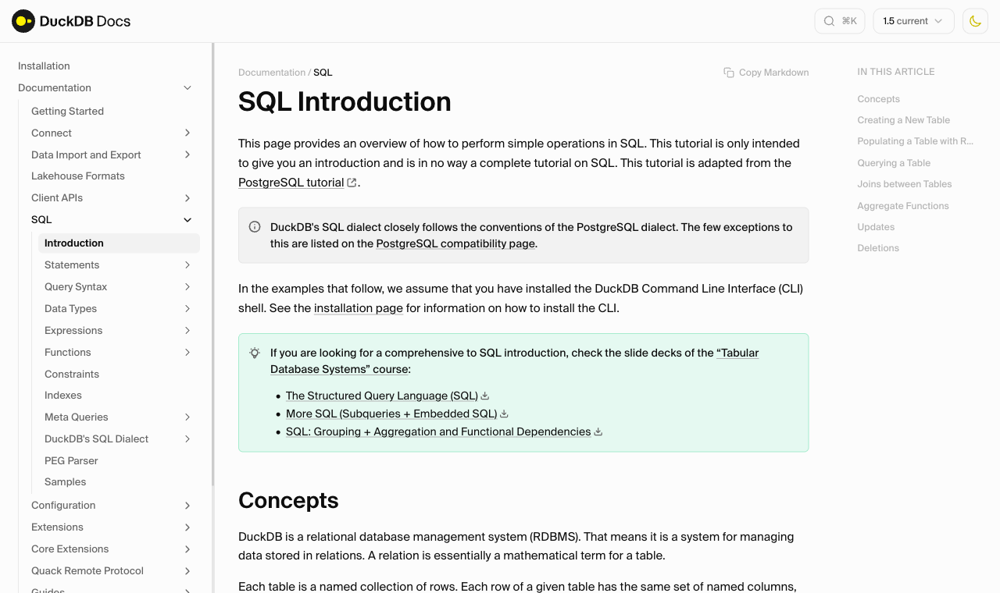
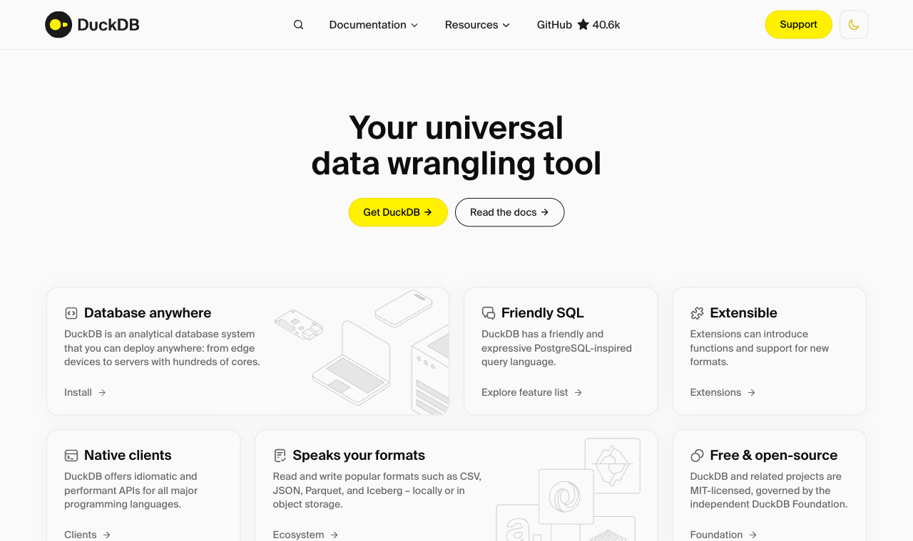
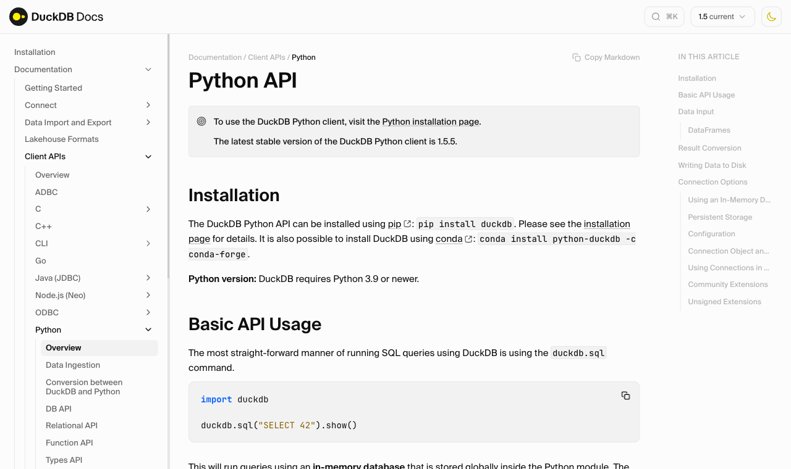
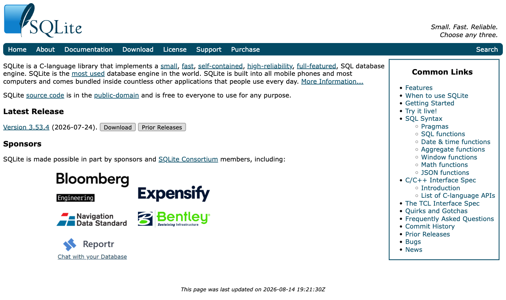

# Hello again! 😊 <br> I hope you had a good week {background-color="#1B3A6B"}

# Brief recap 📚 {background-color="#1B3A6B"}

## Parallel computing fundamentals
### Where lecture 21 left us

:::{style="margin-top: 30px; font-size: 22px;"}
:::{.columns}
:::{.column width="50%"}
- Last class we covered [parallel and scalable computing]{.alert}:
  - [`map`]{.alert}, embarrassingly parallel problems, `joblib` and `concurrent.futures`
  - [Big O]{.alert}: parallelism cuts the constant, the complexity class stays the same
  - [Amdahl's law](https://en.wikipedia.org/wiki/Amdahl%27s_law): the serial share caps your speed-up, so measure before scaling
  - [The GIL](https://en.wikipedia.org/wiki/Global_interpreter_lock): threads for I/O, processes for CPU, C/Rust libraries sidestep it
  - [Dask]{.alert}: lazy arrays and DataFrames for bigger-than-RAM data
:::

:::{.column width="50%"}
- We ended with a promise: some engines [parallelise for you]{.alert}, with no cluster to manage
- DuckDB is one of them, and today we use it to revise [SQL]{.alert}
- In Lecture 02 you voted for a SQL revision over a Polars class
- All queries today run on the [WDI panel]{.alert} you built in Module 06

:::{style="text-align: center; margin-top: -10px;"}
[{width="52%"}](#){data-modal-type="image" data-modal-url="figures/parallel.png"}
:::
:::
:::
:::

# Today's agenda {background-color="#1B3A6B"}

## Lecture overview
### What we will cover today

:::{style="margin-top: 12px; font-size: 21px;"}
:::{.columns}
::::{.column width="50%"}
[1. Why SQL and why DuckDB]{.alert}

- A declarative language every engine speaks
- `import duckdb` is the whole setup

[2. First queries]{.alert}

- `SELECT`, `WHERE`, `ORDER BY`, `LIMIT`
- `IN`, `BETWEEN`, `LIKE`, and the order a query really runs in

[3. Aggregating]{.alert}

- `COUNT`, `AVG`, `GROUP BY`, `HAVING`
- What `COUNT` does when values are missing
::::

::::{.column width="50%"}
[4. NULLs, CASE and windows]{.alert}

- `IS NULL`, `COALESCE`, income bands with `CASE`
- A window function beside a `GROUP BY`

[5. Joins]{.alert}

- Primary keys, foreign keys, and the `ON` clause
- `INNER`, `LEFT`, `FULL OUTER` on two tiny tables

[6. SQL in Python]{.alert}

- Querying a pandas DataFrame by its variable name
- The same queries in plain `sqlite3`, which assignment 09 uses
- DuckDB on 200 million rows
::::
:::
:::

# Why SQL, why DuckDB 🦆 {background-color="#1B3A6B"}

## Why SQL
### You describe the answer, the engine finds it

:::{style="margin-top: 15px; font-size: 21px;"}
:::{.columns}
:::{.column width="52%"}
- [SQL]{.alert} is a language for asking questions of tables
- It is [declarative]{.alert}: you say what you want, and the engine decides how to compute it
  - No loops, no index lookups, no merge strategy
  - The engine can reorder the query, read fewer columns, or use every core
- SQL is about fifty years old, and data job adverts list it more often than any Python library
- Dialects differ in the details, but `SELECT`, `WHERE`, `GROUP BY` and `JOIN` are the same in DuckDB, SQLite, PostgreSQL, BigQuery and Snowflake
:::

:::{.column width="48%"}
:::{style="text-align: center; margin-top: -10px;"}
[{width="100%"}](#){data-modal-type="image" data-modal-url="figures/duckdb-docs-sql-2026.png"}

:::{style="font-size: 17px;"}
DuckDB's SQL introduction: <https://duckdb.org/docs/stable/sql/introduction>
:::
:::
:::
:::
:::

## Why DuckDB for a revision class
### An in-process engine with no setup

:::{style="margin-top: 15px; font-size: 21px;"}
:::{.columns}
:::{.column width="52%"}
- [Zero setup]{.alert}: `pip install duckdb`, then `import duckdb`. No server, no password
- [In-process]{.alert}: the database runs inside your Python session, like SQLite ("SQLite for analytics")
- [Reads files by name]{.alert}: a Parquet or CSV path goes straight in the `FROM` clause
- Reads a pandas DataFrame by its variable name too (more on this later)
- [Columnar]{.alert} and [parallel]{.alert} underneath, so the same `GROUP BY` works on 200 million rows
- Version on my laptop: [DuckDB 1.5.5]{.alert}
:::

:::{.column width="48%"}
:::{style="text-align: center; margin-top: -10px;"}
[{width="100%"}](#){data-modal-type="image" data-modal-url="figures/duckdb-home-2026.png"}

:::{style="font-size: 17px;"}
Source: <https://duckdb.org>
:::
:::

:::{style="background: rgba(27, 58, 107, 0.08); padding: 12px; border-radius: 10px; font-size: 19px; margin-top: 10px;"}
Assignment 09 uses `sqlite3` from the standard library. The sqlite3 section runs the same queries there, so nothing today is DuckDB-only
:::
:::
:::
:::

# First queries {background-color="#1B3A6B"}

## Querying a Parquet file
### The file path goes in the FROM clause

:::{style="margin-top: 15px; font-size: 21px;"}
:::{.columns}
:::{.column width="50%"}
- The WDI panel: 59,024 rows of country, indicator, year and value
- `duckdb.sql()` takes a query string and returns a result you can print
- The path goes in [single quotes]{.alert}: single quotes mean text, double quotes mean a column name
- No `read_parquet`, no connection, no cursor
- The [column types]{.alert} under the names come from the Parquet file
:::

:::{.column width="50%"}
:::{style="font-size: 20px;"}
```{python}
#| echo: true
#| eval: true
#| cache: true
import duckdb

duckdb.sql("""
    SELECT *
    FROM '../lecture-19/data/wdi_panel.parquet'
    LIMIT 5
""")
```
:::
:::
:::
:::

## Creating a view
### One name for the file

:::{style="margin-top: 15px; font-size: 19px;"}
:::{.columns}
:::{.column width="42%"}
- A [view]{.alert} is a saved query that behaves like a table
  - Ours is called `wdi`, so every later query says `FROM wdi` instead of the file path
  - It holds no data: DuckDB re-reads the Parquet file each time
  - `OR REPLACE` makes the cell safe to re-run
- [`DESCRIBE`]{.alert} lists the columns and their types
- [`SUMMARIZE`]{.alert} shows min, max, count and the share of missing values per column
- 11.06% of `value` is missing (more on this in the NULLs section)
:::

:::{.column width="58%"}
:::{style="font-size: 20px;"}
```{python}
#| echo: true
#| eval: true
#| cache: true
duckdb.sql("""
    CREATE OR REPLACE VIEW wdi AS
    SELECT * FROM '../lecture-19/data/wdi_panel.parquet'
""")

duckdb.sql("""
    SELECT COUNT(*) AS n_rows,
           COUNT(DISTINCT country) AS countries,
           COUNT(DISTINCT indicator) AS indicators
    FROM wdi
""")
```

```{python}
#| echo: true
#| eval: true
#| cache: true
duckdb.sql("""
    SELECT column_name, min, max, null_percentage
    FROM (SUMMARIZE SELECT country, year, value FROM wdi)
""")
```
:::
:::
:::
:::

## SELECT, aliases, ORDER BY, LIMIT
### Picking columns and sorting the result

:::{style="margin-top: 15px; font-size: 21px;"}
:::{.columns}
:::{.column width="48%"}
- `SELECT` lists the columns you want (`*` means all of them)
- [`AS`]{.alert} renames a column in the output. The new name is an [alias]{.alert}
- `SELECT` can also compute, e.g. `ROUND(value, 0)`
- `ORDER BY value DESC` sorts high to low (`ASC` is the default)
- [`LIMIT`]{.alert} caps the rows returned. Use it while exploring
- Monaco, at 161,263 dollars per person, is the panel's maximum
:::

:::{.column width="52%"}
:::{style="font-size: 22px;"}
```{python}
#| echo: true
#| eval: true
#| cache: true
duckdb.sql("""
    SELECT country, year,
           ROUND(value, 0) AS gdp_pc
    FROM wdi
    WHERE indicator = 'gdp_per_capita'
      AND year = 2020
    ORDER BY value DESC
    LIMIT 5
""")
```
:::
:::
:::
:::

## WHERE with AND, OR and NOT
### Filtering rows with WHERE

:::{style="margin-top: 15px; font-size: 21px;"}
:::{.columns}
:::{.column width="48%"}
- [`WHERE`]{.alert} keeps rows whose condition is true
- `AND` requires both sides, `OR` requires either, `NOT` flips a condition
- The brackets around the `OR` matter: `AND` binds tighter
- Text goes in single quotes, and comparisons are case-sensitive in DuckDB
- Without the `NOT`, Japan would fill the list
- All five rows are from 2020, although we asked for 2000 too: life expectancy rose almost everywhere
:::

:::{.column width="52%"}
:::{style="font-size: 22px;"}
```{python}
#| echo: true
#| eval: true
#| cache: true
duckdb.sql("""
    SELECT country, year,
           ROUND(value, 1) AS life_exp
    FROM wdi
    WHERE indicator = 'life_expectancy'
      AND (year = 2000 OR year = 2020)
      AND NOT country = 'Japan'
    ORDER BY value DESC
    LIMIT 5
""")
```
:::
:::
:::
:::

## IN, BETWEEN, LIKE and ILIKE
### Shorthand for the conditions you write most often

:::{style="margin-top: 15px; font-size: 19px;"}
:::{.columns}
:::{.column width="52%"}
- [`IN`]{.alert} replaces a chain of `OR` comparisons
- [`BETWEEN`]{.alert} includes both ends: 2018, 2019 and 2020

:::{style="font-size: 20px;"}
```{python}
#| echo: true
#| eval: true
#| cache: true
duckdb.sql("""
    SELECT country, year,
           ROUND(value, 1) AS life_exp
    FROM wdi
    WHERE indicator = 'life_expectancy'
      AND country IN ('Brazil', 'Japan', 'Germany')
      AND year BETWEEN 2018 AND 2020
    ORDER BY country, year
    LIMIT 5
""")
```
:::
:::

:::{.column width="48%"}
- [`LIKE`]{.alert} matches a text pattern. `%` stands for any run of characters, `_` for exactly one
- [`ILIKE`]{.alert} is the same test ignoring case (DuckDB only)

:::{style="font-size: 20px;"}
```{python}
#| echo: true
#| eval: true
#| cache: true
duckdb.sql("""
    SELECT DISTINCT country
    FROM wdi
    WHERE country LIKE 'United%'
""")
```
:::

:::{style="background: rgba(230, 57, 70, 0.1); padding: 12px; border-radius: 10px; font-size: 18px; margin-top: 10px;"}
Write `'united%'` in lower case with plain `LIKE` and DuckDB returns [zero rows]{.alert}. SQLite would return all three. The sqlite3 section has the full list of these differences
:::
:::
:::
:::

## The order a query really runs in
### How the engine evaluates a query

:::{style="margin-top: 10px; font-size: 20px;"}
:::{style="text-align: center;"}
[{width="66%"}](#){data-modal-type="image" data-modal-url="figures/sql-evaluation-order.png"}
:::

:::{.columns}
:::{.column width="50%"}
- You write `SELECT` first, but the engine runs it fifth
- `FROM` finds the rows, `WHERE` filters them, `GROUP BY` forms the groups, `HAVING` filters groups, then `SELECT` computes the output
:::

:::{.column width="50%"}
- An aggregate cannot go in `WHERE`: the groups do not exist yet
- Standard SQL (and PostgreSQL) rejects a `SELECT` alias inside `WHERE`. DuckDB and SQLite accept it
:::
:::
:::

# Aggregating {background-color="#1B3A6B"}

## GROUP BY
### One row of output per group

:::{style="margin-top: 15px; font-size: 19px;"}
:::{.columns}
:::{.column width="50%"}
- An [aggregate function]{.alert} reads many rows and returns one number
  - Without `GROUP BY`, the whole filtered table is one group
- [`GROUP BY`]{.alert} splits the rows into groups and applies the aggregate to each one
- Every column in `SELECT` must be in the `GROUP BY` or inside an aggregate
- Eight indicators, eight rows
- `primary_enrolment_net` has 217 rows in 2020 and no values, so `COUNT(value)` is 0 and `AVG` is NULL
- Mean population is 36 million, mean fertility 2.49: averaging across indicators would be meaningless
- Grouping by two columns gives one row per pair: [[Appendix 05]{.button}](#sec-appendix-05)
:::

:::{.column width="50%"}
:::{style="font-size: 20px;"}
```{python}
#| echo: true
#| eval: true
#| cache: true
duckdb.sql("""
    SELECT indicator,
           COUNT(value) AS n,
           ROUND(AVG(value), 2) AS mean_value
    FROM wdi
    WHERE year = 2020
    GROUP BY indicator
    ORDER BY indicator
""")
```
:::
:::
:::
:::

## WHERE and HAVING
### Filtering before and after grouping

:::{style="margin-top: 15px; font-size: 21px;"}
:::{.columns}
:::{.column width="48%"}
- `WHERE` filters rows before grouping. [`HAVING`]{.alert} filters groups after, so only `HAVING` can take an aggregate
- `WHERE year >= 2010` drops the old rows, `HAVING AVG(value) > 60000` drops the poorer countries
- "Which years count?" is a row question. "Which countries qualify?" is a group question
- Small economies with financial centres dominate: Monaco, Liechtenstein and Bermuda all have under 100,000 people
- `ORDER BY` can use an alias (`mean_gdp` here)
:::

:::{.column width="52%"}
:::{style="font-size: 22px;"}
```{python}
#| echo: true
#| eval: true
#| cache: true
duckdb.sql("""
    SELECT country,
           ROUND(AVG(value), 0) AS mean_gdp
    FROM wdi
    WHERE indicator = 'gdp_per_capita'
      AND year >= 2010
    GROUP BY country
    HAVING AVG(value) > 60000
    ORDER BY mean_gdp DESC
    LIMIT 5
""")
```
:::
:::
:::
:::

## COUNT(\*) and COUNT(value)
### Counting rows and counting values

:::{style="margin-top: 15px; font-size: 20px;"}
:::{.columns}
:::{.column width="50%"}
- `COUNT`, `SUM`, `AVG`, `MIN` and `MAX` cover almost everything you will write
- [`COUNT(*)`]{.alert} counts rows. [`COUNT(value)`]{.alert} counts rows where `value` is present
- `AVG`, `SUM`, `MIN` and `MAX` skip missing values silently
- The difference between the two counts is the number of holes in the column
- Internet use has 217 country rows in each year, but 9 values are missing in 1990, 21 in 2000 and 33 in 2020
- Coverage gets [worse]{.alert} over time: small territories join the panel and never report the series
- Run this on any column before you trust its mean (`SUMMARIZE` does it for the whole file)
:::

:::{.column width="50%"}
:::{style="font-size: 20px;"}
```{python}
#| echo: true
#| eval: true
#| cache: true
duckdb.sql("""
    SELECT year,
           COUNT(*) AS n_rows,
           COUNT(value) AS with_value,
           COUNT(*) - COUNT(value) AS missing
    FROM wdi
    WHERE indicator = 'internet_users_pct'
      AND year IN (1990, 2000, 2020)
    GROUP BY year
    ORDER BY year
""")
```
:::
:::
:::
:::

## Try it yourself! 🧠 {#sec-exercise-01}
### Five minutes

:::{style="margin-top: 20px; font-size: 21px;"}
:::{.columns}
:::{.column width="52%"}
Which countries have had the highest life expectancy since 2010?

1. Open a Python file or a notebook
2. Import `duckdb`
3. Create the `wdi` view over `../lecture-19/data/wdi_panel.parquet`
4. Keep only the rows for `life_expectancy`
5. Keep only the years from 2010 onwards
6. Compute the mean of `value` for each country
7. Keep the countries whose mean is above 82
8. Sort from highest to lowest
9. Return the top five, rounded to one decimal
:::

:::{.column width="48%"}
What to look for:

- The filter on `year` and the filter on the average go in [different clauses]{.alert}. One of them is `WHERE`
- `ORDER BY` can name the alias you created in `SELECT`
- Five rows, all above 83 years. Four are small states or city economies
- Japan is the only large country there, in fourth place
- An error about an aggregate in `WHERE`? Re-read the evaluation-order ladder

:::{style="background: rgba(27, 58, 107, 0.08); padding: 12px; border-radius: 10px; font-size: 19px; margin-top: 12px;"}
Solution and the full output: [[Appendix 01]{.button}](#sec-appendix-01)
:::
:::
:::
:::

# NULLs, CASE and windows {background-color="#1B3A6B"}

## Missing values
### Working with NULL

:::{style="margin-top: 15px; font-size: 20px;"}
:::{.columns}
:::{.column width="48%"}
- A NULL means "unknown", so it is neither zero nor an empty string
- Test it with [`IS NULL`]{.alert}, never with `=`
- [`COALESCE(a, b)`]{.alert} returns `a`, or `b` when `a` is NULL
- We ask for five countries and get four rows: Somalia has no CO2 row at all for 2022
- `COALESCE` cannot fix a missing [row]{.alert}, only a missing value. A `LEFT JOIN` can (see the joins section)
:::

:::{.column width="52%"}
:::{style="font-size: 22px;"}
```{python}
#| echo: true
#| eval: true
#| cache: true
duckdb.sql("""
    SELECT country,
           ROUND(COALESCE(value, 0), 1) AS co2_filled
    FROM wdi
    WHERE indicator = 'co2_per_capita'
      AND year = 2022
      AND country IN ('Brazil', 'Japan', 'Somalia',
                      'Germany', 'Eritrea')
    ORDER BY country
""")
```
:::
:::
:::
:::

## CASE
### Writing an if-else ladder inside a SELECT

:::{style="margin-top: 12px; font-size: 20px;"}
:::{.columns}
:::{.column width="55%"}
:::{style="font-size: 20px;"}
```{python}
#| echo: true
#| eval: true
#| cache: true
duckdb.sql("""
    SELECT country, ROUND(value, 0) AS gdp_pc,
        CASE
            WHEN value IS NULL  THEN 'No data'
            WHEN value >= 13846 THEN 'High income'
            WHEN value >= 4466  THEN 'Upper middle'
            WHEN value >= 1136  THEN 'Lower middle'
            ELSE 'Low income'
        END AS income_band
    FROM wdi
    WHERE indicator = 'gdp_per_capita' AND year = 2020
      AND country IN ('Norway', 'China', 'India',
                      'Burundi', 'Brazil')
    ORDER BY value DESC NULLS LAST
""")
```
:::
:::

:::{.column width="45%"}
- [`CASE`]{.alert} tests conditions in order and stops at the first true one, like `if`/`elif`
- The thresholds are the World Bank's income bands: 13,846, 4,466 and 1,136 dollars per person
- The `IS NULL` test comes [first]{.alert} on purpose: at the bottom, a missing value would fall through to `ELSE` and become "Low income"
- `ELSE` catches everything else. Without it, unmatched rows get NULL
- `NULLS LAST` sends unknown values to the bottom of the sort
- The result is a new column you can group by, join on, or export
:::
:::
:::

## Window functions
### Adding a group-level number to every row

:::{style="margin-top: 15px; font-size: 20px;"}
:::{.columns}
:::{.column width="55%"}
:::{style="font-size: 22px;"}
```{python}
#| echo: true
#| eval: true
#| cache: true
duckdb.sql("""
    SELECT country, ROUND(value, 0) AS gdp_pc,
           ROUND(AVG(value) OVER (PARTITION BY year), 0)
               AS world_mean,
           RANK() OVER (ORDER BY value DESC) AS world_rank
    FROM wdi
    WHERE indicator = 'gdp_per_capita'
      AND year = 2020 AND value IS NOT NULL
    ORDER BY world_rank
    LIMIT 5
""")
```
:::
:::

:::{.column width="45%"}
- `GROUP BY` collapses each group to one row. A [window function]{.alert} keeps every row and adds a value computed across the group
- [`OVER`]{.alert} turns a function into a window function. `PARTITION BY year` defines the group
- `world_mean` is 16,150 on every row, the same as a plain `AVG` over 2020
- [`RANK()`]{.alert} needs an `ORDER BY` inside the `OVER`
- All 208 countries survive this query; we print five
:::
:::
:::

# Joins {background-color="#1B3A6B"}

## Two small tables
### Keys, and the two tables we will join

<style>#two-small-tables .cell-output pre code { font-size: 0.8em !important; }</style>

:::{style="margin-top: 6px; font-size: 20px;"}
:::{.columns}
:::{.column width="58%"}
:::{style="font-size: 20px;"}
```{python}
#| echo: true
#| eval: true
#| cache: true
duckdb.sql("""
    CREATE OR REPLACE TABLE gdp2020 AS
    SELECT country, iso3, ROUND(value, 0) AS gdp_per_capita
    FROM wdi
    WHERE indicator = 'gdp_per_capita' AND year = 2020
      AND iso3 IN ('USA','BRA','CHN','IND','DEU','JPN')
""")

duckdb.sql("""
    CREATE OR REPLACE TABLE regions
        (iso3 VARCHAR PRIMARY KEY, region VARCHAR)
""")

duckdb.sql("""
    INSERT INTO regions VALUES
        ('USA', 'North America'), ('BRA', 'Latin America'),
        ('CHN', 'East Asia'),     ('IND', 'South Asia'),
        ('DEU', 'Europe'),        ('KOR', 'East Asia')
""")

duckdb.sql("SELECT * FROM regions ORDER BY iso3")
```
:::
:::

:::{.column width="42%"}
:::{style="font-size: 19px;"}
- A [table]{.alert} is a grid with named columns, one type per column
- `CREATE TABLE` creates it, `INSERT INTO ... VALUES` adds rows
- A [primary key]{.alert} identifies a row uniquely (no duplicates, no NULLs): `iso3` in `regions`
- A [foreign key]{.alert} points at another table's primary key: `iso3` in `gdp2020`. A join follows it with `ON g.iso3 = r.iso3`
- Six rows on each side, with two mismatches: [`JPN`]{.alert} has a GDP figure and no region, [`KOR`]{.alert} a region and no GDP figure
- East Asia holds two codes (this matters for the second exercise)
:::
:::
:::
:::

## INNER JOIN
### Only the rows that match on both sides

:::{style="margin-top: 15px; font-size: 20px;"}
:::{.columns}
:::{.column width="52%"}
:::{style="font-size: 22px;"}
```{python}
#| echo: true
#| eval: true
#| cache: true
duckdb.sql("""
    SELECT g.country, r.region, g.gdp_per_capita
    FROM gdp2020 AS g
    INNER JOIN regions AS r ON g.iso3 = r.iso3
    ORDER BY g.country
""")
```
:::
:::

:::{.column width="48%"}
- [`ON`]{.alert} says which columns must agree: the `iso3` code on each side
- `AS g` and `AS r` are table aliases, so `g.iso3` and `r.iso3` stay apart
- Six rows on the left, six on the right, [five]{.alert} rows out
- Japan has no matching region, Korea no matching GDP row, so both drop out
- An inner join is a silent filter: if your row count falls after a join, this is usually why
:::
:::
:::

## LEFT JOIN
### Keeping every row of the left table

:::{style="margin-top: 15px; font-size: 20px;"}
:::{.columns}
:::{.column width="52%"}
:::{style="font-size: 22px;"}
```{python}
#| echo: true
#| eval: true
#| cache: true
duckdb.sql("""
    SELECT g.country, r.region, g.gdp_per_capita
    FROM gdp2020 AS g
    LEFT JOIN regions AS r ON g.iso3 = r.iso3
    ORDER BY g.country
""")
```
:::
:::

:::{.column width="48%"}
- The join you will use most often
- [Six]{.alert} rows now: Japan is back, with `NULL` in `region`
- The NULL means the join found no partner
- `LEFT` is the table named in `FROM`. Swap the two tables and you get a different answer
- Korea is still missing, because it only exists in the right table
:::
:::
:::

## FULL OUTER JOIN
### Every row from both tables survives

:::{style="margin-top: 12px; font-size: 20px;"}
:::{.columns}
:::{.column width="55%"}
:::{style="font-size: 21px;"}
```{python}
#| echo: true
#| eval: true
#| cache: true
duckdb.sql("""
    SELECT g.country, r.iso3 AS region_iso3,
           r.region, g.gdp_per_capita
    FROM gdp2020 AS g
    FULL OUTER JOIN regions AS r ON g.iso3 = r.iso3
    ORDER BY r.region NULLS LAST
""")
```
:::
:::

:::{.column width="45%"}
:::{style="text-align: center; margin-top: -20px;"}
[{width="96%"}](#){data-modal-type="image" data-modal-url="figures/sql-joins.png"}

:::{style="font-size: 15px;"}
The picture uses cut-down tables, so its counts are 3, 4 and 5. Ours give 5, 6 and 7
:::
:::

:::{style="font-size: 17px; margin-top: 5px;"}
- Every row from both tables appears, with NULLs where the other side has no partner
- [Seven]{.alert} rows: five matched, plus Korea (no GDP) and Japan (no region)
- Just to recap: 5 rows from `INNER`, 6 from `LEFT`, 7 from `FULL OUTER`
- To choose a join, ask which table must survive whole and what should happen to rows with no partner
:::
:::
:::
:::

## Try it yourself! 🧠 {#sec-exercise-02}
### Ten minutes

:::{style="margin-top: 20px; font-size: 21px;"}
:::{.columns}
:::{.column width="52%"}
How rich is each region, and how much data is it based on?

1. Use the `gdp2020` and `regions` tables from the joins section
2. Report one row per region
3. Count how many of that region's countries have a 2020 GDP figure
4. Compute the mean GDP per capita of that region
5. Keep every region, including the one with no GDP data at all
6. Sort by mean GDP, highest first
7. Send the region with no data to the bottom of the list

Optional: list the codes that appear in only one of the two tables
:::

:::{.column width="48%"}
What to look for:

- Which table goes on the left if every region must survive?
- East Asia holds two codes and one GDP figure. `COUNT(*)` and `COUNT(g.country)` give different answers, and only one is right
- What does `COUNT` do when the value is NULL?
- Five regions come back, each with a count of 1
- The optional part is a `FULL OUTER JOIN` with a `WHERE` on the NULLs

:::{style="background: rgba(27, 58, 107, 0.08); padding: 12px; border-radius: 10px; font-size: 19px; margin-top: 12px;"}
Solution and both outputs: [[Appendix 02]{.button}](#sec-appendix-02). Two more join tools, the anti-join and `UNION`: [[Appendix 06]{.button}](#sec-appendix-06)
:::
:::
:::
:::

# SQL in Python 🐍 {background-color="#1B3A6B"}

## Querying a DataFrame by name
### Your Python variable becomes a SQL table

:::{style="margin-top: 15px; font-size: 20px;"}
:::{.columns}
:::{.column width="52%"}
:::{style="font-size: 22px;"}
```{python}
#| echo: true
#| eval: true
#| cache: true
import pandas as pd

df = pd.read_parquet(
    "../lecture-19/data/wdi_panel.parquet"
)

duckdb.sql("SELECT COUNT(*) AS n FROM df")
```
:::

- DuckDB finds `df` among your Python variables and reads it in place, with no copy and no registration step
:::

:::{.column width="48%"}
:::{style="text-align: center; margin-top: -15px;"}
[{width="92%"}](#){data-modal-type="image" data-modal-url="figures/duckdb-python-api-2026.png"}

:::{style="font-size: 17px;"}
Source: <https://duckdb.org/docs/stable/clients/python/overview>
:::
:::

:::{style="background: rgba(230, 57, 70, 0.1); padding: 12px; border-radius: 10px; font-size: 18px; margin-top: 8px;"}
`country` is a pandas category, which DuckDB reads as an [enum]{.alert}. Add `::VARCHAR` when you want plain text in the result
:::
:::
:::
:::

## Handing the result back to pandas
### Turning a result into a DataFrame

:::{style="margin-top: 12px; font-size: 20px;"}
:::{.columns}
:::{.column width="55%"}
:::{style="font-size: 22px;"}
```{python}
#| echo: true
#| eval: true
#| cache: true
long = duckdb.sql("""
    SELECT country::VARCHAR AS country, indicator,
           ROUND(value, 1) AS value
    FROM df
    WHERE year = 2020
      AND country IN ('Brazil', 'Germany', 'Japan')
      AND indicator IN ('gdp_per_capita',
                        'life_expectancy',
                        'internet_users_pct')
""").df()

long.pivot(index="country", columns="indicator",
           values="value")
```
:::
:::

:::{.column width="45%"}
- [`.df()`]{.alert} turns a DuckDB result into a pandas DataFrame (`.pl()` gives a Polars one)
- Nine rows come out of SQL, and pandas reshapes them into a 3 by 3 table
- `pivot` has no short SQL equivalent, so this is a good place to hand over
- Everything after `.df()` is ordinary pandas: `.plot()`, `.to_csv()`, `seaborn`, `statsmodels`
- Moving between the two costs one method call
- When to reach for SQL and when to stay in pandas: [[Appendix 07]{.button}](#sec-appendix-07)
:::
:::
:::

## Why sqlite3
### Assignment 09 uses SQLite, and it ships with Python

:::{style="margin-top: 15px; font-size: 21px;"}
:::{.columns}
:::{.column width="52%"}
- [SQLite]{.alert} is a database in a single file, with no server
  - The most deployed database in the world: every phone and every browser carries a copy
- Python bundles it, so `import sqlite3` works on a machine with nothing installed
- The cost is boilerplate DuckDB never asked for: a [connection]{.alert}, a [cursor]{.alert}, `commit()` and `fetchall()`
  - A connection links your script to the database file. A cursor sends commands and collects results
- The SQL itself barely changes. The next slides re-run queries you have already seen
:::

:::{.column width="48%"}
:::{style="text-align: center; margin-top: -10px;"}
[{width="100%"}](#){data-modal-type="image" data-modal-url="figures/sqlite-home-2026.png"}

:::{style="font-size: 17px;"}
Source: <https://sqlite.org>
:::
:::
:::
:::
:::

## Loading the panel into SQLite
### Writing a DataFrame into a table

:::{style="margin-top: 15px; font-size: 20px;"}
:::{.columns}
:::{.column width="55%"}
:::{style="font-size: 22px;"}
```{python}
#| echo: true
#| eval: true
#| cache: true
import sqlite3

# ":memory:" builds the database in RAM.
# Use a filename such as "wdi.db" to keep it
conn = sqlite3.connect(":memory:")

df.to_sql("wdi", conn, index=False,
          if_exists="replace")

pd.read_sql("SELECT COUNT(*) AS n FROM wdi", conn)
```
:::
:::

:::{.column width="45%"}
- [`to_sql`]{.alert} writes a DataFrame into a table and picks the column types for you
- `index=False` stops the pandas index becoming a column called `index`
- `if_exists="replace"` drops any old table of that name, so the cell is safe to re-run
- [`pd.read_sql`]{.alert} sends a query and returns a DataFrame, with no cursor and no `fetchall`
- The load took 0.03 seconds for 59,024 rows on my laptop
- Categories need no cast here, unlike the DuckDB enum
:::
:::
:::

## Connection, cursor, commit, fetch
### The sqlite3 boilerplate

:::{style="margin-top: 12px; font-size: 20px;"}
:::{.columns}
:::{.column width="60%"}
:::{style="font-size: 20px;"}
```{python}
#| echo: true
#| eval: true
#| cache: true
cur = conn.cursor()

cur.execute("""CREATE TABLE regions
               (iso3 TEXT PRIMARY KEY, region TEXT)""")

cur.executemany("INSERT INTO regions VALUES (?, ?)",
    [("USA", "North America"), ("BRA", "Latin America"),
     ("CHN", "East Asia"),     ("IND", "South Asia"),
     ("DEU", "Europe"),        ("KOR", "East Asia")])
conn.commit()

cur.execute("""SELECT iso3, region FROM regions
               WHERE region = ? ORDER BY iso3""",
            ("East Asia",))
print(cur.fetchall())

cur.execute("SELECT COUNT(*) FROM regions")
print(cur.fetchone())
```
:::
:::

:::{.column width="40%"}
- [`executemany`]{.alert} runs one SQL template over a list of tuples
- The [`?`]{.alert} marks a slot the driver fills in safely (Python's `None` becomes SQL's `NULL`)
  - Never build a query with an f-string: that is how SQL injection happens
- [`commit()`]{.alert} makes the writes permanent. Skip it and the inserts vanish when the script ends
- [`fetchall()`]{.alert} returns a list of tuples, `fetchone()` a single tuple, e.g. `(6,)`
- Parameters must be a tuple, hence the trailing comma in `("East Asia",)`
:::
:::
:::

## The same queries, unchanged
### Copy the SQL across and it runs

:::{style="margin-top: 12px; font-size: 20px;"}
:::{.columns}
:::{.column width="46%"}
The `GROUP BY` by indicator:

:::{style="font-size: 20px;"}
```{python}
#| echo: true
#| eval: true
#| cache: true
pd.read_sql("""
    SELECT indicator,
           COUNT(value) AS n,
           ROUND(AVG(value), 2) AS mean_value
    FROM wdi
    WHERE year = 2020
    GROUP BY indicator
    ORDER BY indicator
""", conn).head()
```
:::
:::

:::{.column width="54%"}
The `CASE` income bands:

:::{style="font-size: 20px;"}
```{python}
#| echo: true
#| eval: true
#| cache: true
cur.execute("""
    SELECT country, ROUND(value, 0) AS gdp_pc,
        CASE
            WHEN value IS NULL  THEN 'No data'
            WHEN value >= 13846 THEN 'High income'
            WHEN value >= 4466  THEN 'Upper middle'
            WHEN value >= 1136  THEN 'Lower middle'
            ELSE 'Low income'
        END AS income_band
    FROM wdi
    WHERE indicator = 'gdp_per_capita' AND year = 2020
      AND country IN ('Norway', 'China', 'Burundi')
    ORDER BY value DESC
""")
cur.fetchall()
```
:::
:::
:::
:::

## Where the two engines differ
### DuckDB and SQLite side by side

:::{style="margin-top: 12px; font-size: 19px;"}
:::{.columns}
:::{.column width="52%"}
:::{style="text-align: center; font-size: 18px;"}
| Feature | DuckDB | SQLite |
|---|---|---|
| `FROM 'file.parquet'` | works | no such table |
| `ILIKE` | works | syntax error |
| `SUMMARIZE` | works | syntax error |
| `DESCRIBE SELECT ...` | works | use `PRAGMA table_info(t)` |
| `SELECT 7 / 2` | `3.5` | `3` |
| `LIKE 'united%'` | 0 rows | matches |
| `SELECT * EXCLUDE (value)` | works | syntax error |
| `GROUP BY ALL` | works | syntax error |
| `STDDEV(x)` | works | no such function |
| `INNER` / `LEFT` / `FULL OUTER JOIN` | works | works |
| `CASE`, `COALESCE`, `IS NULL` | works | works |
| Window functions, `MEDIAN`, `UNION` | works | works |
:::
:::

:::{.column width="48%"}
- Sections 2 to 5 run unchanged on SQLite, apart from `ILIKE`, `SUMMARIZE`, `DESCRIBE` and reading a file by name
- Two rows are traps, because they return an answer instead of an error:
  - [`7 / 2`]{.alert} is 3.5 in DuckDB and 3 in SQLite (integer division). Write `7 * 1.0 / 2` in SQLite
  - [`LIKE`]{.alert} is case-sensitive in DuckDB and case-insensitive (ASCII) in SQLite, so the same pattern returns different rows
- SQLite has supported `RIGHT` and `FULL OUTER JOIN` since version 3.39 (2022). Older tutorials that emulate them are out of date
- Every row tested on DuckDB 1.5.5 and SQLite 3.53.1
:::
:::
:::

## DuckDB on 200 million rows
### The lecture 21 benchmark, revisited

:::{style="margin-top: 20px; font-size: 20px;"}
:::{.columns}
:::{.column width="55%"}
:::{style="text-align: center;"}
```{python}
#| echo: false
#| eval: true
#| cache: true
import pandas as pd
import matplotlib.pyplot as plt

res = pd.read_csv("data/benchmark_results.csv")
res = res[res["tool"] != "polars"].sort_values("seconds")

colours = {"pandas": "#888888", "dask": "#F2A93B",
           "duckdb": "#2CA02C"}
bar_colours = [colours[t] for t in res["tool"]]

fig, ax = plt.subplots(figsize=(7, 4.2))
bars = ax.barh(res["tool"], res["seconds"], color=bar_colours)
ax.set_xlabel("Wall-clock time (seconds, lower is better)", fontsize=12)
ax.set_title("Mean value by indicator and decade\n200 million rows, one machine",
             fontsize=13, fontweight="bold")
ax.bar_label(bars, fmt="%.2f s", padding=4, fontsize=11)
ax.margins(x=0.15)
ax.invert_yaxis()
plt.tight_layout()
plt.show()
```
:::
:::

:::{.column width="45%"}
:::{style="font-size: 18px;"}
- Task: mean `value` by indicator and decade since 1990, on `wdi_big.parquet`, a synthetic panel of [200,681,600 rows]{.alert}
- [DuckDB]{.alert}: 0.53 s. [Dask]{.alert}: 5.39 s. [pandas]{.alert}: 9.65 s
- pandas loads every column into RAM. DuckDB reads only the row groups and columns the query names
- Why: columnar layout, vectorised execution, all cores by default, and [predicate pushdown]{.alert} into the Parquet file
- MacBook Pro, Apple M5, 10 cores, 24 GB RAM, macOS 26.6
- One task on one machine: your seconds will differ, the ranking usually holds
- [Polars]{.alert} is in the same range as DuckDB (see Tutorial 07 on the course website)
- The query and the scripts behind it: [[Appendix 08]{.button}](#sec-appendix-08)
:::
:::
:::
:::

# Summary {background-color="#1B3A6B"}

## What we learned today
### The vocabulary, in the order we met it

:::{style="margin-top: 20px; font-size: 21px;"}
:::{.columns}
:::{.column width="50%"}
- [SQL]{.alert} is declarative: you describe the answer and the engine plans the work
- [DuckDB]{.alert} needs one import and reads a Parquet file or a pandas DataFrame by name
- A [view]{.alert} names a query. `DESCRIBE` and `SUMMARIZE` show what is in it
- [`WHERE`]{.alert} filters rows, [`GROUP BY`]{.alert} forms groups, [`HAVING`]{.alert} filters groups. No aggregate in `WHERE`
- `COUNT(*)` minus `COUNT(value)` is the number of missing values
:::

:::{.column width="50%"}
- A [NULL]{.alert} means unknown. `COALESCE` fills one in, and a missing row needs a join instead
- [`CASE`]{.alert} builds a category column. A [window function]{.alert} keeps every row and adds a group-level number
- Joins: 5 rows from `INNER`, 6 from `LEFT`, 7 from `FULL OUTER` on the same two tables
- [`sqlite3`]{.alert} needs a connection, a cursor, `commit()` and `fetchall()`, but the SQL is the same
- On 200 million rows, DuckDB runs the same query in [0.53 seconds]{.alert}
:::
:::
:::

## Next class

:::{style="margin-top: 25px; font-size: 21px;"}
:::{.columns}
:::{.column width="50%"}
- [Lecture 23]{.alert}: dependency management, virtual environments and containers
- Today's queries depended on your Python, your DuckDB version and your laptop
- Next class we package all three into an [image]{.alert} that a classmate, a server or a marker can run and get the same answer
- `pip install duckdb` stops being a setup instruction and becomes a line in a `Dockerfile`
:::

:::{.column width="50%"}
:::{style="margin-top: -15px;"}
Before then:

1. Finish both exercises if you did not complete them in class
2. Start [assignment 09]{.alert}, released today. It asks you to join two tables in SQLite
3. Check that `import duckdb` and `import sqlite3` both work in your environment
4. Skim [Tutorial 04](https://danilofreire.github.io/datasci350/04-duckdb-sql-tutorial.html) if any clause today felt new
:::
:::
:::
:::

# Questions? 🤔 {background-color="#1B3A6B"}

# Thank you very much! 😊 {background-color="#1B3A6B"}

# Appendix 📚 {background-color="#1B3A6B"}

## Appendix 01: Solution to Exercise 01 {#sec-appendix-01}

:::{style="margin-top: 20px; font-size: 20px;"}
:::{.columns}
:::{.column width="52%"}
:::{style="font-size: 22px;"}
```{python}
#| echo: true
#| eval: true
#| cache: true
duckdb.sql("""
    SELECT country,
           ROUND(AVG(value), 1) AS mean_life_exp
    FROM wdi
    WHERE indicator = 'life_expectancy'
      AND year >= 2010
    GROUP BY country
    HAVING AVG(value) > 82
    ORDER BY mean_life_exp DESC
    LIMIT 5
""")
```
:::
:::

:::{.column width="48%"}
- `WHERE` drops the rows before 2010 and every other indicator
- `GROUP BY country` forms one group per country
- `HAVING AVG(value) > 82` tests the group, so it cannot be written in `WHERE`
- `ORDER BY` names `mean_life_exp`, the alias created in `SELECT`
- Monaco, San Marino and Andorra are microstates with small, wealthy, ageing populations
- Japan is the only country in the list with more than a million people

[[Back to the exercise]{.button}](#sec-exercise-01)
:::
:::
:::

## Appendix 02: Solution to Exercise 02 {#sec-appendix-02}

:::{style="margin-top: 15px; font-size: 19px;"}
:::{.columns}
:::{.column width="50%"}
:::{style="font-size: 20px;"}
```{python}
#| echo: true
#| eval: true
#| cache: true
duckdb.sql("""
    SELECT r.region,
           COUNT(g.country) AS countries_with_gdp,
           ROUND(AVG(g.gdp_per_capita), 0) AS mean_gdp
    FROM regions AS r
    LEFT JOIN gdp2020 AS g ON g.iso3 = r.iso3
    GROUP BY r.region
    ORDER BY mean_gdp DESC NULLS LAST
""")
```
:::

- `regions` goes on the left because every region must survive
- `COUNT(g.country)` skips the NULLs a left join produces. `COUNT(*)` would count Korea's empty row and report 2 for East Asia
:::

:::{.column width="50%"}
The optional part:

:::{style="font-size: 20px;"}
```{python}
#| echo: true
#| eval: true
#| cache: true
duckdb.sql("""
    SELECT COALESCE(g.iso3, r.iso3) AS iso3,
           g.country, r.region
    FROM gdp2020 AS g
    FULL OUTER JOIN regions AS r ON g.iso3 = r.iso3
    WHERE g.iso3 IS NULL OR r.iso3 IS NULL
    ORDER BY iso3
""")
```
:::

- `COALESCE` picks up whichever code exists, because one of the two is always NULL here

[[Back to the exercise]{.button}](#sec-exercise-02)
:::
:::
:::

## Appendix 03: When something goes wrong {#sec-appendix-03}

:::{style="margin-top: 15px; font-size: 19px;"}
:::{.columns}
:::{.column width="50%"}
[`Parser Error: syntax error at or near ".."`]{.alert}

The file path is not quoted. Put single quotes around it: `FROM '../data/f.parquet'`.

[`IO Error: No files found that match the pattern`]{.alert}

The path is quoted but wrong. Paths are relative to the folder you launched Python in, so check with `os.getcwd()`.

[`Binder Error: Referenced column "gdp" not found`]{.alert}

The column name is misspelled or does not exist. Run `DESCRIBE SELECT * FROM wdi` and read the list.

[`Parser Error: syntax error at or near "SELCT"`]{.alert}

A keyword is misspelled. DuckDB quotes the offending word back at you, so read the message to the end
:::

:::{.column width="50%"}
[`Binder Error` on a value you know exists]{.alert}

You wrote `WHERE indicator = "gdp_per_capita"` with double quotes. Double quotes mean a column name in SQL, single quotes mean text.

[`sqlite3.OperationalError: no such table: wdi`]{.alert}

The table was never created in this connection. `:memory:` databases vanish when the script ends, so re-run the `to_sql` cell.

[`sqlite3.OperationalError: no such column: gdp`]{.alert}

Same as the DuckDB binder error. List the columns with `PRAGMA table_info(wdi)`.

[Your inserts disappeared]{.alert}

You forgot `conn.commit()`. SQLite holds writes in a transaction until you commit them
:::
:::
:::

## Appendix 04: The complete sqlite3 listing {#sec-appendix-04}

<style>#sec-appendix-04 pre code { max-height: none; }</style>

:::{style="margin-top: 12px; font-size: 15px;"}
Everything from the sqlite3 section in one script, ready to adapt for assignment 09:

```{python}
#| echo: true
#| eval: false
import sqlite3
import pandas as pd

# 1. Connect. Use a filename to keep the database on disk
conn = sqlite3.connect("wdi.db")
cur = conn.cursor()

# 2. Load a DataFrame into a table
df = pd.read_parquet("../lecture-19/data/wdi_panel.parquet")
df.to_sql("wdi", conn, index=False, if_exists="replace")

# 3. Create a table by hand and fill it
cur.execute("DROP TABLE IF EXISTS regions")
cur.execute("CREATE TABLE regions (iso3 TEXT PRIMARY KEY, region TEXT)")
cur.executemany("INSERT INTO regions VALUES (?, ?)",
    [("USA", "North America"), ("BRA", "Latin America"),
     ("CHN", "East Asia"),     ("IND", "South Asia"),
     ("DEU", "Europe"),        ("KOR", "East Asia")])
conn.commit()

# 4. Query with a cursor: fetchall returns a list of tuples
cur.execute("SELECT iso3, region FROM regions WHERE region = ?", ("East Asia",))
print(cur.fetchall())

# 5. Query into pandas instead
out = pd.read_sql("""
    SELECT r.region, COUNT(w.value) AS n, ROUND(AVG(w.value), 0) AS mean_gdp
    FROM regions AS r
    LEFT JOIN wdi AS w
      ON w.iso3 = r.iso3
     AND w.indicator = 'gdp_per_capita'
     AND w.year = 2020
    GROUP BY r.region
    ORDER BY mean_gdp DESC
""", conn)
print(out)

# 6. Close the connection when you are done
conn.close()
```
:::

## Appendix 05: Grouping by two columns {#sec-appendix-05}
### Every combination that exists in the data

:::{style="margin-top: 15px; font-size: 21px;"}
:::{.columns}
:::{.column width="50%"}
- Name two columns and you get one row for each pair that appears in the filtered rows
- Two countries and two indicators give four rows here
- Combinations with no rows never appear. SQL does not invent empty groups
- Japan's mean life expectancy since 2010 is nine years above Brazil's. Its CO2 per person is almost four times higher
- Aggregating a mean of yearly means like this weights every year equally. Say so when you report it
:::

:::{.column width="50%"}
:::{style="font-size: 22px;"}
```{python}
#| echo: true
#| eval: true
#| cache: true
duckdb.sql("""
    SELECT country, indicator,
           ROUND(AVG(value), 1) AS mean_value
    FROM wdi
    WHERE year >= 2010
      AND country IN ('Brazil', 'Japan')
      AND indicator IN ('life_expectancy',
                        'co2_per_capita')
    GROUP BY country, indicator
    ORDER BY country, indicator
""")
```
:::
:::
:::
:::

## Appendix 06: Anti-joins and UNION {#sec-appendix-06}
### Finding rows with no partner

:::{style="margin-top: 15px; font-size: 19px;"}
:::{.columns}
:::{.column width="50%"}
- An [anti-join]{.alert} asks which rows on the left have no partner on the right
- `NOT EXISTS` runs a small query for each row and keeps the row when it returns nothing

:::{style="font-size: 20px;"}
```{python}
#| echo: true
#| eval: true
#| cache: true
duckdb.sql("""
    SELECT g.country, g.iso3
    FROM gdp2020 AS g
    WHERE NOT EXISTS (
        SELECT 1 FROM regions AS r
        WHERE r.iso3 = g.iso3
    )
""")
```
:::
:::

:::{.column width="50%"}
- A join adds columns. [`UNION`]{.alert} stacks rows from two results that have the same columns
- `UNION` removes duplicate rows, `UNION ALL` keeps them and is faster

:::{style="font-size: 20px;"}
```{python}
#| echo: true
#| eval: true
#| cache: true
duckdb.sql("""
    SELECT country, 'rich' AS tag FROM gdp2020
    WHERE gdp_per_capita > 30000
    UNION
    SELECT country, 'poor' AS tag FROM gdp2020
    WHERE gdp_per_capita < 10000
    ORDER BY country
""")
```
:::
:::
:::
:::

## Appendix 07: When SQL beats a DataFrame {#sec-appendix-07}
### A checklist for each tool

:::{style="margin-top: 20px; font-size: 21px;"}
:::{.columns}
:::{.column width="50%"}
Reach for SQL when:

- You are joining two or more tables
- You are filtering and aggregating a file that is larger than your RAM
- The question is a `GROUP BY` with a couple of conditions
- Someone else has to read the query. A colleague who has never seen pandas can still read your `SELECT`
- The data already lives in a database
:::

:::{.column width="50%"}
Stay in pandas when:

- You need row-by-row logic that has no set-based version
- You are plotting, or feeding a model
- You want many small inspectable steps, each one a variable you can look at
- The reshaping is the hard part, as in the `pivot` in the SQL in Python section

:::{style="background: rgba(27, 58, 107, 0.08); padding: 12px; border-radius: 10px; font-size: 19px; margin-top: 12px;"}
Want more practice? The course website has a full self-study [DuckDB SQL tutorial](https://danilofreire.github.io/datasci350/04-duckdb-sql-tutorial.html) covering everything on these slides in more depth
:::
:::
:::
:::

## Appendix 08: The benchmark query {#sec-appendix-08}
### The query and where the timings come from

:::{style="margin-top: 15px; font-size: 20px;"}
:::{.columns}
:::{.column width="50%"}
- The DuckDB version is the query you already know, with a file path in `FROM` and a `GROUP BY` at the end
- The data is `wdi_big.parquet`, a synthetic panel of 200,681,600 rows built by cloning the small panel many times
- The file is not committed, and the script that rebuilds it is in [`data/make_big_parquet.py`](https://github.com/danilofreire/datasci350/blob/main/lectures/lecture-22/data/make_big_parquet.py)
- The timings were measured once and saved to [`data/benchmark_results.csv`](https://raw.githubusercontent.com/danilofreire/datasci350/main/lectures/lecture-22/data/benchmark_results.csv). The deck reads that file rather than re-running anything
- pandas loads the whole thing and calls `groupby`, Dask uses a parallel DataFrame, and DuckDB runs SQL straight over the file
:::

:::{.column width="50%"}
:::{style="font-size: 22px;"}
```{python}
#| echo: true
#| eval: false
import duckdb

duckdb.sql("""
    SELECT indicator,
           (year // 10) * 10 AS decade,
           AVG(value) AS mean_value
    FROM 'data/wdi_big.parquet'
    WHERE year >= 1990
    GROUP BY indicator, decade
""").df()
```
:::
:::
:::
:::
