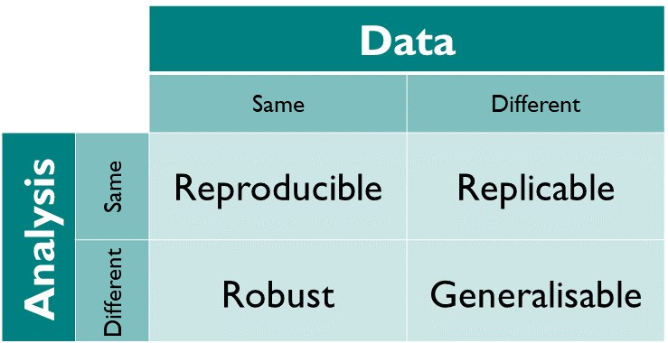
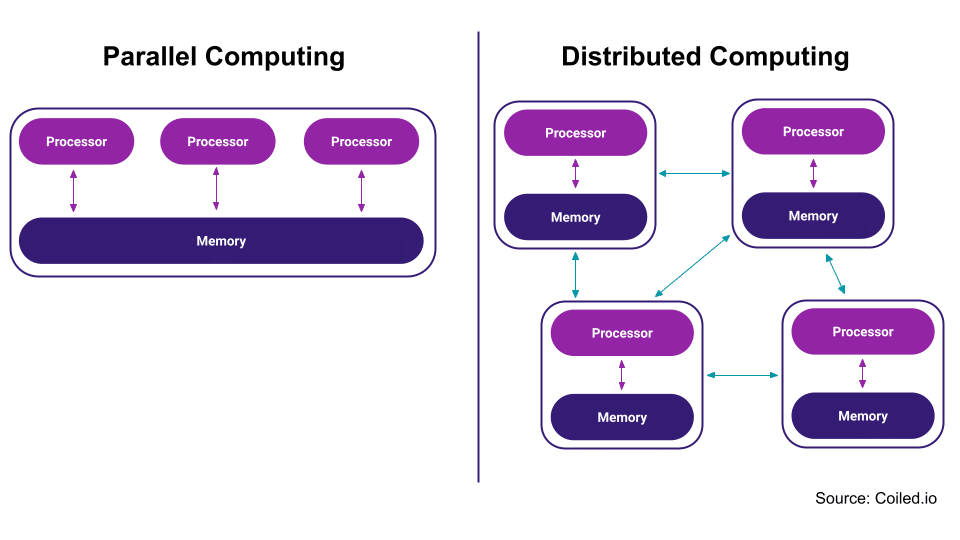
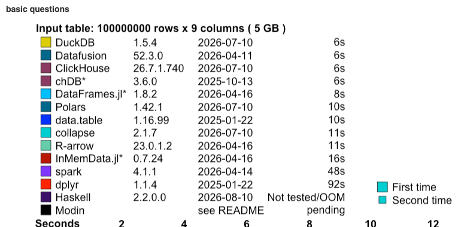
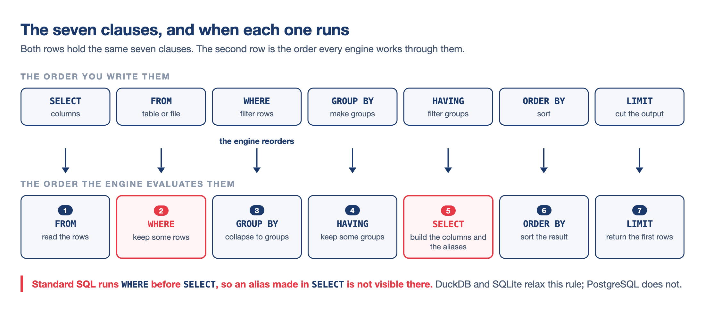
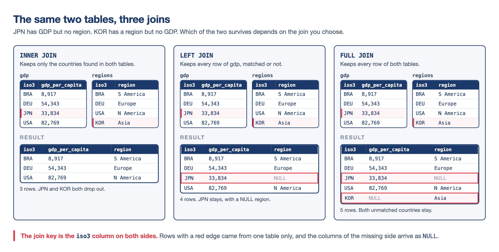
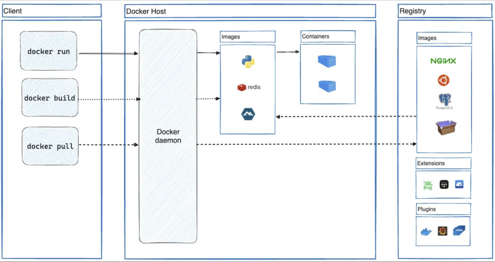
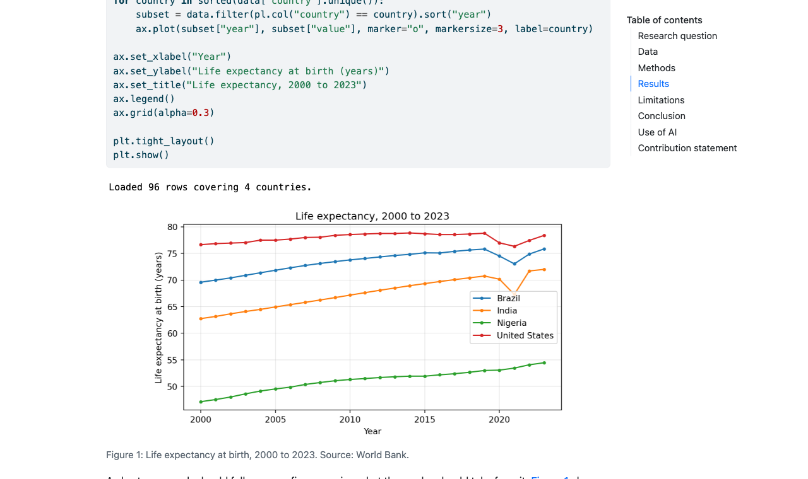
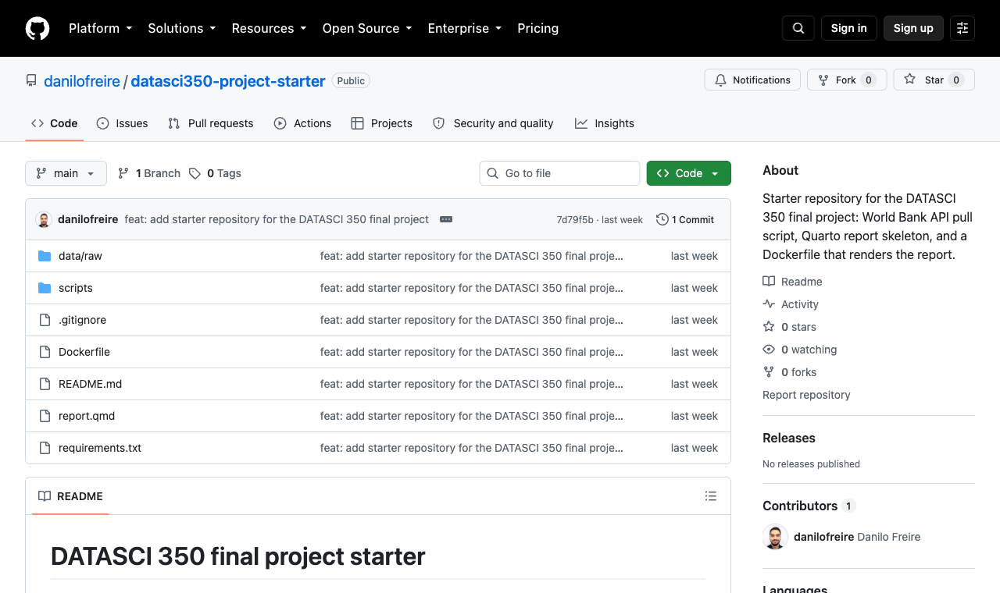

# Hello, everyone! 😊 {background-color="#1B3A6B"}

## Where we are
### The last class before the quiz and the project

:::{style="margin-top: 15px; font-size: 20px;"}
:::{.columns}
:::{.column width="52%"}
- The eight modules, in the order we took them:
  - [Introduction]{.alert}: how a machine stores, encodes, and runs what you write
  - [Command line and version control]{.alert}: Bash, Git, and GitHub
  - [Reproducible research]{.alert}: Quarto, project structure, a pinned environment
  - [AI-assisted programming]{.alert}: local models, APIs, coding agents, RAG
  - [Cloud computing]{.alert}: EC2, S3, and a bill you can control
  - [Getting data from the web]{.alert}: APIs, JSON, and a committed snapshot
  - [Scaling and performance]{.alert}: joblib, Dask, DuckDB
  - [Containers]{.alert}: environments, Docker, and the image you hand in
:::

:::{.column width="48%"}
- Today we revise the last two modules, because that is what the quiz covers
- [Quiz 05]{.alert} is on Thursday 3 December and covers Lectures 21, 22, 23 and 25
- The [final project]{.alert} is due on Tuesday 8 December at 11:59pm, and must render inside a container
- Your project can still use the first six modules, which this quiz does not cover

:::{style="text-align: center; margin-top: 10px;"}
[{width="66%"}](#){data-modal-type="image" data-modal-url="figures/table-reproducibility.jpg"}

:::{style="font-size: 17px;"}
Source: [The Turing Way Community (2025)](https://book.the-turing-way.org/reproducible-research/overview/overview-definitions)
:::
:::
:::
:::
:::

## Lecture overview
### What we will cover today

:::{style="margin-top: 15px; font-size: 20px;"}
:::{.columns}
::::{.column width="50%"}
[1. Scaling and performance]{.alert}

- `map`, embarrassingly parallel work, `joblib`
- Big O, Amdahl's law, and the GIL
- Dask, and the 200-million-row benchmark

[2. SQL revision]{.alert}

- The order a query really runs in
- `WHERE` against `HAVING`, `COUNT(*)` against `COUNT(value)`
- Joins, `sqlite3`, and the dialect traps
::::

::::{.column width="50%"}
[3. SQL practice]{.alert}

- Four exercises on the World Bank panel
- Twenty-five minutes, solutions in the appendix

[4. Containers and Docker]{.alert}

- `venv`, conda and `uv` side by side
- Images, containers, registries
- The project checklist and the Q&A

[5. Quiz 05 preparation]{.alert}

- What to expect from each lecture, and how to revise
::::
:::
:::

# Scaling and performance ⚡ {background-color="#1B3A6B"}

## Serial and parallel work
### Where lecture 21 started

:::{style="margin-top: 15px; font-size: 21px;"}
:::{.columns}
:::{.column width="52%"}
- [Serial]{.alert}: each line finishes before the next one starts
- [Parallel]{.alert}: independent tasks run at the same time on several cores
- [`map`]{.alert} applies one function to every element of a list
  - Every parallel tool copies that shape
- A problem is [embarrassingly parallel]{.alert} when the tasks share no state and need no result from each other
- Our `calculation()` on ten million random numbers qualified
  - A loop carrying a running total does not
- Four parallel calls never reached a full 4× saving: starting workers and moving results back costs time
:::

:::{.column width="48%"}
:::{style="font-size: 22px;"}
```python
def bar(x):
    return x * x

foo = np.array([0, 1, 2, 3, 4, 5])

list(map(bar, foo))
# [0, 1, 4, 9, 16, 25]
```
:::

- Before parallelising anything:
  - Are the tasks independent?
  - Is each one heavy enough to pay for starting a worker?
- If either answer is no, the cores will not help you
:::
:::
:::

## joblib and concurrent.futures
### When to reach for each one

:::{style="margin-top: 15px; font-size: 20px;"}
:::{.columns}
:::{.column width="50%"}
- [`joblib`]{.alert} turns a loop into parallel work in two lines
  - `n_jobs=-1` uses every core

:::{style="font-size: 22px;"}
```python
from joblib import Parallel, delayed

results = Parallel(n_jobs=6)(
    delayed(bar)(x) for x in foo
)
```
:::

- `sklearn` calls joblib internally whenever you set `n_jobs=-1`
- [`concurrent.futures`]{.alert} ships with Python, so it works where you cannot install anything
:::

:::{.column width="50%"}
- The choice comes from why the task is slow:

:::{style="text-align: center; font-size: 18px; margin-top: 10px; margin-bottom: 10px;"}
| Your task | Tool | Why |
|---|---|---|
| Number crunching | `ProcessPoolExecutor` | The processor is busy |
| Downloading many URLs | `ThreadPoolExecutor` | The processor is idle, waiting |
| sklearn, numeric loops | `joblib` | Calls processes for you |
| Bigger than RAM | Dask | Chunks the data itself |
:::

- [CPU-bound]{.alert} work needs more processors
- [I/O-bound]{.alert} work needs cheap threads that wait
- Both executors copy the `map` interface: a function and an iterable
:::
:::
:::

## Big O
### How the runtime grows with the input

:::{style="margin-top: 15px; font-size: 21px;"}
:::{.columns}
:::{.column width="52%"}
- [Big O]{.alert} describes how the runtime grows as the input grows
- [O(1)]{.alert} constant, [O(n)]{.alert} linear, [O(n²)]{.alert} quadratic: doubling the input costs nothing, twice as much, or four times as much
- With `p` cores, an O(n) problem becomes [O(n/p + overhead)]{.alert}
- Parallelism divides the constant in front of the class, and never the class itself
- `pairwise_sum` on 1,000 elements is a million operations, and 10 billion at 100,000
  - No core count rescues that
- An O(n log n) algorithm beats a parallelised O(n²) one on any interesting input
:::

:::{.column width="48%"}
:::{style="font-size: 20px;"}
```python
# O(n^2): every pair of elements
def pairwise_sum(data):
    n = len(data)
    results = []
    for i in range(n):
        for j in range(n):
            results.append(data[i] + data[j])
    return results
```
:::

- Poor candidates for parallelism:
  - Steps that depend on the previous result
  - Algorithms with shared state
  - Work limited by memory rather than by the CPU
:::
:::
:::

## Amdahl's law
### The serial share caps your speed-up

:::{style="margin-top: 15px; font-size: 21px;"}
:::{.columns}
:::{.column width="52%"}
- Every program has a [serial share]{.alert}: the setup, the merging of the results, and any step that waits for the one before it
- The formula is $\text{speedup} = \dfrac{1}{s + \dfrac{p}{N}}$, with $s$ the serial fraction, $p = 1 - s$ the parallel fraction, and $N$ the number of cores
- A program that is 90% parallel, on 8 cores:

:::{style="font-size: 22px;"}
```text
s = 0.1        p = 0.9        N = 8

1 / (0.1 + 0.9/8)
  = 1 / (0.1 + 0.1125)
  = 1 / 0.2125
  = 4.7x
```
:::
:::

:::{.column width="48%"}
- Eight cores give 4.7×: half the hardware does nothing for you
- Push $N$ to infinity and the ceiling is $1/s$, which is 10× here
- A 50% serial program never passes 2×, however large the cluster
- Measure before you scale: `%timeit` and `cProfile` tell you what $s$ actually is
- Expect this arithmetic in the quiz
:::
:::
:::

## The GIL
### Why one thread runs Python at a time

:::{style="margin-top: 15px; font-size: 21px;"}
:::{.columns}
:::{.column width="52%"}
- CPython has a [Global Interpreter Lock]{.alert}: one thread runs Python code at a time, however many cores you own
- Threads still help while your code [waits]{.alert}, because the lock is released during a download or a disk read
- Threads do nothing while your code [computes]{.alert}, because the lock keeps the others idle
- CPU-bound work needs [processes]{.alert}, each one a separate Python with its own lock
- NumPy, Polars and DuckDB [release the GIL]{.alert} while their C and Rust code runs, so they use every core with no processes to manage
- A [free-threaded build]{.alert} is official since Python 3.14, and it is not the default
:::

:::{.column width="48%"}
:::{style="text-align: center; font-size: 18px; margin-top: 15px;"}
| Task | Use |
|---|---|
| Number crunching | Processes |
| Downloading many URLs | Threads |
| NumPy, Polars, DuckDB | Either or neither |
| `sklearn` with `n_jobs=-1` | Processes, via joblib |
:::

:::{style="background: rgba(27, 58, 107, 0.08); padding: 12px; border-radius: 10px; font-size: 19px; margin-top: 15px;"}
The quiz will ask you to pick one. Start from the lock: it is released while Python waits and held while Python computes
:::
:::
:::
:::

## Dask
### Lazy evaluation, and when a cluster is worth it

:::{style="margin-top: 15px; font-size: 20px;"}
:::{.columns}
:::{.column width="52%"}
- [Dask]{.alert} gives you lazy versions of tools you already use: [Array]{.alert} for NumPy, [DataFrame]{.alert} for pandas, [`delayed`]{.alert} for your own functions, [Distributed]{.alert} for a cluster
- [Lazy]{.alert} means nothing runs until `.compute()`, and until then you are building a task graph
- The graph lets Dask optimise the plan and keep memory down before any work starts
- `.persist()` computes a result once and holds it in RAM
  - Use it on a small aggregate, never on the raw frame
- `joblib` parallelises your functions and leaves the data alone
- Dask [chunks the data itself]{.alert}, so a frame can be larger than your RAM
- The [dashboard]{.alert} at `localhost:8787` shows the task stream live, and white space in a row means an idle worker
:::

:::{.column width="48%"}
- A cluster pays for itself when the data does not fit on the machine, or when the graph has real dependencies between tasks
- When the data fits in memory it costs you: building the graph and moving chunks can make Dask slower than pandas
- [Parquet]{.alert} cut our January 2000 data from 182 MB to 86 MB and made the group-by much faster

:::{style="text-align: center; margin-top: 10px;"}
[{width="78%"}](#){data-modal-type="image" data-modal-url="figures/distributed.png"}
:::
:::
:::
:::

## Which tool when
### The same group-by on pandas, Dask and DuckDB

:::{style="margin-top: 12px; font-size: 19px;"}
:::{.columns}
:::{.column width="50%"}
- The task from lecture 22: mean `value` by indicator and decade, on a synthetic panel of [200,681,600 rows]{.alert}

:::{style="text-align: center; font-size: 19px; margin-top: 10px; margin-bottom: 10px;"}
| Engine | Time |
|---|---|
| pandas | 9.65 s |
| Dask | 5.39 s |
| DuckDB | 0.53 s |
:::

- MacBook Pro, Apple M5, 10 cores, 24 GB RAM
- pandas holds every column in RAM
- DuckDB reads only the row groups and columns the query names
- The gap comes from a columnar layout, vectorised execution, every core by default, and [predicate pushdown]{.alert} into the Parquet file
:::

:::{.column width="50%"}
:::{style="text-align: center; margin-bottom: 10px; font-size: 19px;"}
| Your situation | Reach for |
|---|---|
| Fits in RAM, exploring, plotting | pandas |
| A single large file on one machine | Polars or DuckDB |
| Bigger than the machine, or a real cluster | Dask |
:::

- This benchmark measures a single task on one machine
  - Your seconds will differ, and the ranking usually holds
- Measure where the time goes before you scale anything

:::{style="text-align: center; margin-top: 8px;"}
[{width="80%"}](#){data-modal-type="image" data-modal-url="figures/duckdb-db-benchmark-2026-crop.png"}

:::{style="font-size: 17px;"}
Source: [db-benchmark](https://duckdblabs.github.io/db-benchmark/)
:::
:::
:::
:::
:::

# SQL revision 🦆 {background-color="#1B3A6B"}

## The order a query really runs in
### How the engine evaluates a query

:::{style="margin-top: 10px; font-size: 20px;"}
:::{style="text-align: center;"}
[{width="62%"}](#){data-modal-type="image" data-modal-url="figures/sql-evaluation-order.png"}
:::

:::{.columns}
:::{.column width="50%"}
- You write `SELECT` first, but the engine runs it fifth
- `FROM` finds the rows, `WHERE` filters them, `GROUP BY` forms the groups, `HAVING` filters the groups, and `SELECT` computes the output columns
:::

:::{.column width="50%"}
- This ladder answers most SQL questions in the quiz, including why an aggregate cannot go in `WHERE`
- DuckDB and SQLite let you reuse a `SELECT` alias in `WHERE`
  - PostgreSQL rejects it, so do not rely on it
:::
:::
:::

## WHERE and HAVING
### Which clause filters what

:::{style="margin-top: 15px; font-size: 21px;"}
:::{.columns}
:::{.column width="50%"}
- [`WHERE`]{.alert} filters rows before grouping
- [`HAVING`]{.alert} filters groups afterwards
- "Which years count?" is a row question, and "Which countries qualify?" is a group question
- No aggregate belongs in `WHERE`, because at that point the groups do not exist yet
- Every column in your `SELECT` is either in the `GROUP BY` or inside an aggregate function
- `ORDER BY` can name an alias you created in `SELECT`, which `mean_gdp` does here
:::

:::{.column width="50%"}
:::{style="font-size: 22px;"}
```sql
SELECT country,
       ROUND(AVG(value), 0) AS mean_gdp
FROM wdi
WHERE indicator = 'gdp_per_capita'
  AND year >= 2010
GROUP BY country
HAVING AVG(value) > 60000
ORDER BY mean_gdp DESC
LIMIT 5
```
:::

- `WHERE year >= 2010` drops old rows
- `HAVING AVG(value) > 60000` drops poorer countries
- Small economies with financial centres win this list: Monaco, Liechtenstein and Bermuda all have fewer than 100,000 people
:::
:::
:::

## COUNT(\*) and COUNT(value)
### Counting rows and counting values

:::{style="margin-top: 15px; font-size: 21px;"}
:::{.columns}
:::{.column width="50%"}
- [`COUNT(*)`]{.alert} counts rows
- [`COUNT(value)`]{.alert} counts the rows where `value` is present
- The difference between the two is the number of missing values
- 217 countries have a GDP row for 2020, and only 208 have a number in it
- `AVG`, `SUM`, `MIN` and `MAX` all skip missing values silently, so a mean can hide a column that is half empty
- `primary_enrolment_net` has 217 rows in 2020 and no numbers at all, so `COUNT(value)` is 0 and `AVG` is NULL
:::

:::{.column width="50%"}
:::{style="font-size: 22px;"}
```sql
SELECT year,
       COUNT(*) AS n_rows,
       COUNT(value) AS with_value,
       COUNT(*) - COUNT(value) AS missing
FROM wdi
WHERE indicator = 'internet_users_pct'
  AND year IN (1990, 2000, 2020)
GROUP BY year
ORDER BY year
```
:::

- Internet use is recorded for 217 countries in each of those years, with 9 numbers missing in 1990, 21 in 2000, and 33 in 2020
- Coverage gets [worse]{.alert} over time: small territories join the panel and never report the series
  - Small territories join the panel and never report the series
:::
:::
:::

## The three joins
### Which rows survive the join

:::{style="margin-top: 10px; font-size: 20px;"}
:::{style="text-align: center;"}
[{width="50%"}](#){data-modal-type="image" data-modal-url="figures/sql-joins.png"}
:::

:::{.columns}
:::{.column width="52%"}
- [`INNER JOIN`]{.alert} keeps the rows that match on both sides
  - A silent filter: a row count that drops after a join usually means this
- [`LEFT JOIN`]{.alert} keeps the left table whole and fills the missing side with NULL
  - That NULL is the join telling you it found no partner
- [`FULL OUTER JOIN`]{.alert} keeps everything from both sides
:::

:::{.column width="48%"}
- In lecture 22 the same two tiny tables gave 5, 6 and 7 rows
- `ON` says which columns must agree, and the table aliases keep `g.iso3` and `r.iso3` apart
- Which table must survive whole, and what should happen to a row with no partner?
:::
:::
:::

## sqlite3 in one slide
### Connection, cursor, commit, fetch

:::{style="margin-top: 12px; font-size: 20px;"}
:::{.columns}
:::{.column width="58%"}
:::{style="font-size: 20px;"}
```python
import sqlite3
import pandas as pd

conn = sqlite3.connect(":memory:")   # or "wdi.db"
cur = conn.cursor()

df.to_sql("wdi", conn, index=False,
          if_exists="replace")

cur.execute("""CREATE TABLE regions
               (iso3 TEXT PRIMARY KEY, region TEXT)""")
cur.executemany("INSERT INTO regions VALUES (?, ?)",
    [("USA", "North America"), ("KOR", "East Asia")])
conn.commit()

cur.execute("SELECT * FROM regions WHERE region = ?",
            ("East Asia",))
print(cur.fetchall())

out = pd.read_sql("SELECT COUNT(*) FROM wdi", conn)
conn.close()
```
:::
:::

:::{.column width="42%"}
- DuckDB never made you write a [connection]{.alert}, a [cursor]{.alert}, a `commit()` or a `fetchall()`
- [`to_sql`]{.alert} writes a DataFrame into a table and picks the column types for you
- The [`?`]{.alert} marks a slot the driver fills in safely, and it takes a tuple
  - The trailing comma in `("East Asia",)` is what makes it one
- Never build a query with an f-string, which is how SQL injection happens
- [`commit()`]{.alert} makes writes permanent, and skipping it loses your inserts when the script ends
- [`pd.read_sql`]{.alert} sends a query and hands back a DataFrame, with no cursor involved
:::
:::
:::

## Where the two engines differ
### The rows that give an answer instead of an error

:::{style="margin-top: 12px; font-size: 20px;"}
:::{.columns}
:::{.column width="50%"}
:::{style="text-align: center; font-size: 17px;"}
| Feature | DuckDB | SQLite |
|---|---|---|
| `FROM 'file.parquet'` | works | no such table |
| `ILIKE` | works | syntax error |
| `SUMMARIZE` | works | syntax error |
| `DESCRIBE SELECT ...` | works | `PRAGMA table_info(t)` |
| `SELECT 7 / 2` | `3.5` | `3` |
| `LIKE 'united%'` | 0 rows | matches |
| `GROUP BY ALL` | works | syntax error |
| `STDDEV(x)` | works | no such function |
| `INNER` / `LEFT` / `FULL OUTER` | works | works |
| `CASE`, `COALESCE`, `IS NULL` | works | works |
| Window functions, `UNION` | works | works |
:::
:::

:::{.column width="50%"}
- Most of the language is identical, and two rows are traps:
  - [`7 / 2`]{.alert} is 3.5 in DuckDB and 3 in SQLite, because integer division is the default there, so write `7 * 1.0 / 2` for the decimal
  - [`LIKE`]{.alert} is case-sensitive in DuckDB and case-insensitive for ASCII in SQLite, so the same pattern quietly returns different rows
- SQLite has done `RIGHT` and `FULL OUTER JOIN` natively since version 3.39, released in 2022
- Every row was tested on DuckDB 1.5.5 and SQLite 3.53.1
:::
:::
:::

# SQL practice 🧠 {background-color="#1B3A6B"}

## The setup for all four exercises
### What to run before exercise 1

:::{style="margin-top: 15px; font-size: 21px;"}
:::{.columns}
:::{.column width="50%"}
- Open a notebook or a Python file next to the lecture folder, and run this once:

:::{style="font-size: 22px;"}
```{python}
#| echo: true
#| eval: true
#| cache: true
import duckdb

duckdb.sql("""
    CREATE OR REPLACE VIEW wdi AS
    SELECT * FROM
    '../lecture-19/data/wdi_panel.parquet'
""")

duckdb.sql("SELECT COUNT(*) AS n_rows FROM wdi")
```
:::
:::

:::{.column width="50%"}
- The same panel from Module 06: 59,024 rows of `country`, `iso3`, `indicator`, `year` and `value`
- Eight indicators, including `gdp_per_capita`, `life_expectancy`, `co2_per_capita` and `internet_users_pct`
- The four exercises get harder as we go, and each one has a solution appendix
- Work in pairs if you like
  - I will walk around, and we look at each solution together
- Exercise 4 needs `import sqlite3` and `import pandas as pd` as well
:::
:::
:::

## Try it yourself! 🧠 {#sec-exercise-01}
### Five minutes

:::{style="margin-top: 20px; font-size: 21px;"}
:::{.columns}
:::{.column width="52%"}
Which countries emitted the most CO2 per person in 2020?

1. Run the setup cell so the `wdi` view exists
2. Keep only the rows for `co2_per_capita`
3. Keep only the year 2020
4. Return `country` and `value`, rounded to one decimal
5. Rename the rounded column `co2_pc`
6. Sort from highest to lowest
7. Return the top five rows
:::

:::{.column width="48%"}
What to look for:

- Two conditions join with `AND` inside one `WHERE`
- Text goes in [single quotes]{.alert}
  - Double quotes mean a column name, and DuckDB will say the column does not exist
- Sorting needs `DESC`, because `ASC` is the default
- The winner is a Pacific island with fewer than 20,000 people
- Four of the five are oil or gas economies

:::{style="background: rgba(27, 58, 107, 0.08); padding: 12px; border-radius: 10px; font-size: 19px; margin-top: 12px;"}
Solution and the full output: [[Appendix 01]{.button}](#sec-appendix-01)
:::
:::
:::
:::

## Try it yourself! 🧠 {#sec-exercise-02}
### Five minutes

:::{style="margin-top: 20px; font-size: 21px;"}
:::{.columns}
:::{.column width="52%"}
Which countries have been the most connected since 2015?

1. Keep only the rows for `internet_users_pct`
2. Keep only the years from 2015 onwards
3. Report one row per country
4. Count how many years have a number in `value`, and call it `n_years`
5. Compute the mean of `value`, rounded to one decimal, as `mean_internet`
6. Keep the countries with at least 5 years of data and a mean above 95
7. Sort by the mean, highest first, and return five rows
:::

:::{.column width="48%"}
What to look for:

- The filter on `year` and the two filters on the group go in [different clauses]{.alert}
- `COUNT(value)` and `COUNT(*)` disagree here, and only one of them counts years with data
- Five countries come back, every one of them above 97%
- The list mixes Nordic countries with Gulf states, and one country is neither
- An error about an aggregate in `WHERE` means the evaluation ladder is worth another look

:::{style="background: rgba(27, 58, 107, 0.08); padding: 12px; border-radius: 10px; font-size: 19px; margin-top: 12px;"}
Solution and the full output: [[Appendix 02]{.button}](#sec-appendix-02)
:::
:::
:::
:::

## Try it yourself! 🧠 {#sec-exercise-03}
### Eight minutes

:::{style="margin-top: -14px; font-size: 16px;"}
:::{.columns}
:::{.column width="60%"}
:::{style="margin-top: -12px;"}
How rich is each region, and on how much data? Run this first.
:::

1. Report one row per region, keeping every region
2. Count the countries in the region with a 2022 GDP figure
3. Compute the region's mean GDP per capita
4. Sort by the mean, highest first, empty region last

:::{style="font-size: 20px; margin-top: -10px;"}
```python
duckdb.sql("""
    CREATE OR REPLACE TABLE gdp2022 AS
    SELECT country, iso3, ROUND(value, 0) AS gdp_per_capita
    FROM wdi
    WHERE indicator = 'gdp_per_capita' AND year = 2022
      AND iso3 IN ('USA','BRA','CHN','IND','NGA','FRA')
""")

duckdb.sql("""
    CREATE OR REPLACE TABLE regions
        (iso3 VARCHAR PRIMARY KEY, region VARCHAR)
""")

duckdb.sql("""
    INSERT INTO regions VALUES
        ('USA', 'North America'), ('BRA', 'Latin America'),
        ('CHN', 'East Asia'),     ('JPN', 'East Asia'),
        ('IND', 'South Asia'),    ('FRA', 'Europe'),
        ('ZAF', 'Sub-Saharan Africa')
""")
```
:::
:::

:::{.column width="40%"}
What to look for:

- Which table goes on the left if every region must survive?
- East Asia holds two codes and one GDP figure, Sub-Saharan Africa one code and none
- `COUNT(*)` reports 2 and 1 there, `COUNT(g.country)` reports 1 and 0
- Six regions come back, and one of them has a NULL mean
- Nigeria has a GDP figure and no region, so it never appears
  - Swap the two table names and it does

:::{style="background: rgba(27, 58, 107, 0.08); padding: 12px; border-radius: 10px; font-size: 19px; margin-top: 10px;"}
Solution and both counts: [[Appendix 03]{.button}](#sec-appendix-03)
:::
:::
:::
:::

## Try it yourself! 🧠 {#sec-exercise-04}
### Seven minutes

:::{style="margin-top: 15px; font-size: 20px;"}
:::{.columns}
:::{.column width="52%"}
Run exercise 2 again, in `sqlite3` this time.

1. Import `sqlite3` and `pandas`
2. Read the panel with `pd.read_parquet` into `df`
3. Open a connection to `":memory:"`
4. Write `df` into a table called `wdi` with `to_sql`, using `index=False` and `if_exists="replace"`
5. Copy your exercise 2 query across, unchanged
6. Replace `2015` with a `?` placeholder
7. Send the query with `pd.read_sql` and pass `params=(2015,)`
8. Check that the five countries match exercise 2
:::

:::{.column width="48%"}
What to look for:

- The SQL does not change, so everything you revised today is portable
- `params` takes a [tuple]{.alert}, so the trailing comma in `(2015,)` matters
- The result is a pandas DataFrame, printed with an index column
- Change the parameter to 1995 and rerun, and only the results change
- Assignment 09 asked for this pattern, and so may the quiz

:::{style="background: rgba(27, 58, 107, 0.08); padding: 12px; border-radius: 10px; font-size: 19px; margin-top: 12px;"}
Solution and the full output: [[Appendix 04]{.button}](#sec-appendix-04)
:::
:::
:::
:::

## What those four exercises tested
### What each exercise tested

:::{style="margin-top: 20px; font-size: 21px;"}
:::{.columns}
:::{.column width="50%"}
- Exercise 1: `WHERE` with two conditions, an alias, `ORDER BY DESC`, and `LIMIT`
- Exercise 2: `GROUP BY` with `HAVING`, and the difference between `COUNT(*)` and `COUNT(value)`
- Exercise 3: a `LEFT JOIN` that keeps the left table whole, and a count that must skip the NULLs the join created
- Exercise 4: the same SQL under `sqlite3`, with a `?` placeholder instead of a literal
:::

:::{.column width="50%"}
- If exercise 3 was hard, check the direction of the join
  - Write down which table must survive before you type `FROM`
- If exercise 2 was hard, reread the evaluation ladder
- The full solutions are in Appendices 01 to 04, with the outputs from this laptop
- Lecture 22 has about thirty more queries, and Tutorial 04 on the website has the rest
:::
:::
:::

# Containers and Docker 🐳 {background-color="#1B3A6B"}

## Why working code breaks
### Why working code breaks

:::{style="margin-top: 15px; font-size: 21px;"}
:::{.columns}
:::{.column width="52%"}
- "It works on my machine" happens when your code assumes software you never wrote down
- [Dependencies]{.alert}: the external libraries and tools your code needs
- [Dependency management]{.alert}: making sure it still runs next year
- Libraries change: `print "hello"` was valid Python 2 and is a `SyntaxError` in Python 3
- A 2016 Nature survey of 1,576 researchers found more than 70% had failed to reproduce someone else's experiment, and more than half had failed to reproduce one of their own
- Missing documentation and unrecorded dependencies have a technical fix
:::

:::{.column width="48%"}
- The ladder, from cheap to thorough:
  - [Declare]{.alert} your dependencies in one file in the repository root
  - [Manage]{.alert} them with an environment tool
  - [Pin]{.alert} them to exact versions
  - [Containerise]{.alert} the whole environment
- Your project sits at the last rung, because the marker's machine has Docker and nothing else
- Lecture 10's ingredients of a reproducible result: code, data, environment, documentation
  - A container ships the environment with the code already inside it
:::
:::
:::

## Ways to pin an environment
### venv, conda and uv side by side

:::{style="margin-top: 12px; font-size: 18px;"}
:::{.columns}
:::{.column width="33%"}
[`venv` and `pip`]{.alert}

- Ships with Python
- `python3 -m venv .venv`, then `source .venv/bin/activate`
- `pip freeze > requirements.txt` writes `==` pins
- `pip install -r requirements.txt` reads them back
- Two packages became seven lines, because pip lists the dependencies of your dependencies
- Freeze inside conda and you get `name @ file:///...` paths that install nowhere else
:::

:::{.column width="33%"}
[conda]{.alert}

- Handles environments and packages together
- Installs non-Python software: compilers, R, CUDA
- `conda create --name demo python=3.14 numpy`
- `environment.yml` is the file you commit
- `--from-history` gives a file that travels between operating systems
- You met it in DATASCI 151
:::

:::{.column width="33%"}
[`uv`]{.alert}

- Written in Rust by Astral, and fast: eight packages resolved in 1.62 seconds
- `uv init`, `uv add polars`, `uv sync`
- `pyproject.toml` for humans, `uv.lock` for the exact versions and hashes
- Both files belong in git, and you never edit the lock by hand
- `uv export --format requirements-txt --no-hashes` writes the file your Dockerfile wants
:::
:::

:::{style="background: rgba(27, 58, 107, 0.08); padding: 12px; border-radius: 10px; font-size: 19px; margin-top: 12px;"}
Whichever tool you use, the deliverable is the same: [`requirements.txt`]{.alert} with `==` pins, in the repository root, because every Dockerfile reads it
:::
:::

## Image, container, registry
### What each word means

:::{style="margin-top: 15px; font-size: 21px;"}
:::{.columns}
:::{.column width="52%"}
- An [image]{.alert} is a read-only template: operating system, libraries, your code, configuration
  - You build one from a `Dockerfile`
- A [container]{.alert} is a running instance of an image, and one image can start many
- A [registry]{.alert} is where images live, such as [Docker Hub](https://hub.docker.com)
  - `docker push` and `docker pull` move them
- A virtual environment isolates Python packages
  - A container also carries the system libraries, the interpreter and the tools your code touches
- A virtual machine boots a whole operating system
  - A container carries only what the application needs, so it starts in a second
:::

:::{.column width="48%"}
- Docker Desktop is free for personal use, for open source, and for companies with fewer than 250 employees and under $10M in annual revenue
- The personal plan caps Docker Hub at 100 image pulls per hour
- [Podman, Colima, OrbStack and Rancher Desktop]{.alert} take the same commands, and every `docker` line in lecture 25 ran through OrbStack

:::{style="text-align: center; margin-top: 10px;"}
[{width="66%"}](#){data-modal-type="image" data-modal-url="figures/docker-architecture.png"}

:::{style="font-size: 17px;"}
Client, daemon and registry, from the [Docker documentation](https://docs.docker.com/get-started/docker-overview/)
:::
:::
:::
:::
:::

## The project Dockerfile
### What each block does

:::{style="margin-top: 10px; font-size: 20px;"}
:::{.columns}
:::{.column width="58%"}
:::{style="font-size: 20px;"}
```dockerfile
# 1. Base image
FROM ubuntu:24.04

# 2. Build-time settings
ENV DEBIAN_FRONTEND=noninteractive
SHELL ["/bin/bash", "-c"]

# 3. System packages
RUN apt-get update && apt-get install -y [...]

# 4. Quarto
ARG QUARTO_VERSION=1.9.37
RUN ARCH=$(dpkg --print-architecture) && [...]

# 5. Python environment
RUN python3 -m venv /opt/venv
ENV PATH="/opt/venv/bin:$PATH"
COPY requirements.txt /project/requirements.txt
RUN pip install --no-cache-dir -r /project/requirements.txt

# 6. Project files
WORKDIR /project
COPY . /project

# 7. Default command
ENV QUARTO_PYTHON=/opt/venv/bin/python
CMD ["bash", "-c", "quarto render report.qmd && [...]"]
```
:::
:::

:::{.column width="42%"}
- [`FROM`]{.alert} pins the starting point to a tag
  - `latest` moves, and a base image that moves breaks reproducibility
- `ENV DEBIAN_FRONTEND=noninteractive` stops apt asking questions nobody is there to answer
- Quarto arrives as a `.deb`, and `dpkg --print-architecture` picks arm64 or amd64
- Ubuntu protects its own Python, so we build a virtual environment at `/opt/venv` and put it first on the `PATH`
- [`COPY requirements.txt`]{.alert} sits alone above `COPY . /project`, so editing your report leaves the slow `pip install` cached
- Fourteen instructions, of which eight create a layer, so the log counts `[1/8]` to `[8/8]`
:::
:::
:::

## Build, run, and the flags that matter
### Layer caching, volumes, and ports

:::{style="margin-top: 15px; font-size: 20px;"}
:::{.columns}
:::{.column width="52%"}
:::{style="font-size: 22px;"}
```text
docker build -t datasci350-project .

docker run --rm \
  -v "$(pwd)/output:/project/output" \
  datasci350-project
```
:::

- The cold build took [7 minutes 00.70 seconds]{.alert}: Quarto 206.5s, pip 89.2s, apt 70.8s
- After a title edit, the rebuild took [0.837 seconds]{.alert}, with seven of eight steps `CACHED`
- Edit `requirements.txt` instead and the cache misses at `COPY requirements.txt`, so pip and everything below it runs again
- [`.dockerignore`]{.alert} took the build context from 1.42MB to 59.36kB
:::

:::{.column width="48%"}
- `--rm` deletes the container when it exits
- [`-v host:container`]{.alert} connects a folder on your laptop to one inside the container
  - The left path must be absolute, which is why we write `$(pwd)`
- Without the mount the render succeeds, the container is deleted, and `report.html` goes with it
  - This is the most common Docker mistake in the course
- [`-p host:container`]{.alert} does the same job for ports
  - `docker run --rm -p 8888:8888 quay.io/jupyter/scipy-notebook` puts JupyterLab on `localhost:8888`
- Our project writes a file, so it needs `-v` and no `-p`
:::
:::
:::

## The project checklist
### What the marker's machine needs to render your report

:::{style="margin-top: 15px; font-size: 21px;"}
:::{.columns}
:::{.column width="54%"}
- [Commit `data/raw/`]{.alert}. `report.qmd` reads the snapshot, and the API is never called at render time
- Check it with `git ls-files data/raw`, which must print your files
- [Pin every package]{.alert} in `requirements.txt` with `==`, and use a version that exists on PyPI
- [Test from a fresh clone]{.alert} in an empty folder
  - The folder you wrote the code in already has the files you forgot to commit
- Run `ls output` after the container exits, and check the timestamp on the file
- The five commands are 30% of the project grade, and you can run them tonight
:::

:::{.column width="46%"}
:::{style="text-align: center;"}
[{width="86%"}](#){data-modal-type="image" data-modal-url="figures/starter-report-rendered-2026.png"}

:::{style="font-size: 17px;"}
`output/report.html`, rendered inside the container
:::
:::

- My machine has Docker installed and nothing else: no Python, no Quarto, no packages
- The exact commands I run are in [[Appendix 05]{.button}](#sec-appendix-05)
:::
:::
:::

# Quiz 05 and the project 📝 {background-color="#1B3A6B"}

## What to expect on Thursday
### The kind of question each lecture brings

:::{style="margin-top: 15px; font-size: 21px;"}
:::{.columns}
:::{.column width="50%"}
- [Lecture 21]{.alert}
  - Name the tool for a task and say why
  - Decide whether a small function is embarrassingly parallel
  - Do an Amdahl calculation with the numbers given
- [Lecture 22]{.alert}
  - Read a query and say what comes back
  - Fix a query that puts an aggregate in `WHERE`
  - Say how many rows a given join returns, and what `COUNT` does with a NULL
:::

:::{.column width="50%"}
- [Lecture 23]{.alert}
  - Match `venv`, conda and `uv` to their files
  - Explain what `pip freeze` writes and what `==` means
  - Define image, container and registry
- [Lecture 25]{.alert}
  - Read a `Dockerfile` block and say what it does
  - Explain why `COPY requirements.txt` comes before `COPY .`
  - Say what happens to the report without `-v`
- The quiz is in class on Thursday 3 December, open book and open notes, and it is worth 6%
:::
:::
:::

## How to revise
### A two-hour plan, in order

:::{style="margin-top: 15px; font-size: 21px;"}
:::{.columns}
:::{.column width="52%"}
1. Reread the summary slide of each lecture, where every alert term is fair game
2. Redo today's four SQL exercises without looking at the appendices
3. Redo the lecture 25 exercise: add a package, rebuild, and read which steps say `CACHED`
4. Do the Amdahl arithmetic for 95% parallel on 4 cores and on 64, then compare
5. Open lecture 22 and read three queries out loud, clause by clause, in evaluation order
:::

:::{.column width="48%"}
- The appendices you want:
  - Lecture 21, Appendix 02: chunk sizes compared
  - Lecture 22, Appendix 04: the complete `sqlite3` listing
  - Lecture 23, Appendix 02: six build errors and their fixes
  - Lecture 25, Appendix 03: the complete Dockerfile, with comments
- Tutorial 04 on the course website is the longer SQL revision if any clause still feels new
- Email me before Thursday if a topic is still unclear, and we can meet in office hours
:::
:::
:::

## Project questions
### The problems I expect to hear about

:::{style="margin-top: 15px; font-size: 21px;"}
:::{.columns}
:::{.column width="52%"}
- [The data is not in the repository]{.alert}
  - The build succeeds, because nothing in the Dockerfile mentions your CSV, and the run dies with `FileNotFoundError`
  - Fix it with `git add data/raw/`, then check with `git ls-files data/raw`
- [A pin that does not exist]{.alert}
  - pip stops the build, and nothing below that layer is cached
  - Read the version numbers in your `requirements.txt` against PyPI
- [The mount is missing]{.alert}
  - The report renders, the container is deleted, and `ls output` says no such directory
  - Add `-v "$(pwd)/output:/project/output"`
:::

:::{.column width="48%"}
- Where the answers live:
  - Failures one and two: [Lecture 25](https://danilofreire.github.io/datasci350/lectures/lecture-25/25-docker.html), the "When something goes wrong" section
  - Seven build and run errors: Lecture 25, Appendix 02
  - Six installation errors: [Lecture 23](https://danilofreire.github.io/datasci350/lectures/lecture-23/23-containers.html), Appendix 02
- Bring me your build log rather than a description of it
  - The log names the step that failed
- What else is blocking your group today?
:::
:::
:::

# Summary {background-color="#1B3A6B"}

## What to revise before Thursday
### The vocabulary, in the order we met it today

:::{style="margin-top: 20px; font-size: 21px;"}
:::{.columns}
:::{.column width="50%"}
- [Serial and parallel]{.alert} work, `map`, and problems that are [embarrassingly parallel]{.alert}
- [`joblib`]{.alert} for numeric loops, `ProcessPoolExecutor` for CPU work, `ThreadPoolExecutor` for waiting
- [Big O]{.alert}: parallelism divides the constant and leaves the class alone
- [Amdahl's law]{.alert}: 90% parallel on 8 cores gives 4.7×
- [The GIL]{.alert}: threads help while Python waits, processes help while Python computes
- [Dask]{.alert} is lazy until `.compute()`, and on 200 million rows DuckDB finished in 0.53 s against pandas at 9.65 s
:::

:::{.column width="50%"}
- The [evaluation ladder]{.alert}: `FROM`, `WHERE`, `GROUP BY`, `HAVING`, then `SELECT`
- [`WHERE`]{.alert} filters rows and [`HAVING`]{.alert} filters groups
- `COUNT(*)` counts rows and `COUNT(value)` counts numbers
- The three joins gave 5, 6 and 7 rows on the same two tables
- [`sqlite3`]{.alert} wants a connection, a cursor, `commit()`, and `?` placeholders
- [`requirements.txt`]{.alert} with `==` pins, whichever tool wrote it
- [Image, container, registry]{.alert}, and the `-v` flag that puts the report on your laptop
:::
:::
:::

## Before we finish

:::{style="margin-top: 25px; font-size: 22px;"}
:::{.columns}
:::{.column width="55%"}
- Thank you for a good semester
  - You have gone from `cd` and `ls` to shipping an image someone else can run
- [Quiz 05]{.alert} is on Thursday 3 December and covers Lectures 21, 22, 23 and 25
- The [final project]{.alert} is due on Tuesday 8 December at 11:59pm
- We meet on 8 December for a Q&A session and project work time, with no lecture
- Test your container from a fresh clone tonight, while there is still time to fix it
- Please fill in the [course evaluation]{.alert}
  - I read every comment, and this course changes every year because of them
:::

:::{.column width="45%"}
:::{style="text-align: center;"}
[{width="100%"}](#){data-modal-type="image" data-modal-url="figures/starter-repo-github-2026.png"}

:::{style="font-size: 17px;"}
Source: [datasci350-project-starter](https://github.com/danilofreire/datasci350-project-starter)
:::
:::
:::
:::
:::

# Questions? 🤔 {background-color="#1B3A6B"}

# Thank you very much! 🙏 {background-color="#1B3A6B"}

# Appendix 📚 {background-color="#1B3A6B"}

## Appendix 01: Solution to Exercise 01 {#sec-appendix-01}

:::{style="margin-top: 20px; font-size: 20px;"}
:::{.columns}
:::{.column width="52%"}
:::{style="font-size: 20px;"}
```{python}
#| echo: true
#| eval: true
#| cache: true
duckdb.sql("""
    SELECT country,
           ROUND(value, 1) AS co2_pc
    FROM wdi
    WHERE indicator = 'co2_per_capita'
      AND year = 2020
    ORDER BY value DESC
    LIMIT 5
""")
```
:::
:::

:::{.column width="48%"}
- `WHERE` drops every other indicator and every other year
- `ROUND(value, 1)` computes a new column, and `AS co2_pc` names it
- `ORDER BY value DESC` sorts on the original column, which works just as well as sorting on the alias
- Palau reports 71.7 tonnes per person, four times the second place, with fewer than 20,000 residents and a large tourist economy
- Qatar, Bahrain, Brunei and Trinidad and Tobago follow, all of them oil or gas producers

[[Back to the exercise]{.button}](#sec-exercise-01)
:::
:::
:::

## Appendix 02: Solution to Exercise 02 {#sec-appendix-02}

:::{style="margin-top: 20px; font-size: 20px;"}
:::{.columns}
:::{.column width="52%"}
:::{style="font-size: 20px;"}
```{python}
#| echo: true
#| eval: true
#| cache: true
duckdb.sql("""
    SELECT country,
           COUNT(value) AS n_years,
           ROUND(AVG(value), 1) AS mean_internet
    FROM wdi
    WHERE indicator = 'internet_users_pct'
      AND year >= 2015
    GROUP BY country
    HAVING COUNT(value) >= 5
       AND AVG(value) > 95
    ORDER BY mean_internet DESC
    LIMIT 5
""")
```
:::
:::

:::{.column width="48%"}
- `WHERE` keeps rows, and both `HAVING` conditions test the group
- `COUNT(value)` returns 9 for each of these countries, so the panel holds 2015 to 2023
- `COUNT(*)` would return 9 for every country in the world, including the ones with no numbers at all
- Iceland leads at 98.7%, with Bahrain, Luxembourg, Qatar and Denmark behind it
- `ORDER BY` names `mean_internet`, the alias created in `SELECT`

[[Back to the exercise]{.button}](#sec-exercise-02)
:::
:::
:::

## Appendix 03: Solution to Exercise 03 {#sec-appendix-03}

:::{style="margin-top: 12px; font-size: 19px;"}
```{python}
#| echo: false
#| eval: true
#| cache: true
duckdb.sql("""
    CREATE OR REPLACE TABLE gdp2022 AS
    SELECT country, iso3, ROUND(value, 0) AS gdp_per_capita
    FROM wdi
    WHERE indicator = 'gdp_per_capita' AND year = 2022
      AND iso3 IN ('USA','BRA','CHN','IND','NGA','FRA')
""")

duckdb.sql("""
    CREATE OR REPLACE TABLE regions
        (iso3 VARCHAR PRIMARY KEY, region VARCHAR)
""")

duckdb.sql("""
    INSERT INTO regions VALUES
        ('USA', 'North America'), ('BRA', 'Latin America'),
        ('CHN', 'East Asia'),     ('JPN', 'East Asia'),
        ('IND', 'South Asia'),    ('FRA', 'Europe'),
        ('ZAF', 'Sub-Saharan Africa')
""")
None
```

:::{.columns}
:::{.column width="50%"}
:::{style="font-size: 20px;"}
```{python}
#| echo: true
#| eval: true
#| cache: true
duckdb.sql("""
    SELECT r.region,
           COUNT(g.country) AS countries_with_gdp,
           ROUND(AVG(g.gdp_per_capita), 0) AS mean_gdp
    FROM regions AS r
    LEFT JOIN gdp2022 AS g ON g.iso3 = r.iso3
    GROUP BY r.region
    ORDER BY mean_gdp DESC NULLS LAST
""")
```
:::

- `regions` goes on the left, because every region must survive
- Sub-Saharan Africa comes back with 0 countries and a NULL mean
:::

:::{.column width="50%"}
The two counts side by side:

:::{style="font-size: 20px;"}
```{python}
#| echo: true
#| eval: true
#| cache: true
duckdb.sql("""
    SELECT r.region,
           COUNT(*) AS count_star,
           COUNT(g.country) AS count_country
    FROM regions AS r
    LEFT JOIN gdp2022 AS g ON g.iso3 = r.iso3
    GROUP BY r.region
    ORDER BY r.region
""")
```
:::

- `COUNT(*)` counts the empty row a left join creates, so East Asia looks like 2 and Sub-Saharan Africa like 1

[[Back to the exercise]{.button}](#sec-exercise-03)
:::
:::
:::

## Appendix 04: Solution to Exercise 04 {#sec-appendix-04}

:::{style="margin-top: -8px; font-size: 20px;"}
:::{.columns}
:::{.column width="44%"}
:::{style="font-size: 20px;"}
```{python}
#| echo: true
#| eval: true
#| cache: true
#| output: false
import sqlite3
import pandas as pd

df = pd.read_parquet(
    "../lecture-19/data/wdi_panel.parquet")

conn = sqlite3.connect(":memory:")
df.to_sql("wdi", conn, index=False,
          if_exists="replace")
```
:::
:::

:::{.column width="56%"}
:::{style="font-size: 20px;"}
```{python}
#| echo: true
#| eval: true
#| cache: true
pd.read_sql("""
    SELECT country,
           COUNT(value) AS n_years,
           ROUND(AVG(value), 1) AS mean_internet
    FROM wdi
    WHERE indicator = 'internet_users_pct'
      AND year >= ?
    GROUP BY country
    HAVING COUNT(value) >= 5
       AND AVG(value) > 95
    ORDER BY mean_internet DESC
    LIMIT 5
""", conn, params=(2015,))
```
:::
:::
:::

:::{style="font-size: 17px; margin-top: -11px;"}
:::{.columns}
:::{.column width="50%"}
- The SQL is identical to Appendix 02, apart from the `?`
- `params=(2015,)` passes a tuple with one element
  - Drop the comma and Python hands SQLite an integer, which it refuses
- `pd.read_sql` returns a DataFrame, so the output carries an index column DuckDB's printed table does not
:::

:::{.column width="50%"}
- The same five countries and the same means come back
- Swap `":memory:"` for `"wdi.db"` and the table survives the script

[[Back to the exercise]{.button}](#sec-exercise-04)
:::
:::
:::
:::

## Appendix 05: Checking your container {#sec-appendix-05}
### The commands I run on your repository

:::{style="margin-top: 20px; font-size: 21px;"}
:::{.columns}
:::{.column width="54%"}
```text
git clone <your repo url> fresh-test
cd fresh-test
docker build -t datasci350-project .
docker run --rm \
  -v "$(pwd)/output:/project/output" \
  datasci350-project
open output/report.html
```

* The machine has Docker installed and nothing else: no Python, no Quarto, no packages
* There is internet during the build, and none promised during the run
:::

:::{.column width="46%"}
* Check that the snapshot is committed:

```text
git ls-files data/raw
```

* It should print your data files, and an empty answer means the render fails inside the container
* Build errors: [Lecture 23, Appendix 02](https://danilofreire.github.io/datasci350/lectures/lecture-23/23-containers.html#sec-appendix-02)
* Run errors: [Lecture 25, Appendix 02](https://danilofreire.github.io/datasci350/lectures/lecture-25/25-docker.html#sec-appendix-02)
:::
:::
:::
