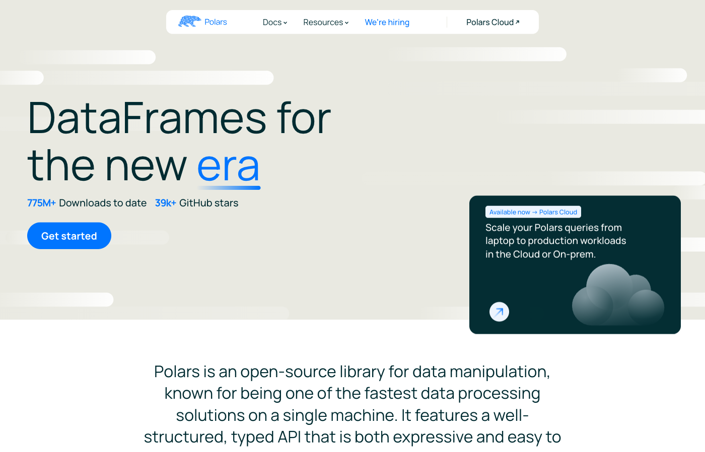
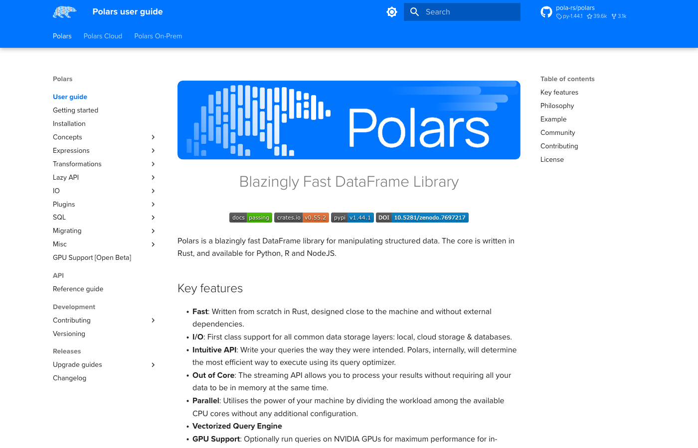
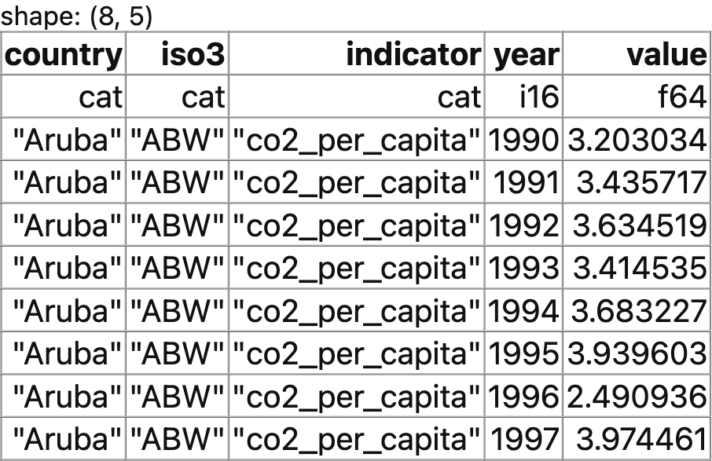
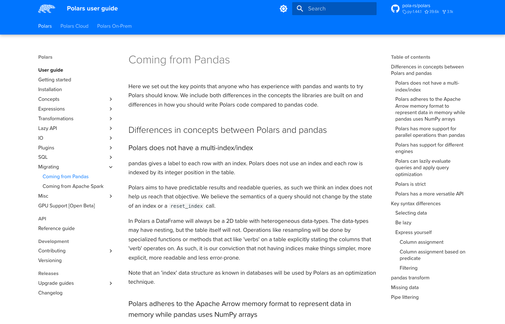
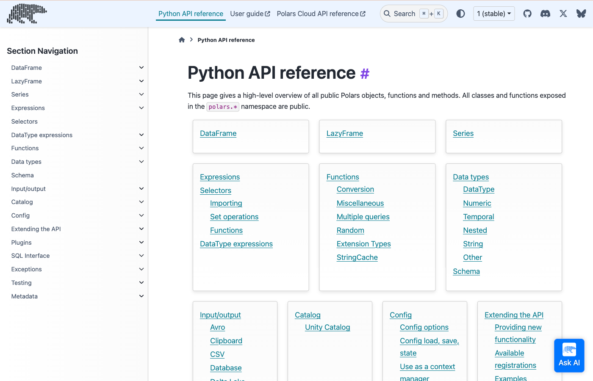

::: {.content-visible when-format="pdf"}
\newpage
:::

# Introduction

In Lecture 02 the class voted on what Lecture 22 should cover. The choice was between keeping the Polars material and replacing it with an SQL revision in DuckDB. SQL won. I promised a tutorial for the option that lost, and this is it.

Polars is a DataFrame library. It does what pandas does, with a different engine underneath and a different way of writing the same operations. You still meet it in Lecture 22, in the benchmark against pandas, Dask and DuckDB.

By the end you will be able to read a Parquet file with Polars, select and filter it, add computed columns, group and aggregate, reshape and join, write a lazy query and read its plan, and process a file larger than memory in streaming mode. You will also be able to translate most pandas code you already write.

The tutorial assumes the pandas you learned in the course and nothing about Polars. Every code chunk runs when the document is rendered, so every output you read is real.

# Why Polars

pandas was written in 2008 for a single processor and a Python-first design. Polars was written in 2020 in [Rust](https://www.rust-lang.org/), with the last fifteen years of database research already known. The design differences show up as speed.

Four of them matter to you:

- **A multi-threaded engine.** Polars uses every core on your machine without being asked. pandas uses one core for most operations.
- **Arrow memory.** Data sits in [Apache Arrow](https://arrow.apache.org/) columnar format, which is compact, cache-friendly, and shared with other tools without a copy.
- **Lazy execution.** You can describe a whole query before running it. Polars then optimises the description, dropping columns and rows it will never need, the way a database planner does.
- **Streaming.** A lazy query can run in batches, so a file bigger than your RAM still goes through.

## When pandas is still the right choice

Polars is not a replacement for everything. Three cases where pandas still wins:

- **Small data.** On a few thousand rows the difference is microseconds. Use whichever you write faster.
- **A library that requires pandas.** Many plotting, statistics and machine-learning packages accept a pandas DataFrame and nothing else. Statsmodels and Seaborn are two you will meet.
- **Code that already exists.** A working pandas script does not become better by being rewritten.

Polars is worth learning when your files get large, when you find yourself waiting, or when you want the lazy and streaming tools pandas lacks. The two libraries convert into each other in one line, so you are never locked in.

Keep the [Polars user guide](https://docs.pola.rs/user-guide/) open beside this tutorial. It is organised by task, and the examples are short.

::: {layout-ncol=2}
{#fig-home width=100%}

{#fig-guide width=100%}
:::

# Setup

You install Polars the same way you install any Python package. The instructions below assume the working Python environment you built in Tutorial 01.

Install the package first.

```bash
pip install polars
```

Install `pyarrow` as well. Polars needs it to convert frames to and from pandas.

```bash
pip install pyarrow pandas
```

If you manage your environment with conda, install from `conda-forge` instead.

```bash
conda install -c conda-forge polars pyarrow
```

Now verify the installation. Open Python. Run the two lines below. A version number appears.

```{python}
#| echo: true
#| eval: true
import polars as pl
print(pl.__version__)
```

The output of this tutorial was produced with Polars 1.43.2. Polars changes quickly, and a few method names have been renamed across versions. Everything here uses the current names.

Next, set the display options. Polars prints as much of a frame as fits, and the defaults are wider than a PDF page. These four settings keep the tables in this document readable.

```{python}
#| echo: true
#| eval: true
pl.Config.set_tbl_rows(8)          # rows to print before eliding
pl.Config.set_tbl_cols(10)         # columns to print before eliding
pl.Config.set_fmt_str_lengths(40)  # characters per string cell
pl.Config.set_tbl_formatting("ASCII_MARKDOWN")  # plain-text table borders
```

The last line is cosmetic. Polars draws tables with box-drawing characters by default, which look good in a terminal and poorly in a PDF. `ASCII_MARKDOWN` replaces them with pipes and dashes. Leave that line out if you work in a terminal or a notebook.

```{python}
#| echo: false
#| eval: true
# Print frames as plain text rather than HTML, so the shape line and the
# dtype row survive into the PDF. Not needed in your own notebooks.
from IPython import get_ipython
get_ipython().display_formatter.formatters["text/html"].for_type(
    pl.DataFrame, lambda frame: None
)
```

In a Jupyter notebook you get more than plain text. Polars renders a frame as an HTML table, with the column names on the first row, the data types on the second, and the shape printed above.

{width=80%}

# Reading data and looking at it

We use the World Bank panel that ships with the course tutorials. It is the same file Tutorial 04 queries with SQL, so you can compare the two approaches on identical data.

Copy the file `wdi_panel.parquet` into a folder named `data` beside your script. Confirm that the path `data/wdi_panel.parquet` exists.

`read_parquet` loads the whole file into memory.

```{python}
#| echo: true
#| eval: true
df = pl.read_parquet("data/wdi_panel.parquet")
df.head()
```

Read the printed table carefully. It carries more than a pandas one:

- The first line gives the **shape**: rows first, then columns.
- The first row of the table is the **column names**.
- The second row, the one with the dashes, is the **data type** of each column. Here `cat` is a categorical, `i16` a 16-bit integer, and `f64` a 64-bit float.

The data is in **long** format. Each row is one country, one indicator, and one year. That is what the World Bank API returns, and what most panel data looks like before you reshape it.

`read_csv` works the same way for text files, guessing the types from the first rows.

```python
# The CSV equivalent, not run here
df_csv = pl.read_csv("data/wdi_panel.csv")
```

Four methods describe a frame before you touch it. `shape` gives the dimensions as a tuple, and `schema` gives the column names with their types.

```{python}
#| echo: true
#| eval: true
print(df.shape)
df.schema
```

`describe` computes summary statistics for every column at once, including the count of missing values.

```{python}
#| echo: true
#| eval: true
df.describe()
```

Two rows deserve attention. `count` is the number of non-missing entries and `null_count` the number of missing ones. The `value` column has 6,526 gaps, which is normal: not every country reports every indicator every year.

`glimpse` prints the frame sideways, one line per column, which suits a frame with many columns.

```{python}
#| echo: true
#| eval: true
df.glimpse(max_items_per_column=4)
```

`null_count()` reports the missing values per column on its own, which is the `null_count` row of `describe` without the rest.

# Expressions, the core idea

Everything in Polars is built from **expressions**. An expression is a small description of a column operation. It does not hold data. `pl.col("value") * 2` is an expression that says "take the column named value and double it", and it means nothing until you hand it to a frame.

This is the one idea that makes Polars feel different. In pandas you write operations on data. In Polars you write descriptions of operations and pass them to a method that applies them. The payoff arrives in the lazy section: because your query is a description, the engine can rearrange it before running it.

## Selecting columns with select

`select` picks columns and returns a new frame.

```{python}
#| echo: true
#| eval: true
df.select(["country", "year", "value"]).head(3)
```

```python
# pandas
df[["country", "year", "value"]].head(3)
```

## Keeping rows with filter

`filter` keeps the rows for which an expression is true.

```{python}
#| echo: true
#| eval: true
df.select(["country", "year", "value"]).filter(pl.col("year") >= 2000).head(3)
```

```python
# pandas
df[["country", "year", "value"]].loc[df["year"] >= 2000].head(3)
```

When a chain grows too long for one line, wrap it in round brackets. Python then reads the whole block as one expression, and you avoid a backslash at the end of every line. Later examples do this.

Polars never modifies a frame in place. Each step returns a new frame, so there is no `inplace=` argument and no `SettingWithCopyWarning`.

## Adding columns with with_columns and alias

`with_columns` adds a column, or replaces one of the same name. `alias` gives the new column its name.

```{python}
#| echo: true
#| eval: true
(df.with_columns(((pl.col("year") // 10) * 10).alias("decade"))
   .select(["country", "year", "decade"]).head(3))
```

```python
# pandas
df["decade"] = (df["year"] // 10) * 10
df[["country", "year", "decade"]].head(3)
```

Arithmetic on an expression works as you expect. `(pl.col("value") / 1e6).alias("pop_millions")` turns raw population counts into millions.

## Boolean logic

Combine conditions with `&` for and, `|` for or, and `~` for not. Each condition needs its own brackets, because in Python `&` binds more tightly than `>=`.

```{python}
#| echo: true
#| eval: true
df.filter((pl.col("year") >= 2015) & (pl.col("indicator") == "life_expectancy")
          & ~pl.col("value").is_null()).head(3)
```

```python
# pandas
df[(df["year"] >= 2015) & (df["indicator"] == "life_expectancy")
   & df["value"].notna()].head(3)
```

Two expression methods shorten long conditions. `pl.col("country").is_in(["Brazil", "Japan"])` tests membership in a list. `pl.col("year").is_between(2018, 2020)` tests a range, with both endpoints included.

`pl.lit` turns a constant into an expression, which is how you add a column of a fixed value: `df.select(pl.lit("World Bank").alias("source"))`.

## Working with text

String methods live in a namespace called `str`. Three of the columns here are stored as `Categorical`, a compact type for repeated text, so cast them to `String` first.

```{python}
#| echo: true
#| eval: true
(df.filter(pl.col("country").cast(pl.String).str.starts_with("United"))
   .select("country").unique().sort("country"))
```

```python
# pandas
df[df["country"].str.startswith("United")]["country"].unique()
```

The namespace holds the methods you expect: `str.contains` for a regular expression, `str.to_uppercase` and `str.to_lowercase` for case, `str.strip_chars` for whitespace, `str.len_chars` for length.

## Conditional values with when, then, otherwise

`when(...).then(...).otherwise(...)` is the Polars if-then-else. Chain several `when` clauses for several branches. Polars takes the first branch that is true, so put the most specific condition first.

We label countries by the World Bank income bands, using GDP per capita in 2020.

```{python}
#| echo: true
#| eval: true
(df.filter((pl.col("indicator") == "gdp_per_capita") & (pl.col("year") == 2020))
   .with_columns(pl.when(pl.col("value") >= 13846).then(pl.lit("High income"))
                   .when(pl.col("value") >= 4466).then(pl.lit("Upper middle"))
                   .when(pl.col("value") >= 1136).then(pl.lit("Lower middle"))
                   .otherwise(pl.lit("Low income")).alias("income_band"))
   .select(["country", "value", "income_band"]).head(5))
```

```python
# pandas
sub["income_band"] = np.select(
    [sub["value"] >= 13846, sub["value"] >= 4466, sub["value"] >= 1136],
    ["High income", "Upper middle", "Lower middle"],
    default="Low income",
)
```

## Try it yourself

1. Select the `country`, `year` and `value` columns for the indicator `internet_users_pct`, keep the rows from 2010 onwards, and show the first five.
2. Label each row of the `life_expectancy` indicator in 2019 as `Above 75` or `75 or below`. Show five rows.

The solutions are in @sec-solutions.

# Missing values

Polars distinguishes two kinds of absent number, and the distinction is sharper than in pandas.

- A **null** is a missing value. The row exists and the entry is unknown. Any column type can hold nulls.
- A **NaN** is the floating-point "not a number", the result of an invalid arithmetic operation such as zero divided by zero. Only float columns can hold it.

pandas mostly conflates the two and represents both as `NaN`. Polars keeps them apart, which means `is_null` and `is_nan` answer different questions.

Count the nulls in the `value` column.

```{python}
#| echo: true
#| eval: true
df.select(
    pl.col("value").is_null().sum().alias("nulls"),
    pl.col("value").is_nan().sum().alias("nans"),
)
```

There are 6,526 nulls and no NaNs. The gaps come from the World Bank, not from a failed calculation.

`fill_null` replaces the gaps with a value of your choice.

```{python}
#| echo: true
#| eval: true
df.with_columns(pl.col("value").fill_null(0.0)).null_count()
```

```python
# pandas
df["value"].fillna(0.0)
```

`fill_null` also takes a strategy instead of a value. `"forward"` carries the previous value down, which is a common fix for a time series with an occasional gap. Use it with care: it invents data.

```python
df.with_columns(pl.col("value").fill_null(strategy="forward"))
```

`drop_nulls` removes the rows that have a gap. Give it a column name to look at one column only.

```{python}
#| echo: true
#| eval: true
df.drop_nulls("value").shape
```

# Sorting, unique values, sampling

`sort` orders the frame. `descending=True` reverses it, and `nulls_last=True` pushes the gaps to the bottom instead of the top.

```{python}
#| echo: true
#| eval: true
(df.filter(pl.col("indicator") == "life_expectancy")
   .sort("value", descending=True, nulls_last=True).head(3))
```

`unique` removes duplicate rows.

```{python}
#| echo: true
#| eval: true
df.select("indicator").unique().sort("indicator")
```

`n_unique` counts them instead of listing them: `df.select(pl.col("country").n_unique())` returns 217. `sample(3, seed=350)` draws three random rows, and the seed makes the draw repeatable.

`top_k` returns the largest rows by a column, without sorting the whole frame. It is faster than `sort().head()` when the frame is large.

```{python}
#| echo: true
#| eval: true
(df.filter((pl.col("indicator") == "life_expectancy") & (pl.col("year") == 2019))
   .top_k(5, by="value"))
```

# Group by and aggregation

`group_by(...).agg(...)` splits the frame into groups and computes one row per group. Inside `agg` you list one expression per output column.

```{python}
#| echo: true
#| eval: true
(
    df.group_by("indicator")
      .agg(
          pl.col("value").mean().alias("mean_value"),
          pl.col("value").median().alias("median_value"),
          pl.len().alias("n"),
      )
      .sort("indicator")
)
```

```python
# pandas
df.groupby("indicator").agg(
    mean_value=("value", "mean"),
    median_value=("value", "median"),
    n=("value", "size"),
)
```

`pl.len()` counts the rows in each group, including those with a missing `value`. `pl.col("value").count()` counts the non-missing ones instead, which is the difference between the two columns below.

```{python}
#| echo: true
#| eval: true
(df.group_by("indicator")
   .agg(pl.len().alias("rows"), pl.col("value").count().alias("with_data"))
   .sort("indicator").head(4))
```

Group by more than one column by passing a list: `group_by(["country", "indicator"])` gives one row per country and indicator pair.

The rows of a `group_by` come back in an unpredictable order, because the groups are built in parallel across cores. Add a `sort` when the order matters, as every example here does.

## Window expressions with over

`group_by` collapses each group into one row and throws the detail away. `over` computes the same summary and attaches it to every row, which is what you want when you compare each row against its group.

Here each country's CO2 figure for 2015 sits beside the world mean for that year, and the gap between them.

```{python}
#| echo: true
#| eval: true
(df.filter((pl.col("indicator") == "co2_per_capita") & (pl.col("year") == 2015)
           & pl.col("value").is_not_null())
   .with_columns(pl.col("value").mean().over("year").alias("world_mean"))
   .with_columns((pl.col("value") - pl.col("world_mean")).alias("gap"))
   .select(["country", "value", "world_mean", "gap"]).head(5))
```

```python
# pandas
sub["world_mean"] = sub.groupby("year")["value"].transform("mean")
sub["gap"] = sub["value"] - sub["world_mean"]
```

`over` is the Polars name for what pandas calls `transform` and SQL calls a window function. Tutorial 04 covers the SQL version.

## Try it yourself

1. For the indicator `urban_pop_pct`, compute the mean, minimum and maximum value per year. Sort by year and show the first five rows.
2. For `gdp_per_capita` in 2020, add a column holding each country's value as a share of the world mean for that year. Show the five highest.

The solutions are in @sec-solutions.

# Reshaping and joining

## Long to wide with pivot

`pivot` turns long data into wide data. `on` names the column whose values become new column names, `index` names the column that stays, and `values` names the numbers that fill the grid.

```{python}
#| echo: true
#| eval: true
wide = (
    df.filter((pl.col("year") == 2020)
              & pl.col("country").is_in(["Brazil", "Germany", "India", "Japan"]))
      .pivot(on="indicator", index="country", values="value")
)
wide.select(["country", "gdp_per_capita", "life_expectancy", "fertility_rate"])
```

```python
# pandas
df.pivot(index="country", columns="indicator", values="value")
```

## Wide to long with unpivot

`unpivot` reverses the operation. It was called `melt` in earlier versions of Polars and in pandas, and the old name now raises a deprecation warning.

```{python}
#| echo: true
#| eval: true
(wide.unpivot(index="country", variable_name="indicator", value_name="value")
     .sort(["country", "indicator"]).head(4))
```

```python
# pandas
wide.melt(id_vars="country", var_name="indicator", value_name="value")
```

## Joining frames

A **join** matches rows from two frames on a shared column. We build a small regions frame by hand with `pl.DataFrame`, which takes a dictionary of columns.

```{python}
#| echo: true
#| eval: true
regions = pl.DataFrame({
    "iso3": ["USA", "BRA", "DEU", "ZAF", "KOR"],
    "region": ["North America", "Latin America", "Europe",
               "Sub-Saharan Africa", "East Asia"],
})
regions.head(3)
```

Now build the left side: GDP per capita in 2020 for five countries.

```{python}
#| echo: true
#| eval: true
gdp2020 = (
    df.filter((pl.col("indicator") == "gdp_per_capita") & (pl.col("year") == 2020)
              & pl.col("iso3").is_in(["USA", "BRA", "DEU", "ZAF", "JPN"]))
      .select(["country", pl.col("iso3").cast(pl.String),
               pl.col("value").round(0).alias("gdp_per_capita")])
      .sort("iso3")
)
gdp2020
```

Note the asymmetry we built in. `gdp2020` has Japan (`JPN`), which `regions` lacks. `regions` has South Korea (`KOR`), which `gdp2020` lacks. Each kind of join treats those unmatched rows differently.

An **inner** join keeps only the rows that match on both sides. Japan and South Korea both disappear.

```{python}
#| echo: true
#| eval: true
gdp2020.join(regions, on="iso3", how="inner").sort("country")
```

A **left** join keeps every row of the left frame. Japan stays, with a null region.

```{python}
#| echo: true
#| eval: true
gdp2020.join(regions, on="iso3", how="left").sort("country")
```

A **full** join keeps every row from both frames. Both Japan and South Korea appear, each null on the side that has no match.

```{python}
#| echo: true
#| eval: true
gdp2020.join(regions, on="iso3", how="full").sort("country", nulls_last=True)
```

A **semi** join keeps the left rows that have a match, and adds no columns. Read it as a filter: "keep the countries that appear in `regions`".

```{python}
#| echo: true
#| eval: true
gdp2020.join(regions, on="iso3", how="semi").sort("country")
```

An **anti** join is the opposite filter: keep the left rows with no match. It is the fastest way to find what is missing from a reference table.

```{python}
#| echo: true
#| eval: true
gdp2020.join(regions, on="iso3", how="anti")
```

```python
# pandas: inner, left and full have direct equivalents
gdp2020.merge(regions, on="iso3", how="inner")
gdp2020.merge(regions, on="iso3", how="left")
gdp2020.merge(regions, on="iso3", how="outer")
# semi and anti have none; you write them with isin()
gdp2020[gdp2020["iso3"].isin(regions["iso3"])]
gdp2020[~gdp2020["iso3"].isin(regions["iso3"])]
```

## Stacking frames with concat

`pl.concat` stacks frames on top of each other, and the frames must have the same columns. It is `pd.concat` under a different spelling.

```python
pl.concat([gdp2020.head(2), gdp2020.tail(2)])   # Polars
pd.concat([gdp2020.head(2), gdp2020.tail(2)])   # pandas
```

## Try it yourself

1. Build a wide frame of `life_expectancy` and `fertility_rate` for 2020, with one row per country, then keep the ten countries with the highest life expectancy.
2. Use an anti join to list the `iso3` codes in `regions` that have no row in `gdp2020`. The trick is which frame goes on the left.

The solutions are in @sec-solutions.

# Lazy mode {#sec-lazy}

Everything so far has been **eager**: each method ran as soon as you typed it. Lazy mode is the other half of Polars, and it is where the speed comes from on large data.

`scan_parquet` returns a **LazyFrame** instead of a DataFrame. Nothing is read and nothing is computed. You chain the same methods you already know, and the chain builds a plan. `collect()` runs it.

```{python}
#| echo: true
#| eval: true
lazy = (
    pl.scan_parquet("data/wdi_panel.parquet")
    .filter(pl.col("year") >= 2000)
    .group_by("indicator")
    .agg(pl.col("value").mean().alias("mean_value"))
)
type(lazy)
```

```{python}
#| echo: true
#| eval: true
lazy.collect().sort("indicator").head(3)
```

## Reading the query plan

`explain()` prints the plan Polars will run, after optimisation. Read it from the bottom up: the last lines happen first.

```{python}
#| echo: true
#| eval: true
print(lazy.explain())
```

Two lines carry the point.

- `PROJECT 3/5 COLUMNS` says Polars will read three of the five columns from the file. Your query never mentions `iso3` or `country`, so they are never loaded. This is **projection pushdown**, written `π` in relational algebra.
- `SELECTION: col("year") >= 2000` says the year filter is applied while the file is being read, not afterwards. Old rows never enter memory. This is **predicate pushdown**.

You wrote the filter after the scan and Polars moved it into the scan. That rewriting is only possible because the lazy chain is a description rather than a sequence of completed steps. It is also why the eager version is slower on a big file: `read_parquet` has already loaded all five columns and every row before your first `filter` runs.

## Writing results without collecting

`sink_parquet` runs a lazy query and writes the result straight to a file. The result never has to fit in memory, because it goes out in batches as it is produced.

```{python}
#| echo: true
#| eval: true
import os

lazy.sink_parquet("data/tmp_indicator_means.parquet")
print(os.path.getsize("data/tmp_indicator_means.parquet"), "bytes")
os.remove("data/tmp_indicator_means.parquet")
```

## Try it yourself {#sec-exercise-lazy}

Here is a pandas chain on the World Bank panel:

```python
import pandas as pd
df = pd.read_parquet("data/wdi_panel.parquet")
out = (
    df[df["year"] >= 2000]
      .groupby("country")["value"]
      .mean()
)
```

1. Rewrite it in lazy Polars. Five steps, in this order: `scan_parquet`, `filter`, `group_by`, `agg`, `collect`. Remember that `agg` takes an expression, not a column name, so build it with `pl.col`.
2. Time both versions with `time.perf_counter`, and print the two durations.

The solution is in @sec-solutions.

# Streaming and data larger than RAM

A lazy query can run in **streaming** mode. Polars pulls the data through in batches, so the whole file never sits in memory at once. The change to your code is one argument: `collect(engine="streaming")`.

The World Bank panel is 460 KB, which proves nothing. We build a larger file to make the point.

The chunk below writes 20 million rows of synthetic data to a temporary Parquet file. It runs in about a second, and the file is deleted at the end of this section.

```{python}
#| echo: true
#| eval: true
import time
import numpy as np

rng = np.random.default_rng(350)
n_rows = 20_000_000

big = pl.DataFrame({
    "group": rng.integers(0, 1000, n_rows),
    "value": rng.random(n_rows),
})
big.write_parquet("data/tmp_big.parquet")
del big

size_mb = os.path.getsize("data/tmp_big.parquet") / 1e6
print(f"{n_rows:,} rows written, {size_mb:.0f} MB on disk")
```

Now run a filter and a grouped mean over it in streaming mode.

```{python}
#| echo: true
#| eval: true
start = time.perf_counter()

result = (
    pl.scan_parquet("data/tmp_big.parquet")
    .filter(pl.col("value") > 0.5)
    .group_by("group")
    .agg(
        pl.col("value").mean().alias("mean_value"),
        pl.len().alias("n"),
    )
    .collect(engine="streaming")
)

elapsed = time.perf_counter() - start
print(f"{result.height} groups in {elapsed:.2f} seconds")
result.sort("group").head(3)
```

Twenty million rows, filtered and grouped, in a fraction of a second. Delete the file now.

```{python}
#| echo: true
#| eval: true
os.remove("data/tmp_big.parquet")
print("temporary file removed:", not os.path.exists("data/tmp_big.parquet"))
```

Two caveats about what you just saw.

This file fits in RAM, so the timing does not demonstrate the streaming advantage. It shows that the streaming engine gives the right answer at a comparable speed. The advantage appears when the file does not fit: the eager version fails with a memory error and the streaming one finishes.

We also did not measure memory. Doing it properly needs a separate process and a sampler, which is more machinery than this tutorial should carry. Take the claim from the Polars documentation and from the Lecture 22 benchmark, which runs the same query on 200 million rows.

The streaming engine has been renamed across Polars versions. Older code and older tutorials write `collect(streaming=True)`. That form is deprecated. On Polars 1.43 and later, write `collect(engine="streaming")`.

# Polars and pandas together

You do not have to choose one library forever. The conversion is one method call in each direction, and it is cheap, because both libraries store data in Arrow format underneath.

```{python}
#| echo: true
#| eval: true
pdf = gdp2020.to_pandas()      # Polars -> pandas
back = pl.from_pandas(pdf)     # pandas -> Polars
type(pdf), type(back)
```

`to_numpy` gives a plain NumPy array, which is what scikit-learn and most numerical code want.

```{python}
#| echo: true
#| eval: true
gdp2020.select("gdp_per_capita").to_numpy()[:3]
```

The pattern to aim for: do the heavy work in Polars, then convert at the last moment for the tool that needs pandas. Plotting is the usual case.

```python
import matplotlib.pyplot as plt

japan = (
    df.filter((pl.col("country") == "Japan")
              & (pl.col("indicator") == "life_expectancy"))
      .sort("year")
      .to_pandas()
)
japan.plot(x="year", y="value", legend=False)
plt.show()
```

## SQL on a Polars frame

Polars can also run SQL. `pl.SQLContext` registers frames under a name, and `execute` runs a query against them.

```{python}
#| echo: true
#| eval: true
ctx = pl.SQLContext(wdi=df)
ctx.execute("""
    SELECT indicator, AVG(value) AS mean_value
    FROM wdi
    WHERE year = 2020
    GROUP BY indicator
    ORDER BY indicator
""", eager=True).head(4)
```

The SQL support covers the common clauses and little beyond them. For real SQL work use DuckDB, which reads a Polars frame by its Python variable name and returns results with `.pl()`. Tutorial 04 covers that path in full.

# A pandas to Polars phrasebook

The table below covers the operations you write most often. Keep it beside you for the first few scripts.

| Task | pandas | Polars |
|:--|:--|:--|
| Read Parquet | `pd.read_parquet(f)` | `pl.read_parquet(f)` |
| Read CSV | `pd.read_csv(f)` | `pl.read_csv(f)` |
| First rows | `df.head(5)` | `df.head(5)` |
| Dimensions | `df.shape` | `df.shape` |
| Column types | `df.dtypes` | `df.schema` |
| Summary stats | `df.describe()` | `df.describe()` |
| Pick columns | `df[["a", "b"]]` | `df.select(["a", "b"])` |
| Filter rows | `df[df["a"] > 1]` | `df.filter(pl.col("a") > 1)` |
| New column | `df["c"] = df["a"] * 2` | `df.with_columns((pl.col("a") * 2).alias("c"))` |
| Rename | `df.rename(columns={"a": "b"})` | `df.rename({"a": "b"})` |
| Sort | `df.sort_values("a")` | `df.sort("a")` |
| Missing values | `df["a"].isna()` | `pl.col("a").is_null()` |
| Fill missing | `df["a"].fillna(0)` | `pl.col("a").fill_null(0)` |
| Drop missing | `df.dropna()` | `df.drop_nulls()` |
| Distinct values | `df["a"].unique()` | `df.select("a").unique()` |
| Group and aggregate | `df.groupby("a").mean()` | `df.group_by("a").agg(pl.all().mean())` |
| Group value on each row | `df.groupby("a").transform("mean")` | `pl.col("b").mean().over("a")` |
| Join | `df.merge(other, on="k", how="left")` | `df.join(other, on="k", how="left")` |
| Stack frames | `pd.concat([a, b])` | `pl.concat([a, b])` |
| Long to wide | `df.pivot(index=..., columns=...)` | `df.pivot(index=..., on=...)` |
| Wide to long | `df.melt(id_vars=...)` | `df.unpivot(index=...)` |
| If-then-else | `np.where(cond, x, y)` | `pl.when(cond).then(x).otherwise(y)` |

: The operations you write most often, in both libraries {#tbl-phrasebook tbl-colwidths="[17,43,40]"}

Three differences to keep in mind while you translate:

- There is no index in Polars. A frame is columns and rows, and nothing else. Everything pandas does with `set_index`, `reset_index` and `loc` is done here with ordinary columns.
- Nothing changes in place. Every method returns a new frame, so you always assign the result or continue the chain.
- Column names go inside `pl.col`, not inside square brackets. `df["a"]` still works and returns a Series, but the expression form is what chains.

# Going further

- The [Polars user guide](https://docs.pola.rs/user-guide/) is the place to start. Its concepts section explains expressions and contexts properly, and it is short.
- The [migration guide for pandas users](https://docs.pola.rs/user-guide/migration/pandas/) is the official version of the phrasebook above, with more entries and an explanation of why each idiom differs.

- The [Python API reference](https://docs.pola.rs/api/python/stable/reference/index.html) lists every method, grouped by the object it belongs to. Use it when you know what you want and not what it is called.

::: {layout-ncol=2}
{#fig-migration width=100%}

{#fig-api width=100%}
:::

- Lecture 22 puts Polars in context, benchmarked against pandas, Dask and DuckDB on 200 million rows. Read it for the question of which tool to reach for at which size.
- Tutorial 04 covers SQL with DuckDB on this same dataset. Polars and DuckDB solve overlapping problems, and comparing your Polars code with the SQL there is a good way to understand both.

# Solutions to exercises {#sec-solutions}

The code below answers the "Try it yourself" tasks. Try each one before you read its solution.

**Expressions, task 1.** Internet use from 2010 onwards.

```{python}
#| echo: true
#| eval: true
(df.filter((pl.col("indicator") == "internet_users_pct") & (pl.col("year") >= 2010))
   .select(["country", "year", "value"]).head(5))
```

**Expressions, task 2.** A two-way label on life expectancy in 2019.

```{python}
#| echo: true
#| eval: true
(df.filter((pl.col("indicator") == "life_expectancy") & (pl.col("year") == 2019))
   .with_columns(pl.when(pl.col("value") > 75).then(pl.lit("Above 75"))
                   .otherwise(pl.lit("75 or below")).alias("band"))
   .select(["country", "value", "band"]).head(5))
```

**Group by, task 1.** Urban population share by year.

```{python}
#| echo: true
#| eval: true
(df.filter(pl.col("indicator") == "urban_pop_pct")
   .group_by("year")
   .agg(pl.col("value").mean().alias("mean_pct"),
        pl.col("value").min().alias("min_pct"),
        pl.col("value").max().alias("max_pct"))
   .sort("year").head(5))
```

**Group by, task 2.** Each country's GDP per capita as a share of the world mean.

```{python}
#| echo: true
#| eval: true
(df.filter((pl.col("indicator") == "gdp_per_capita") & (pl.col("year") == 2020)
           & pl.col("value").is_not_null())
   .with_columns((pl.col("value") / pl.col("value").mean().over("year"))
                 .alias("share_of_mean"))
   .select(["country", "value", "share_of_mean"]).top_k(5, by="share_of_mean"))
```

**Reshaping, task 1.** Life expectancy and fertility side by side in 2020.

```{python}
#| echo: true
#| eval: true
(df.filter((pl.col("year") == 2020)
           & pl.col("indicator").is_in(["life_expectancy", "fertility_rate"]))
   .pivot(on="indicator", index="country", values="value")
   .top_k(10, by="life_expectancy"))
```

**Reshaping, task 2.** Region codes with no GDP row. `regions` goes on the left.

```{python}
#| echo: true
#| eval: true
regions.join(gdp2020, on="iso3", how="anti")
```

**Lazy mode.** The pandas chain rewritten in lazy Polars, with both versions timed.

```{python}
#| echo: true
#| eval: true
import pandas as pd

start = time.perf_counter()
pdf_all = pd.read_parquet("data/wdi_panel.parquet")
out_pandas = (
    pdf_all[pdf_all["year"] >= 2000]
    .groupby("country", observed=True)["value"]
    .mean()
)
pandas_time = time.perf_counter() - start

start = time.perf_counter()
out_polars = (
    pl.scan_parquet("data/wdi_panel.parquet")
    .filter(pl.col("year") >= 2000)
    .group_by("country")
    .agg(pl.col("value").mean().alias("mean_value"))
    .collect()
)
polars_time = time.perf_counter() - start

print(f"pandas: {pandas_time:.3f} s")
print(f"polars: {polars_time:.3f} s")
out_polars.sort("country").head(3)
```

The three verbs, in order: `filter` keeps the recent rows, `group_by` forms the groups, `agg` summarises each one. Both timings include reading the file, which is the fair comparison, because the lazy version reads only the columns and rows it needs.

On a file this small the absolute numbers change from run to run and mean little. The gap opens up on data a thousand times larger, which is what Lecture 22 measures.

That is the end of the tutorial. You installed Polars, read a real dataset, worked through expressions, groups, joins and lazy queries, and ran a streaming aggregation over 20 million rows. Keep this document as a reference, and open the [user guide](https://docs.pola.rs/user-guide/) when you meet something it did not cover.
